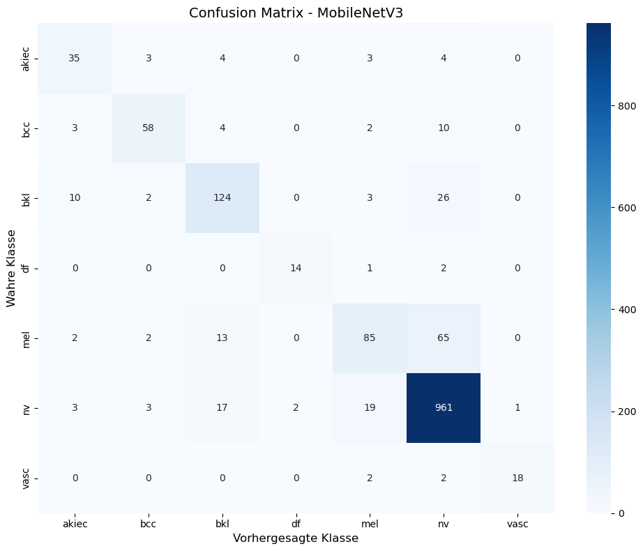
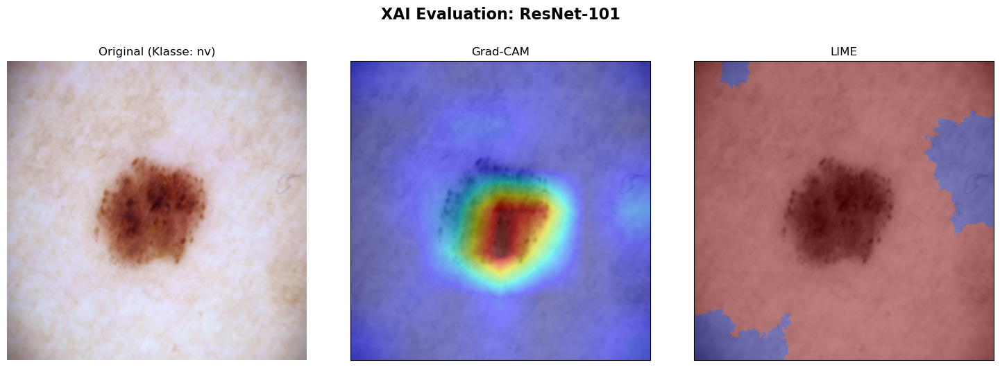
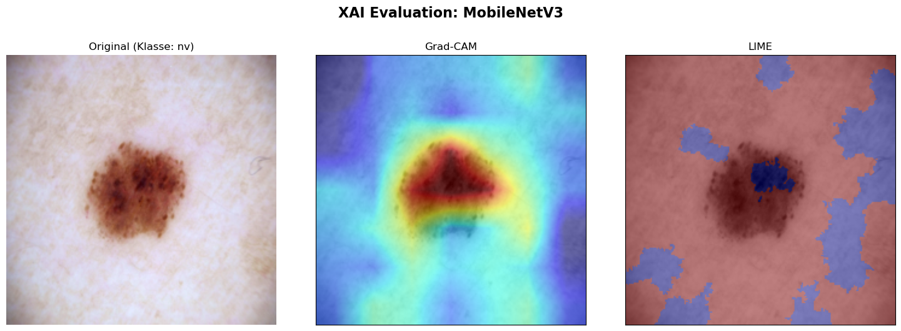
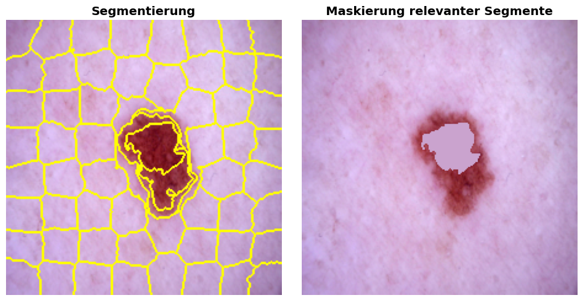
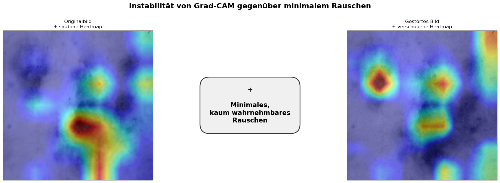
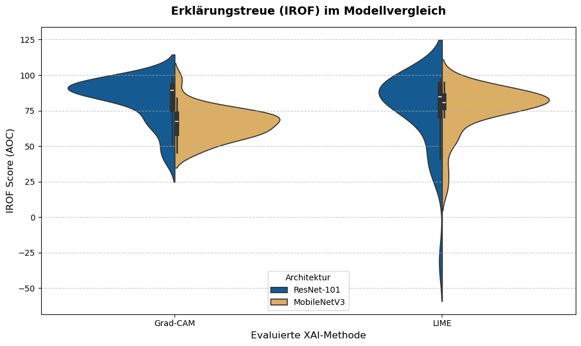
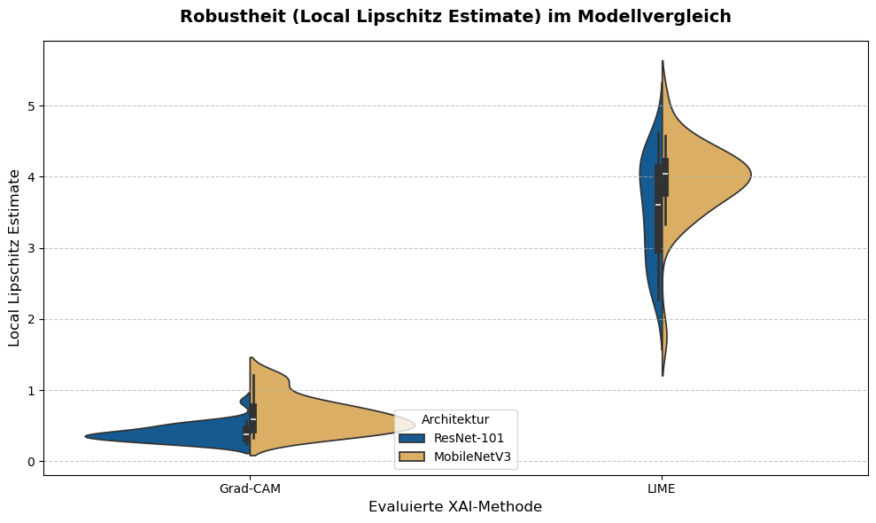
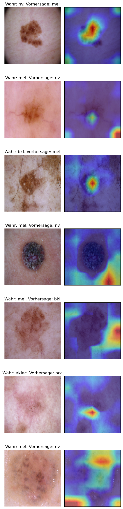

# Thesis - Vertrauen durch Validierung

**Eine quantitative Evaluation der Robustheit und Erklärungstreue von XAI-Methoden bei der dermatologischen Bildklassifikation auf dem HAM10000-Datensatz.**

Dieses Notebook demonstriert die gesamte experimentelle Pipeline der Bachelorarbeit: Vom Laden und Aufbereiten der dermatologischen Bilddaten über das Training der Convolutional Neural Networks (ResNet-101 und MobileNetV3) bis hin zur abschließenden quantitativen Evaluation der Explainable AI (XAI) Methoden LIME und Grad-CAM mithilfe des Quantus-Frameworks.

## 0. Installation
In diesem Schritt werden alle benötigten Bibliotheken und Abhängigkeiten installiert. Neben den Standard-Bibliotheken für Deep Learning (PyTorch) werden hier insbesondere captum für die Erklärungsgenerierung sowie quantus für die quantitative Validierung der XAI-Methoden benötigt


```python
# Führe diese Zelle nur aus, wenn die Pakete noch nicht installiert sind.
# Das Flag -q sorgt dafür, dass der Output nicht das ganze Notebook überflutet.

# Tipp: Eine eigene Umgebung dafür erstellen. Im Anaconda Prompt folgende Befehle ausführen:
#  - conda create --name thesis_env python=3.11 -y
#  - conda activate ml_env
#  - conda install ipykernel -y
#  - python -m ipykernel install --user --name thesis_env --display-name "cb thesis env"

# 1. Alle großen "schweren" Pakete über Conda installieren. 
# Das ! erlaubt den Terminal-Befehl im Notebook und das -y bestätigt die Installation automatisch.
#!conda install -y -c pytorch -c nvidia -c conda-forge pytorch torchvision pytorch-cuda=12.4 pandas "numpy<2.0" seaborn matplotlib ipywidgets scikit-learn scikit-image imbalanced-learn captum

# 2. Nur spezielle Pakete (wie quantus), die es bei Conda oft nicht gibt, über pip installieren:
#%pip install quantus
```


```python
# 1. Python Standardbibliotheken
import os

os.environ["KMP_DUPLICATE_LIB_OK"] = "TRUE"

import copy
import time
from collections import Counter
from math import pi

# 2. Drittanbieter-Bibliotheken (Datenverarbeitung & Machine Learning)
import numpy as np
import pandas as pd

from imblearn.over_sampling import RandomOverSampler
from PIL import Image
from skimage.segmentation import slic, mark_boundaries
from skimage import color
from sklearn.metrics import accuracy_score, classification_report, f1_score, precision_score, confusion_matrix
from sklearn.model_selection import train_test_split
from sklearn.preprocessing import LabelEncoder
import matplotlib.pyplot as plt
import seaborn as sns

# 3. PyTorch (Deep Learning)
import torch
import torch.nn as nn
import torch.nn.functional as F
import torch.optim as optim
from torch.utils.data import DataLoader, Dataset, Subset
from torchvision import models, transforms
from torchvision.models import MobileNet_V3_Large_Weights

# 4. Explainable AI (XAI)
import quantus
from captum._utils.models.linear_model import SkLearnLinearRegression
from captum.attr import LayerGradCam, visualization as viz, LayerAttribution
from lime import lime_image
```


```python
# Globale Konstanten & Pfade

# Den HAM10000-Datensatz unter https://dataverse.harvard.edu/dataset.xhtml?persistentId=doi:10.7910/DVN/DBW86T runterladen, entpacken
# und an die entsprechenden stellen kopieren und evntl. die folgenden Pfade anpassen.
METADATA_PATH = "./HAM10000_metadata.csv"
IMAGE_DIR = "./images/"

# Modell-Pfade
MODEL_RESNET101_FILE_PATH = "./ham10000_model_resnet101.pth"
MODEL_MOBILE_NET_V3_FILE_PATH = "./ham10000_model_mobilenet_v3.pth" 

# Device Konfiguration
device = torch.device("cuda" if torch.cuda.is_available() else "cpu")
print(f"Aktuell verwendetes Gerät: {device}")
```

    Aktuell verwendetes Gerät: cuda
    

## 1. HAM10000 Datensatz
Als standardisierte Datengrundlage für diese Arbeit dient der HAM10000-Datensatz (Human Against Machine with 10000 training images). Er umfasst über 10.000 dermatoskopische Bilder der sieben häufigsten pigmentierten Hautläsionen und dient als etablierter Benchmark für KI-Diagnosesysteme in der Dermatologie.

### Bilddaten laden
Zunächst werden die Bilddaten sowie die dazugehörigen Metadaten (Diagnosen) aus dem Dateisystem in einen strukturierten Pandas-DataFrame geladen.


```python
 # Wir laden die Metadaten-Datei, die Labels und Bild-IDs enthält.
df = pd.read_csv(METADATA_PATH)

# Erstellen des vollen Pfades zu den Bildern, damit wir sie später laden können
# Wir fügen '.jpg' an die image_id an.
df['path'] = df['image_id'].apply(lambda x: os.path.join(IMAGE_DIR, f"{x}.jpg"))

df.head()
```


<div>
<style scoped>
    .dataframe tbody tr th:only-of-type {
        vertical-align: middle;
    }

    .dataframe tbody tr th {
        vertical-align: top;
    }

    .dataframe thead th {
        text-align: right;
    }
</style>
<table border="1" class="dataframe">
  <thead>
    <tr style="text-align: right;">
      <th></th>
      <th>lesion_id</th>
      <th>image_id</th>
      <th>dx</th>
      <th>dx_type</th>
      <th>age</th>
      <th>sex</th>
      <th>localization</th>
      <th>dataset</th>
      <th>path</th>
    </tr>
  </thead>
  <tbody>
    <tr>
      <th>0</th>
      <td>HAM_0000118</td>
      <td>ISIC_0027419</td>
      <td>bkl</td>
      <td>histo</td>
      <td>80.0</td>
      <td>male</td>
      <td>scalp</td>
      <td>vidir_modern</td>
      <td>./images/ISIC_0027419.jpg</td>
    </tr>
    <tr>
      <th>1</th>
      <td>HAM_0000118</td>
      <td>ISIC_0025030</td>
      <td>bkl</td>
      <td>histo</td>
      <td>80.0</td>
      <td>male</td>
      <td>scalp</td>
      <td>vidir_modern</td>
      <td>./images/ISIC_0025030.jpg</td>
    </tr>
    <tr>
      <th>2</th>
      <td>HAM_0002730</td>
      <td>ISIC_0026769</td>
      <td>bkl</td>
      <td>histo</td>
      <td>80.0</td>
      <td>male</td>
      <td>scalp</td>
      <td>vidir_modern</td>
      <td>./images/ISIC_0026769.jpg</td>
    </tr>
    <tr>
      <th>3</th>
      <td>HAM_0002730</td>
      <td>ISIC_0025661</td>
      <td>bkl</td>
      <td>histo</td>
      <td>80.0</td>
      <td>male</td>
      <td>scalp</td>
      <td>vidir_modern</td>
      <td>./images/ISIC_0025661.jpg</td>
    </tr>
    <tr>
      <th>4</th>
      <td>HAM_0001466</td>
      <td>ISIC_0031633</td>
      <td>bkl</td>
      <td>histo</td>
      <td>75.0</td>
      <td>male</td>
      <td>ear</td>
      <td>vidir_modern</td>
      <td>./images/ISIC_0031633.jpg</td>
    </tr>
  </tbody>
</table>
</div>


```python
#Encoding Labels
label_encoder = LabelEncoder()

df['label'] = label_encoder.fit_transform(df['dx'])

# Display the mapping between original labels and encoded labels
label_mapping = {klasse: int(wert) for klasse, wert in zip(label_encoder.classes_, label_encoder.transform(label_encoder.classes_))}
print("Label Encoding Mapping:")
print(label_mapping)
```

    Label Encoding Mapping:
    {'akiec': 0, 'bcc': 1, 'bkl': 2, 'df': 3, 'mel': 4, 'nv': 5, 'vasc': 6}
    

### Datensplit
Die Daten werden strikt in Trainings-, Validierungs- und Testdatensätze unterteilt. Das Modell lernt die Merkmale auf den Trainingsdaten und optimiert seine Hyperparameter auf den Validierungsdaten. Der Testdatensatz wird vollständig separiert und dient später als Grundlage für die XAI-Evaluation, da Erklärungen zwingend an ungesehenen Daten getestet werden müssen.


```python
X = df.drop(columns=['label'])
y = df['label']

# 1. Testdatensatz abspalten (ca. 15% -> entspricht Sangwans 1500 Bildern)
# WICHTIG: "Stratified sampling was employed".
# Das erreichen wir durch den Parameter 'stratify=y'.
X_temp, X_test, y_temp, y_test = train_test_split(
    X,
    y,
    test_size=0.15,  # Entspricht split_rate = 0.25 ??? RELLAY?
    stratify=y,  # Garantiert gleiche Klassenverteilung
    random_state=42  # Wichtig für Reproduzierbarkeit
)


# 2. Den Rest (85%) in Training und Validierung aufteilen (75-25 Split)
# Sangwan nutzt eine split_rate von 0.25 auf den verbleibenden Daten
X_train, X_val, y_train, y_val = train_test_split(
    X_temp, y_temp,
    test_size=0.25,
    stratify=y_temp,
    random_state=42
)
```

### Oversampling
Ein charakteristisches Merkmal des HAM10000-Datensatzes ist seine starke Klassenimbalance. Während gutartige melanozytäre Nävi stark überrepräsentiert sind (ca. 67 % der Daten), sind andere Klassen (wie Dermatofibrome) nur in geringer Zahl vorhanden. Um zu verhindern, dass das Modell einen Bias zugunsten der Mehrheitsklasse entwickelt, wird hier ein Oversampling-Verfahren angewendet, das sich an der Methodik von Sangwan (2024) orientiert. (GIT-Quelle: https://github.com/HardikSangwan/thesis_diagnostics_skin/tree/main)


```python
# 1. Wie viele Bilder pro Klasse sind AKTUELL in y_train?
train_counts = Counter(y_train)
majority_class_count = max(train_counts.values())

# 2. Dynamische Strategie nach Sangwans "Max 300% Increase" Regel berechnen
dynamic_strategy = {}
for cls, count in train_counts.items():
    # Wir vervierfachen die Minderheitsklassen (Original + 300% Increase) (Sangwan)
    # aber wir deckeln es bei der Größe der Mehrheitsklasse, damit keine Klasse 
    # größer wird als die Mehrheitsklasse.
    target_count = min(count * 4, majority_class_count)
    dynamic_strategy[cls] = target_count

# 3. Den Sampler mit der dynamischen Strategie anwenden
oversample = RandomOverSampler(sampling_strategy=dynamic_strategy, random_state=42)
X_train_oversampled, y_train_oversampled = oversample.fit_resample(X_train, y_train)

y_train_oversampled_text = label_encoder.inverse_transform(y_train_oversampled)
y_train_text = label_encoder.inverse_transform(y_train)
print(f"Verteilung vor Sangwan-Oversampling: {Counter(y_train_text)}")
print(f"Verteilung nach Sangwan-Oversampling: {Counter(y_train_oversampled_text)}")
```

    Verteilung vor Sangwan-Oversampling: Counter({'nv': 4274, 'mel': 709, 'bkl': 701, 'bcc': 328, 'akiec': 209, 'vasc': 90, 'df': 73})
    Verteilung nach Sangwan-Oversampling: Counter({'nv': 4274, 'mel': 2836, 'bkl': 2804, 'bcc': 1312, 'akiec': 836, 'vasc': 360, 'df': 292})
    

### HAM10000Dataset Klasse
Hier definieren wir eine benutzerdefinierte PyTorch-Dataset-Klasse, die das effiziente Laden der Bilder, das Zuordnen der Labels und die spätere Übergabe an den DataLoader übernimmt.


```python
class HAM10000Dataset(Dataset):
    def __init__(self, file_paths, labels, transform=None):
        # Wir wandeln die Pandas Series in Numpy-Arrays um für schnelleren Zugriff
        self.file_paths = file_paths.values
        self.labels = labels.values
        self.transform = transform

    def __len__(self):
        return len(self.file_paths)

    def __getitem__(self, idx):
        # 1. Bildpfad holen und Bild laden
        img_path = self.file_paths[idx]
        image = Image.open(img_path).convert("RGB")

        # 2. Augmentierung anwenden (falls vorhanden)
        if self.transform:
            image = self.transform(image)

        # 3. Label holen. Es ist BEREITS eine Zahl, also direkt in einen Tensor packen!
        label = torch.tensor(self.labels[idx], dtype=torch.long)

        return image, label

```

## 2. Datenaufbereitung
Tiefe neuronale Netze reagieren sensibel auf unvorbereitete Rohdaten. In diesem Abschnitt werden die Bilder standardisiert und durch Data Augmentation (Datenaugmentierung) künstlich variiert, um die Generalisierungsfähigkeit der Modelle zu verbessern.

### Augmentierungs-Pipeline erstellen
Mithilfe der ```torchvision.transforms```-Pipeline werden die Bilder auf eine einheitliche Größe (z. B. 224x224 Pixel) skaliert und normalisiert. Für die Trainingsdaten werden zusätzlich zufällige Transformationen (wie Rotationen und Spiegelungen) angewendet, um Overfitting vorzubeugen und das Modell robuster zu machen.


```python
"""
Erstellt die Augmentierungs-Pipeline für das Training basierend auf Sangwan (2024).
Enthält: Resize, Normalize, Random Shifts, Flips, Zooms, Shears, Brightness.
"""
train_data_image_transformer = transforms.Compose([
    transforms.Resize((224, 224)),
    # Sangwan-spezifische Augmentations:
    transforms.RandomHorizontalFlip(p=0.5),
    transforms.RandomVerticalFlip(p=0.5),

    transforms.ColorJitter(brightness=0.5, contrast=0.1, hue=0.08),  # Helligkeit/Farbe
    transforms.RandomAffine(degrees=0, shear=15),  # Scherung & Zoom
    
    transforms.ToTensor(),
    transforms.Normalize([0.485, 0.456, 0.406], [0.229, 0.224, 0.225])
])

"""
Transformationen für die Validierung/Tests.
KEINE Augmentierung (kein Flip/Shear), nur Resize und Normalize.
"""
validation_data_image_transformer = transforms.Compose([
    transforms.Resize((224, 224)),
    transforms.ToTensor(),
    transforms.Normalize(mean=[0.485, 0.456, 0.406],
                         std=[0.229, 0.224, 0.225])
])

```

### Beispiel-Visualisierung der Augmentierungs-Pipeline


```python
# Wir nehmen einfach den ersten Pfad aus deinem Datensatz (oder du wählst einen spezifischen Index)
sample_image_path = X_train_oversampled['path'].iloc[1] 
original_image = Image.open(sample_image_path).convert('RGB')

# --- 3. Plot mit Original und Variationen erstellen ---
num_variations = 3  # Wie viele augmentierte Bilder gezeigt werden sollen
fig, axes = plt.subplots(1, num_variations + 1, figsize=(15, 4))

# Originalbild anzeigen (nur auf 224x224 skaliert für einen fairen Vergleich)
resize_only = transforms.Resize((224, 224))
axes[0].imshow(resize_only(original_image))
axes[0].set_title("Original (nur Resized)", fontsize=12)
axes[0].axis('off')

# Augmentierte Versionen generieren und anzeigen
for i in range(1, num_variations + 1):
    # Durch den Aufruf von viz_transformer() werden die Zufallsoperationen jedes Mal neu berechnet
    aug_image = train_data_image_transformer(original_image)
    aug_image = aug_image.detach().cpu().permute(1, 2, 0).numpy()
    # Farben für Matplotlib in den Bereich [0, 1] zwingen , da die Bilder durch das normalize aus der 
    # Augmentierungspipline sonst nicht "menschlich" dargstellt werden.
    aug_image = (aug_image - aug_image.min()) / (aug_image.max() - aug_image.min() + 1e-8)

    axes[i].imshow(aug_image)
    axes[i].set_title(f"Augmentierung {i}", fontsize=12)
    axes[i].axis('off')

# Layout anpassen, damit die Bilder schön nebeneinander stehen
plt.tight_layout()
plt.show()
```


    

    


### Erstelle Datasets and loader
Die aufbereiteten Pipelines werden nun an die PyTorch-DataLoader übergeben, welche die Bilder für den Trainingsprozess in ressourcenschonende Batches unterteilen. (evtl. nochmal übberarbeiten wegen der Bachtes-Aussage)


```python
train_dataset = HAM10000Dataset(
    X_train_oversampled['path'],
    y_train_oversampled,
    transform=train_data_image_transformer  # Deine Augmentierung
)

val_dataset = HAM10000Dataset(
    X_val['path'],
    y_val,
    transform=validation_data_image_transformer  # Nur Resize/Normalize
)

test_dataset = HAM10000Dataset(
    X_test['path'],
    y_test,
    transform=validation_data_image_transformer  # Nur Resize/Normalize
)

train_loader = DataLoader(train_dataset, batch_size=32, shuffle=True) # nur 32 Batchsize... sind das nicht zu wenig... wie funktioniert das?
val_loader = DataLoader(val_dataset, batch_size=32, shuffle=False)
test_loader = DataLoader(test_dataset, batch_size=32, shuffle=False)

```

## 3. Modelle erstellen
Um sicherzustellen, dass die XAI-Evaluation architekturübergreifend gültig ist und den Trade-off zwischen maximaler Performance und klinischer Effizienz abbildet, werden in dieser Arbeit zwei grundlegend unterschiedliche State-of-the-Art-Modelle implementiert: ResNet-101 und MobileNetV3. Da der Datensatz für ein Training von Grund auf nicht ausreicht, wird bei beiden Modellen auf Transfer Learning (vortrainierte ImageNet-Gewichte) zurückgegriffen.

### Resnet101 erstellen
Das ResNet-101 (Residual Network) repräsentiert in dieser Arbeit den massiven, parameterreichen Ansatz. Durch die Nutzung von "Shortcut-Connections" löst es das Problem der verschwindenden Gradienten und ermöglicht das Training extrem tiefer Netze. Es ist auf maximale Repräsentationskraft und höchste Klassifikationsgenauigkeit ausgelegt.


```python
# 1. ResNet101 laden (Standard für Transfer Learning in der Literatur)
# Sangwan (2024) nutzt ResNet (ResNet50 und ResNet101)
resNet101Model = models.resnet101(weights=models.ResNet101_Weights.IMAGENET1K_V2)

# Anzahl der Eingangs-Features holen (bei ResNet50 sind das 2048)
num_ftrs = resNet101Model.fc.in_features

# Den Classifier ersetzen => sangwan pseudocode
resNet101Model.fc = nn.Sequential(
    nn.Linear(num_ftrs, 512),  # Reduktion der Dimension
    nn.ReLU(),  # Nicht-Linearität
    nn.Dropout(0.5),  # WICHTIG: Gegen Overfitting (siehe Sangwan)
    nn.Linear(512, 7)  # Output: 7 Klassen für HAM10000
)
```

### MobileNetV3 erstellen
Im direkten Kontrast dazu steht das MobileNetV3. Diese Architekturfamilie wurde speziell für den Einsatz auf ressourcenbeschränkten, mobilen Geräten entwickelt (z. B. für Smartphone-Dermatoskope am Patientenbett). Es nutzt effiziente tiefenweise separierbare Faltungen (Depthwise Separable Convolutions) und Attention-Module (Squeeze-and-Excitation), um mit einem Bruchteil der Parameter auszukommen. (Viel zu kompliziert!!!)


```python
mobileNetV3Model = models.mobilenet_v3_large(weights=MobileNet_V3_Large_Weights.IMAGENET1K_V1)

# Den Classifier inspizieren und anpassen
# Der Classifier ist ein nn.Sequential Block.
# Struktur meist:
# (0): Linear (...)
# (1): Hardswish()
# (2): Dropout(...)
# (3): Linear (in_features=1280, out_features=1000)  
# Wir greifen auf die letzte Schicht zu
last_layer_index = len(mobileNetV3Model.classifier) - 1
in_features = mobileNetV3Model.classifier[last_layer_index].in_features

# Um Overfitting bei den relativ kleinen medizinischen Daten zu vermeiden,
# Dropout anpassen Hossain et al. (2024)
mobileNetV3Model.classifier[last_layer_index - 1] = nn.Dropout(p=0.3, inplace=True)

# Letzte Schicht auf 7 Klassen (HAM10000) anpassen
mobileNetV3Model.classifier[last_layer_index] = nn.Linear(in_features, 7)
```

## 4. Modelle trainieren
In diesem Schritt erfolgt das eigentliche Fine-Tuning der beiden Modelle. Die obersten Klassifikationsschichten der vortrainierten Netzwerke wurden auf die 7 Läsionsklassen des HAM10000-Datensatzes angepasst. Optimiert wird mit dem Adam-Optimizer und der Categorical Cross-Entropy als Verlustfunktion.

(Hinweis: Der Code-Block für das Training ist standardmäßig auskommentiert, da das Training auf einer Standard-Hardware mehrere Stunden in Anspruch nehmen kann. Die trainierten Gewichte werden stattdessen im nächsten Schritt geladen)


```python
def fit(model, train_loader, val_loader, title, num_epochs=100, learning_rate=0.00001, early_stop_patience=10):
    """
    Implementierung der Trainingsschleife basierend auf Sangwan (2024).
    Nutzt Adam Optimizer und ReduceLROnPlateau.
    """
    # Definition der Loss-Funktion: "Categorical Cross Entropy"
    criterion = nn.CrossEntropyLoss()

    # WICHTIG: Wir übergeben dem Optimierer NUR die Parameter, die aufgetaut sind!
    trainable_params = filter(lambda p: p.requires_grad, model.parameters())
    
    # Definition des Optimizers: "Adam"
    # Wir optimieren nur die Parameter, die requires_grad=True haben (unser neuer Classifier Head).
    # „Für das Training des Klassifikators wurde der Adam-Optimizer gewählt. Im Gegensatz zum klassischen Stochastic Gradient Descent (SGD)
    # nutzt Adam adaptive Lernraten, was in der Literatur (Kingma & Ba, 2014) und in der Referenzstudie von Sangwan (2024) mit einer
    # schnelleren Konvergenz des Modells begründet wird.“
    optimizer = optim.Adam(trainable_params, lr=learning_rate)

    # Learning Rate Scheduler: "Reduce on plateau was used"
    # Reduziert die Lernrate, wenn der Validation-Loss nicht mehr sinkt.
    scheduler = optim.lr_scheduler.ReduceLROnPlateau(optimizer, mode='min', factor=0.5, patience=2)

    model = model.to(device)

    best_model_wts = copy.deepcopy(model.state_dict())
    best_acc = 0.0
    best_precision = 0.0
    best_f1 = 0.0
    epochs_no_improve = 0
    
    print(f"Starte Training auf Gerät: {device} für {title}")
    
    for epoch in range(num_epochs):
        print(f'Epoch {epoch + 1}/{num_epochs}')
        print('-' * 10)

        # Jede Epoche hat eine Trainings- und eine Validierungsphase
        for phase in ['train', 'val']:
            if phase == 'train':
                model.train()  # Modell in Trainingsmodus setzen
                dataloader = train_loader
            else:
                model.eval()  # Modell in Evaluierungsmodus setzen
                dataloader = val_loader

            running_loss = 0.0
            running_corrects = 0
            
            # Listen zum Sammeln aller Vorhersagen und Labels dieser Epoche
            all_preds = []
            all_labels = []

            # Iteration über die Daten
            for inputs, labels in dataloader:
                inputs = inputs.to(device)
                labels = labels.to(device)

                # Parameter-Gradienten auf Null setzen
                optimizer.zero_grad()
                # Forward Pass
                # Nur im Trainings-Modus Gradienten berechnen (spart Speicher bei Val)
                with torch.set_grad_enabled(phase == 'train'):
                    outputs = model(inputs)
                    _, preds = torch.max(outputs, 1)
                    loss = criterion(outputs, labels)

                    # Backward Pass und Optimierung nur in der Trainingsphase
                    if phase == 'train':
                        loss.backward()
                        optimizer.step()
                        
                # echtes lernen nur bis hier
                # --------------------------------------
                # Statistiken sammeln
                running_loss += loss.item() * inputs.size(0)
                running_corrects += torch.sum(preds == labels.data)

                # Daten für Precision sammeln (auf CPU verschieben für scikit-learn)
                all_preds.extend(preds.cpu().numpy())
                all_labels.extend(labels.cpu().numpy())

            epoch_loss = running_loss / len(dataloader.dataset)
            epoch_acc = running_corrects.double() / len(dataloader.dataset)

            # Precision berechnen
            # average='weighted': Berücksichtigt das Ungleichgewicht der Klassen
            # zero_division=0: Verhindert Abstürze, falls eine Klasse gar nicht vorhergesagt wurde
            epoch_precision = precision_score(all_labels, all_preds, average='weighted', zero_division=0)
            epoch_f1 = f1_score(all_labels, all_preds, average='weighted', zero_division=0)
            print(f'{phase} Loss: {epoch_loss:.4f} Acc: {epoch_acc:.4f} Precision: {epoch_precision:.4f} F1-Score: {epoch_f1:.4f}')

            # Deep Copy des Modells, wenn es das beste bisher ist (basierend auf Val-Acc)
            if phase == 'val':
                scheduler.step(epoch_loss)  # Update Learning Rate basierend auf Val-Loss
                if epoch_acc > best_acc:
                    best_acc = epoch_acc
                    best_precision = epoch_precision
                    best_f1 = epoch_f1
                    best_model_wts = copy.deepcopy(model.state_dict())
                    epochs_no_improve = 0  # Counter zurücksetzen
                    print("Neues bestes Modell gespeichert!")
                else:
                    # Keine Verbesserung
                    epochs_no_improve += 1
                    print(f"Keine Verbesserung seit {epochs_no_improve} Epoche(n).")

        print()
        # --- Early Stopping Abbruchbedingung prüfen ---
        if epochs_no_improve >= early_stop_patience:
            print(f"Early Stopping ausgelöst! Keine Verbesserung der Validation Accuracy über {early_stop_patience} aufeinanderfolgende Epochen.")
            break # Bricht die äußere Epochen-Schleife ab

    print(f'Best Val Acc: {best_acc:.4f} Precision: {best_precision:.4f} F1-Score: {best_f1:.4f}')

    # Das beste Modell laden und zurückgeben
    model.load_state_dict(best_model_wts)
    return model
```

#### Modell MobileNetV3 trainieren
Vorsicht: Folgender Aufruf ist sehr zeitintensiv. (mehrere Stunden)


```python
# Komplettes Netz einfrieren, nur Classifier auftauen!
for param in mobileNetV3Model.parameters():
    param.requires_grad = False
    
for param in mobileNetV3Model.classifier.parameters():
    param.requires_grad = True
    
mobileNetV3Model = fit(
    model=mobileNetV3Model, 
    train_loader=train_loader, 
    val_loader=val_loader,
    title="MobileNetV3 Phase 1 (Warm-up)", 
    num_epochs=100,             
    learning_rate=0.001,       
    early_stop_patience=10     
)

print("\nEntfriere das gesamte Netzwerk für das Fine-Tuning...")

# Wir tauen nun das gesamte Netzwerk auf, um die tieferen Schichten an die 
# spezifischen Hautkrebs-Merkmale anzupassen ("and then all layers were trained 
# to fine-tune the models" - Alfi et al., 2022).
for param in mobileNetV3Model.parameters():
    param.requires_grad = True

# Jetzt starten wir das eigentliche lange Training. !
mobileNetV3Model = fit(
    model=mobileNetV3Model, 
    train_loader=train_loader, 
    val_loader=val_loader, 
    title="MobileNetV3 Phase 2 (Full Fine-Tuning)", 
    num_epochs=100,           
    learning_rate=0.0001,       
    early_stop_patience=10    
)

torch.save(mobileNetV3Model.state_dict(), MODEL_MOBILE_NET_V3_FILE_PATH)
```

    Starte Training auf Gerät: cuda für MobileNetV3 Phase 1 (Warm-up)
    Epoch 1/100
    ----------
    train Loss: 0.0676 Acc: 0.9781 Precision: 0.9781 F1-Score: 0.9781
    val Loss: 0.7588 Acc: 0.8609 Precision: 0.8549 F1-Score: 0.8560
    Neues bestes Modell gespeichert!
    
    Epoch 2/100
    ----------
    train Loss: 0.0676 Acc: 0.9785 Precision: 0.9785 F1-Score: 0.9785
    val Loss: 0.8578 Acc: 0.8623 Precision: 0.8598 F1-Score: 0.8553
    Neues bestes Modell gespeichert!
    
    Epoch 3/100
    ----------
    train Loss: 0.0690 Acc: 0.9781 Precision: 0.9781 F1-Score: 0.9781
    val Loss: 0.8677 Acc: 0.8633 Precision: 0.8548 F1-Score: 0.8543
    Neues bestes Modell gespeichert!
    
    Epoch 4/100
    ----------
    train Loss: 0.0633 Acc: 0.9792 Precision: 0.9792 F1-Score: 0.9792
    val Loss: 0.8381 Acc: 0.8642 Precision: 0.8567 F1-Score: 0.8557
    Neues bestes Modell gespeichert!
    
    Epoch 5/100
    ----------
    train Loss: 0.0602 Acc: 0.9818 Precision: 0.9818 F1-Score: 0.9818
    val Loss: 0.7085 Acc: 0.8675 Precision: 0.8623 F1-Score: 0.8636
    Neues bestes Modell gespeichert!
    
    Epoch 6/100
    ----------
    train Loss: 0.0500 Acc: 0.9811 Precision: 0.9811 F1-Score: 0.9811
    val Loss: 0.7265 Acc: 0.8651 Precision: 0.8588 F1-Score: 0.8606
    Keine Verbesserung seit 1 Epoche(n).
    
    Epoch 7/100
    ----------
    train Loss: 0.0513 Acc: 0.9821 Precision: 0.9821 F1-Score: 0.9821
    val Loss: 0.7439 Acc: 0.8675 Precision: 0.8611 F1-Score: 0.8622
    Keine Verbesserung seit 2 Epoche(n).
    
    Epoch 8/100
    ----------
    train Loss: 0.0469 Acc: 0.9836 Precision: 0.9836 F1-Score: 0.9836
    val Loss: 0.7232 Acc: 0.8684 Precision: 0.8631 F1-Score: 0.8644
    Neues bestes Modell gespeichert!
    
    Epoch 9/100
    ----------
    train Loss: 0.0498 Acc: 0.9825 Precision: 0.9825 F1-Score: 0.9825
    val Loss: 0.7499 Acc: 0.8647 Precision: 0.8576 F1-Score: 0.8580
    Keine Verbesserung seit 1 Epoche(n).
    
    Epoch 10/100
    ----------
    train Loss: 0.0482 Acc: 0.9839 Precision: 0.9839 F1-Score: 0.9839
    val Loss: 0.7426 Acc: 0.8708 Precision: 0.8642 F1-Score: 0.8631
    Neues bestes Modell gespeichert!
    
    Epoch 11/100
    ----------
    train Loss: 0.0473 Acc: 0.9835 Precision: 0.9835 F1-Score: 0.9835
    val Loss: 0.7380 Acc: 0.8680 Precision: 0.8621 F1-Score: 0.8618
    Keine Verbesserung seit 1 Epoche(n).
    
    Epoch 12/100
    ----------
    train Loss: 0.0420 Acc: 0.9858 Precision: 0.9858 F1-Score: 0.9858
    val Loss: 0.7383 Acc: 0.8694 Precision: 0.8631 F1-Score: 0.8631
    Keine Verbesserung seit 2 Epoche(n).
    
    Epoch 13/100
    ----------
    train Loss: 0.0485 Acc: 0.9833 Precision: 0.9833 F1-Score: 0.9833
    val Loss: 0.7021 Acc: 0.8717 Precision: 0.8655 F1-Score: 0.8662
    Neues bestes Modell gespeichert!
    
    Epoch 14/100
    ----------
    train Loss: 0.0448 Acc: 0.9840 Precision: 0.9840 F1-Score: 0.9840
    val Loss: 0.7249 Acc: 0.8694 Precision: 0.8626 F1-Score: 0.8625
    Keine Verbesserung seit 1 Epoche(n).
    
    Epoch 15/100
    ----------
    train Loss: 0.0427 Acc: 0.9866 Precision: 0.9866 F1-Score: 0.9866
    val Loss: 0.6907 Acc: 0.8689 Precision: 0.8627 F1-Score: 0.8639
    Keine Verbesserung seit 2 Epoche(n).
    
    Epoch 16/100
    ----------
    train Loss: 0.0424 Acc: 0.9855 Precision: 0.9855 F1-Score: 0.9855
    val Loss: 0.7053 Acc: 0.8727 Precision: 0.8667 F1-Score: 0.8670
    Neues bestes Modell gespeichert!
    
    Epoch 17/100
    ----------
    train Loss: 0.0440 Acc: 0.9851 Precision: 0.9851 F1-Score: 0.9851
    val Loss: 0.7044 Acc: 0.8689 Precision: 0.8624 F1-Score: 0.8632
    Keine Verbesserung seit 1 Epoche(n).
    
    Epoch 18/100
    ----------
    train Loss: 0.0441 Acc: 0.9864 Precision: 0.9864 F1-Score: 0.9864
    val Loss: 0.7041 Acc: 0.8712 Precision: 0.8655 F1-Score: 0.8664
    Keine Verbesserung seit 2 Epoche(n).
    
    Epoch 19/100
    ----------
    train Loss: 0.0429 Acc: 0.9836 Precision: 0.9836 F1-Score: 0.9836
    val Loss: 0.7015 Acc: 0.8694 Precision: 0.8627 F1-Score: 0.8639
    Keine Verbesserung seit 3 Epoche(n).
    
    Epoch 20/100
    ----------
    train Loss: 0.0385 Acc: 0.9862 Precision: 0.9862 F1-Score: 0.9862
    val Loss: 0.7035 Acc: 0.8722 Precision: 0.8661 F1-Score: 0.8667
    Keine Verbesserung seit 4 Epoche(n).
    
    Epoch 21/100
    ----------
    train Loss: 0.0386 Acc: 0.9874 Precision: 0.9874 F1-Score: 0.9874
    val Loss: 0.7060 Acc: 0.8694 Precision: 0.8626 F1-Score: 0.8636
    Keine Verbesserung seit 5 Epoche(n).
    
    Epoch 22/100
    ----------
    train Loss: 0.0395 Acc: 0.9860 Precision: 0.9860 F1-Score: 0.9860
    val Loss: 0.6965 Acc: 0.8712 Precision: 0.8649 F1-Score: 0.8657
    Keine Verbesserung seit 6 Epoche(n).
    
    Epoch 23/100
    ----------
    train Loss: 0.0421 Acc: 0.9862 Precision: 0.9862 F1-Score: 0.9862
    val Loss: 0.7016 Acc: 0.8698 Precision: 0.8632 F1-Score: 0.8641
    Keine Verbesserung seit 7 Epoche(n).
    
    Epoch 24/100
    ----------
    train Loss: 0.0437 Acc: 0.9854 Precision: 0.9854 F1-Score: 0.9854
    val Loss: 0.6883 Acc: 0.8703 Precision: 0.8642 F1-Score: 0.8653
    Keine Verbesserung seit 8 Epoche(n).
    
    Epoch 25/100
    ----------
    train Loss: 0.0366 Acc: 0.9866 Precision: 0.9866 F1-Score: 0.9866
    val Loss: 0.7042 Acc: 0.8694 Precision: 0.8627 F1-Score: 0.8633
    Keine Verbesserung seit 9 Epoche(n).
    
    Epoch 26/100
    ----------
    train Loss: 0.0345 Acc: 0.9884 Precision: 0.9884 F1-Score: 0.9884
    val Loss: 0.7137 Acc: 0.8712 Precision: 0.8646 F1-Score: 0.8648
    Keine Verbesserung seit 10 Epoche(n).
    
    Early Stopping ausgelöst! Keine Verbesserung der Validation Accuracy über 10 aufeinanderfolgende Epochen.
    Best Val Acc: 0.8727 Precision: 0.8667 F1-Score: 0.8670
    Starte Training auf Gerät: cuda für MobileNetV3 Phase 2 (Full Fine-Tuning)
    Epoch 1/100
    ----------
    train Loss: 0.0494 Acc: 0.9829 Precision: 0.9829 F1-Score: 0.9829
    val Loss: 0.7248 Acc: 0.8595 Precision: 0.8543 F1-Score: 0.8561
    Neues bestes Modell gespeichert!
    
    Epoch 2/100
    ----------
    train Loss: 0.0585 Acc: 0.9798 Precision: 0.9798 F1-Score: 0.9798
    val Loss: 0.7421 Acc: 0.8548 Precision: 0.8477 F1-Score: 0.8498
    Keine Verbesserung seit 1 Epoche(n).
    
    Epoch 3/100
    ----------
    train Loss: 0.0425 Acc: 0.9843 Precision: 0.9843 F1-Score: 0.9843
    val Loss: 0.7775 Acc: 0.8595 Precision: 0.8522 F1-Score: 0.8522
    Keine Verbesserung seit 2 Epoche(n).
    
    Epoch 4/100
    ----------
    train Loss: 0.0473 Acc: 0.9835 Precision: 0.9835 F1-Score: 0.9835
    val Loss: 0.8550 Acc: 0.8614 Precision: 0.8533 F1-Score: 0.8518
    Neues bestes Modell gespeichert!
    
    Epoch 5/100
    ----------
    train Loss: 0.0379 Acc: 0.9868 Precision: 0.9868 F1-Score: 0.9868
    val Loss: 0.7171 Acc: 0.8684 Precision: 0.8632 F1-Score: 0.8626
    Neues bestes Modell gespeichert!
    
    Epoch 6/100
    ----------
    train Loss: 0.0283 Acc: 0.9904 Precision: 0.9904 F1-Score: 0.9904
    val Loss: 0.7171 Acc: 0.8712 Precision: 0.8649 F1-Score: 0.8638
    Neues bestes Modell gespeichert!
    
    Epoch 7/100
    ----------
    train Loss: 0.0261 Acc: 0.9906 Precision: 0.9906 F1-Score: 0.9906
    val Loss: 0.7634 Acc: 0.8694 Precision: 0.8626 F1-Score: 0.8625
    Keine Verbesserung seit 1 Epoche(n).
    
    Epoch 8/100
    ----------
    train Loss: 0.0243 Acc: 0.9914 Precision: 0.9914 F1-Score: 0.9914
    val Loss: 0.7453 Acc: 0.8703 Precision: 0.8632 F1-Score: 0.8640
    Keine Verbesserung seit 2 Epoche(n).
    
    Epoch 9/100
    ----------
    train Loss: 0.0230 Acc: 0.9922 Precision: 0.9922 F1-Score: 0.9922
    val Loss: 0.7254 Acc: 0.8670 Precision: 0.8609 F1-Score: 0.8611
    Keine Verbesserung seit 3 Epoche(n).
    
    Epoch 10/100
    ----------
    train Loss: 0.0201 Acc: 0.9936 Precision: 0.9936 F1-Score: 0.9936
    val Loss: 0.7390 Acc: 0.8670 Precision: 0.8598 F1-Score: 0.8601
    Keine Verbesserung seit 4 Epoche(n).
    
    Epoch 11/100
    ----------
    train Loss: 0.0213 Acc: 0.9929 Precision: 0.9929 F1-Score: 0.9929
    val Loss: 0.7443 Acc: 0.8656 Precision: 0.8583 F1-Score: 0.8585
    Keine Verbesserung seit 5 Epoche(n).
    
    Epoch 12/100
    ----------
    train Loss: 0.0181 Acc: 0.9939 Precision: 0.9939 F1-Score: 0.9939
    val Loss: 0.7446 Acc: 0.8637 Precision: 0.8564 F1-Score: 0.8567
    Keine Verbesserung seit 6 Epoche(n).
    
    Epoch 13/100
    ----------
    train Loss: 0.0158 Acc: 0.9947 Precision: 0.9947 F1-Score: 0.9947
    val Loss: 0.7344 Acc: 0.8670 Precision: 0.8602 F1-Score: 0.8607
    Keine Verbesserung seit 7 Epoche(n).
    
    Epoch 14/100
    ----------
    train Loss: 0.0172 Acc: 0.9938 Precision: 0.9938 F1-Score: 0.9938
    val Loss: 0.7443 Acc: 0.8675 Precision: 0.8607 F1-Score: 0.8603
    Keine Verbesserung seit 8 Epoche(n).
    
    Epoch 15/100
    ----------
    train Loss: 0.0166 Acc: 0.9956 Precision: 0.9956 F1-Score: 0.9956
    val Loss: 0.7403 Acc: 0.8665 Precision: 0.8599 F1-Score: 0.8592
    Keine Verbesserung seit 9 Epoche(n).
    
    Epoch 16/100
    ----------
    train Loss: 0.0130 Acc: 0.9965 Precision: 0.9965 F1-Score: 0.9965
    val Loss: 0.7503 Acc: 0.8661 Precision: 0.8594 F1-Score: 0.8588
    Keine Verbesserung seit 10 Epoche(n).
    
    Early Stopping ausgelöst! Keine Verbesserung der Validation Accuracy über 10 aufeinanderfolgende Epochen.
    Best Val Acc: 0.8712 Precision: 0.8649 F1-Score: 0.8638
    

#### Modell ResNet101 trainieren
Vorsicht: Folgender Aufruf ist sehr zeitintensiv. (mehrere Stunden)


```python
# ALLES einfrieren (Basis-Wissen bewahren)...
for param in resNet101Model.parameters():
    param.requires_grad = False
    
# ... bis auf die letzten Layer
for param in resNet101Model.layer4.parameters():
    param.requires_grad = True

for param in resNet101Model.fc.parameters():
    param.requires_grad = True

resNet101Model = fit(
    model=resNet101Model, 
    train_loader=train_loader, 
    val_loader=val_loader, 
    title="ResNet101 Phase 1 (Warm-Up Kopf)", 
    num_epochs=100,          
    learning_rate=0.001,       
    early_stop_patience=10
)

print("\nEntfriere das gesamte Netzwerk für das Fine-Tuning...")

# Wir tauen nun das gesamte Netzwerk auf, um die tieferen Schichten an die 
# spezifischen Hautkrebs-Merkmale anzupassen ("and then all layers were trained 
# to fine-tune the models" - Alfi et al., 2022).
for param in resNet101Model.parameters():
    param.requires_grad = True

# Jetzt starten wir das eigentliche lange Training. 
resNet101Model = fit(
    model=resNet101Model, 
    train_loader=train_loader, 
    val_loader=val_loader, 
    title="ResNet101 Phase 2 (Full Fine-Tuning)", 
    num_epochs=100,            
    learning_rate=0.0001,       
    early_stop_patience=10
)

torch.save(resNet101Model.state_dict(), MODEL_RESNET101_FILE_PATH)
```

    Starte Training auf Gerät: cuda für ResNet101 Phase 1 (Warm-Up Kopf)
    Epoch 1/100
    ----------
    train Loss: 0.9584 Acc: 0.6350 Precision: 0.6324 F1-Score: 0.6289
    val Loss: 0.5241 Acc: 0.8177 Precision: 0.8229 F1-Score: 0.8164
    Neues bestes Modell gespeichert!
    
    Epoch 2/100
    ----------
    train Loss: 0.6225 Acc: 0.7681 Precision: 0.7675 F1-Score: 0.7675
    val Loss: 0.4928 Acc: 0.8327 Precision: 0.8331 F1-Score: 0.8284
    Neues bestes Modell gespeichert!
    
    Epoch 3/100
    ----------
    train Loss: 0.4914 Acc: 0.8204 Precision: 0.8202 F1-Score: 0.8202
    val Loss: 0.6846 Acc: 0.8271 Precision: 0.8197 F1-Score: 0.8183
    Keine Verbesserung seit 1 Epoche(n).
    
    Epoch 4/100
    ----------
    train Loss: 0.4252 Acc: 0.8440 Precision: 0.8440 F1-Score: 0.8439
    val Loss: 0.5141 Acc: 0.8257 Precision: 0.8392 F1-Score: 0.8292
    Keine Verbesserung seit 2 Epoche(n).
    
    Epoch 5/100
    ----------
    train Loss: 0.3505 Acc: 0.8718 Precision: 0.8717 F1-Score: 0.8717
    val Loss: 0.5504 Acc: 0.8275 Precision: 0.8451 F1-Score: 0.8318
    Keine Verbesserung seit 3 Epoche(n).
    
    Epoch 6/100
    ----------
    train Loss: 0.2478 Acc: 0.9130 Precision: 0.9131 F1-Score: 0.9130
    val Loss: 0.5514 Acc: 0.8501 Precision: 0.8433 F1-Score: 0.8452
    Neues bestes Modell gespeichert!
    
    Epoch 7/100
    ----------
    train Loss: 0.2053 Acc: 0.9262 Precision: 0.9263 F1-Score: 0.9262
    val Loss: 0.5536 Acc: 0.8379 Precision: 0.8461 F1-Score: 0.8399
    Keine Verbesserung seit 1 Epoche(n).
    
    Epoch 8/100
    ----------
    train Loss: 0.1829 Acc: 0.9346 Precision: 0.9347 F1-Score: 0.9346
    val Loss: 0.5191 Acc: 0.8510 Precision: 0.8473 F1-Score: 0.8484
    Neues bestes Modell gespeichert!
    
    Epoch 9/100
    ----------
    train Loss: 0.1480 Acc: 0.9489 Precision: 0.9489 F1-Score: 0.9488
    val Loss: 0.5676 Acc: 0.8543 Precision: 0.8489 F1-Score: 0.8494
    Neues bestes Modell gespeichert!
    
    Epoch 10/100
    ----------
    train Loss: 0.1375 Acc: 0.9509 Precision: 0.9510 F1-Score: 0.9509
    val Loss: 0.5453 Acc: 0.8524 Precision: 0.8462 F1-Score: 0.8474
    Keine Verbesserung seit 1 Epoche(n).
    
    Epoch 11/100
    ----------
    train Loss: 0.1240 Acc: 0.9564 Precision: 0.9564 F1-Score: 0.9564
    val Loss: 0.5450 Acc: 0.8543 Precision: 0.8532 F1-Score: 0.8534
    Keine Verbesserung seit 2 Epoche(n).
    
    Epoch 12/100
    ----------
    train Loss: 0.0992 Acc: 0.9654 Precision: 0.9655 F1-Score: 0.9654
    val Loss: 0.6326 Acc: 0.8567 Precision: 0.8494 F1-Score: 0.8471
    Neues bestes Modell gespeichert!
    
    Epoch 13/100
    ----------
    train Loss: 0.0954 Acc: 0.9668 Precision: 0.9668 F1-Score: 0.9668
    val Loss: 0.5595 Acc: 0.8647 Precision: 0.8584 F1-Score: 0.8599
    Neues bestes Modell gespeichert!
    
    Epoch 14/100
    ----------
    train Loss: 0.0844 Acc: 0.9697 Precision: 0.9697 F1-Score: 0.9697
    val Loss: 0.5889 Acc: 0.8647 Precision: 0.8589 F1-Score: 0.8596
    Keine Verbesserung seit 1 Epoche(n).
    
    Epoch 15/100
    ----------
    train Loss: 0.0806 Acc: 0.9741 Precision: 0.9741 F1-Score: 0.9741
    val Loss: 0.6162 Acc: 0.8604 Precision: 0.8539 F1-Score: 0.8552
    Keine Verbesserung seit 2 Epoche(n).
    
    Epoch 16/100
    ----------
    train Loss: 0.0836 Acc: 0.9711 Precision: 0.9711 F1-Score: 0.9711
    val Loss: 0.5643 Acc: 0.8618 Precision: 0.8565 F1-Score: 0.8577
    Keine Verbesserung seit 3 Epoche(n).
    
    Epoch 17/100
    ----------
    train Loss: 0.0737 Acc: 0.9748 Precision: 0.9748 F1-Score: 0.9748
    val Loss: 0.6049 Acc: 0.8628 Precision: 0.8557 F1-Score: 0.8562
    Keine Verbesserung seit 4 Epoche(n).
    
    Epoch 18/100
    ----------
    train Loss: 0.0745 Acc: 0.9738 Precision: 0.9738 F1-Score: 0.9738
    val Loss: 0.5913 Acc: 0.8665 Precision: 0.8603 F1-Score: 0.8619
    Neues bestes Modell gespeichert!
    
    Epoch 19/100
    ----------
    train Loss: 0.0742 Acc: 0.9743 Precision: 0.9743 F1-Score: 0.9743
    val Loss: 0.6128 Acc: 0.8637 Precision: 0.8572 F1-Score: 0.8574
    Keine Verbesserung seit 1 Epoche(n).
    
    Epoch 20/100
    ----------
    train Loss: 0.0650 Acc: 0.9781 Precision: 0.9781 F1-Score: 0.9781
    val Loss: 0.6387 Acc: 0.8670 Precision: 0.8614 F1-Score: 0.8610
    Neues bestes Modell gespeichert!
    
    Epoch 21/100
    ----------
    train Loss: 0.0633 Acc: 0.9776 Precision: 0.9776 F1-Score: 0.9776
    val Loss: 0.6192 Acc: 0.8647 Precision: 0.8588 F1-Score: 0.8603
    Keine Verbesserung seit 1 Epoche(n).
    
    Epoch 22/100
    ----------
    train Loss: 0.0651 Acc: 0.9764 Precision: 0.9764 F1-Score: 0.9764
    val Loss: 0.6027 Acc: 0.8642 Precision: 0.8583 F1-Score: 0.8597
    Keine Verbesserung seit 2 Epoche(n).
    
    Epoch 23/100
    ----------
    train Loss: 0.0621 Acc: 0.9774 Precision: 0.9774 F1-Score: 0.9774
    val Loss: 0.6228 Acc: 0.8680 Precision: 0.8619 F1-Score: 0.8622
    Neues bestes Modell gespeichert!
    
    Epoch 24/100
    ----------
    train Loss: 0.0627 Acc: 0.9777 Precision: 0.9777 F1-Score: 0.9777
    val Loss: 0.5993 Acc: 0.8661 Precision: 0.8602 F1-Score: 0.8616
    Keine Verbesserung seit 1 Epoche(n).
    
    Epoch 25/100
    ----------
    train Loss: 0.0662 Acc: 0.9770 Precision: 0.9771 F1-Score: 0.9770
    val Loss: 0.6108 Acc: 0.8665 Precision: 0.8599 F1-Score: 0.8611
    Keine Verbesserung seit 2 Epoche(n).
    
    Epoch 26/100
    ----------
    train Loss: 0.0601 Acc: 0.9786 Precision: 0.9786 F1-Score: 0.9786
    val Loss: 0.6046 Acc: 0.8736 Precision: 0.8676 F1-Score: 0.8684
    Neues bestes Modell gespeichert!
    
    Epoch 27/100
    ----------
    train Loss: 0.0604 Acc: 0.9802 Precision: 0.9802 F1-Score: 0.9802
    val Loss: 0.5934 Acc: 0.8680 Precision: 0.8624 F1-Score: 0.8639
    Keine Verbesserung seit 1 Epoche(n).
    
    Epoch 28/100
    ----------
    train Loss: 0.0625 Acc: 0.9786 Precision: 0.9786 F1-Score: 0.9786
    val Loss: 0.6104 Acc: 0.8670 Precision: 0.8604 F1-Score: 0.8615
    Keine Verbesserung seit 2 Epoche(n).
    
    Epoch 29/100
    ----------
    train Loss: 0.0602 Acc: 0.9788 Precision: 0.9788 F1-Score: 0.9788
    val Loss: 0.6223 Acc: 0.8675 Precision: 0.8614 F1-Score: 0.8616
    Keine Verbesserung seit 3 Epoche(n).
    
    Epoch 30/100
    ----------
    train Loss: 0.0631 Acc: 0.9790 Precision: 0.9790 F1-Score: 0.9790
    val Loss: 0.6094 Acc: 0.8647 Precision: 0.8580 F1-Score: 0.8586
    Keine Verbesserung seit 4 Epoche(n).
    
    Epoch 31/100
    ----------
    train Loss: 0.0626 Acc: 0.9784 Precision: 0.9784 F1-Score: 0.9784
    val Loss: 0.6072 Acc: 0.8675 Precision: 0.8606 F1-Score: 0.8611
    Keine Verbesserung seit 5 Epoche(n).
    
    Epoch 32/100
    ----------
    train Loss: 0.0612 Acc: 0.9794 Precision: 0.9794 F1-Score: 0.9794
    val Loss: 0.6042 Acc: 0.8675 Precision: 0.8612 F1-Score: 0.8624
    Keine Verbesserung seit 6 Epoche(n).
    
    Epoch 33/100
    ----------
    train Loss: 0.0569 Acc: 0.9806 Precision: 0.9806 F1-Score: 0.9806
    val Loss: 0.6107 Acc: 0.8651 Precision: 0.8589 F1-Score: 0.8600
    Keine Verbesserung seit 7 Epoche(n).
    
    Epoch 34/100
    ----------
    train Loss: 0.0629 Acc: 0.9789 Precision: 0.9789 F1-Score: 0.9789
    val Loss: 0.5969 Acc: 0.8694 Precision: 0.8632 F1-Score: 0.8646
    Keine Verbesserung seit 8 Epoche(n).
    
    Epoch 35/100
    ----------
    train Loss: 0.0569 Acc: 0.9792 Precision: 0.9793 F1-Score: 0.9792
    val Loss: 0.6015 Acc: 0.8647 Precision: 0.8579 F1-Score: 0.8594
    Keine Verbesserung seit 9 Epoche(n).
    
    Epoch 36/100
    ----------
    train Loss: 0.0656 Acc: 0.9773 Precision: 0.9773 F1-Score: 0.9773
    val Loss: 0.6367 Acc: 0.8656 Precision: 0.8589 F1-Score: 0.8597
    Keine Verbesserung seit 10 Epoche(n).
    
    Early Stopping ausgelöst! Keine Verbesserung der Validation Accuracy über 10 aufeinanderfolgende Epochen.
    Best Val Acc: 0.8736 Precision: 0.8676 F1-Score: 0.8684
    
    Entfriere das gesamte Netzwerk für das Fine-Tuning...
    Starte Training auf Gerät: cuda für ResNet101 Phase 2 (Full Fine-Tuning)
    Epoch 1/100
    ----------
    train Loss: 0.1186 Acc: 0.9564 Precision: 0.9564 F1-Score: 0.9564
    val Loss: 0.5698 Acc: 0.8543 Precision: 0.8549 F1-Score: 0.8536
    Neues bestes Modell gespeichert!
    
    Epoch 2/100
    ----------
    train Loss: 0.0985 Acc: 0.9659 Precision: 0.9659 F1-Score: 0.9659
    val Loss: 0.5546 Acc: 0.8712 Precision: 0.8669 F1-Score: 0.8667
    Neues bestes Modell gespeichert!
    
    Epoch 3/100
    ----------
    train Loss: 0.0731 Acc: 0.9744 Precision: 0.9745 F1-Score: 0.9744
    val Loss: 0.6036 Acc: 0.8633 Precision: 0.8568 F1-Score: 0.8561
    Keine Verbesserung seit 1 Epoche(n).
    
    Epoch 4/100
    ----------
    train Loss: 0.0608 Acc: 0.9790 Precision: 0.9790 F1-Score: 0.9790
    val Loss: 0.4981 Acc: 0.8797 Precision: 0.8776 F1-Score: 0.8784
    Neues bestes Modell gespeichert!
    
    Epoch 5/100
    ----------
    train Loss: 0.0638 Acc: 0.9783 Precision: 0.9783 F1-Score: 0.9783
    val Loss: 0.5429 Acc: 0.8722 Precision: 0.8674 F1-Score: 0.8686
    Keine Verbesserung seit 1 Epoche(n).
    
    Epoch 6/100
    ----------
    train Loss: 0.0555 Acc: 0.9806 Precision: 0.9806 F1-Score: 0.9806
    val Loss: 0.5452 Acc: 0.8727 Precision: 0.8672 F1-Score: 0.8681
    Keine Verbesserung seit 2 Epoche(n).
    
    Epoch 7/100
    ----------
    train Loss: 0.0515 Acc: 0.9831 Precision: 0.9831 F1-Score: 0.9831
    val Loss: 0.5652 Acc: 0.8830 Precision: 0.8808 F1-Score: 0.8804
    Neues bestes Modell gespeichert!
    
    Epoch 8/100
    ----------
    train Loss: 0.0363 Acc: 0.9877 Precision: 0.9877 F1-Score: 0.9877
    val Loss: 0.5845 Acc: 0.8811 Precision: 0.8761 F1-Score: 0.8753
    Keine Verbesserung seit 1 Epoche(n).
    
    Epoch 9/100
    ----------
    train Loss: 0.0209 Acc: 0.9933 Precision: 0.9933 F1-Score: 0.9933
    val Loss: 0.5835 Acc: 0.8830 Precision: 0.8783 F1-Score: 0.8788
    Keine Verbesserung seit 2 Epoche(n).
    
    Epoch 10/100
    ----------
    train Loss: 0.0185 Acc: 0.9940 Precision: 0.9940 F1-Score: 0.9940
    val Loss: 0.6337 Acc: 0.8820 Precision: 0.8771 F1-Score: 0.8766
    Keine Verbesserung seit 3 Epoche(n).
    
    Epoch 11/100
    ----------
    train Loss: 0.0155 Acc: 0.9950 Precision: 0.9950 F1-Score: 0.9950
    val Loss: 0.6109 Acc: 0.8835 Precision: 0.8785 F1-Score: 0.8781
    Neues bestes Modell gespeichert!
    
    Epoch 12/100
    ----------
    train Loss: 0.0135 Acc: 0.9955 Precision: 0.9955 F1-Score: 0.9955
    val Loss: 0.6627 Acc: 0.8835 Precision: 0.8792 F1-Score: 0.8779
    Keine Verbesserung seit 1 Epoche(n).
    
    Epoch 13/100
    ----------
    train Loss: 0.0094 Acc: 0.9971 Precision: 0.9971 F1-Score: 0.9971
    val Loss: 0.7095 Acc: 0.8783 Precision: 0.8743 F1-Score: 0.8703
    Keine Verbesserung seit 2 Epoche(n).
    
    Epoch 14/100
    ----------
    train Loss: 0.0081 Acc: 0.9976 Precision: 0.9976 F1-Score: 0.9976
    val Loss: 0.6793 Acc: 0.8844 Precision: 0.8802 F1-Score: 0.8776
    Neues bestes Modell gespeichert!
    
    Epoch 15/100
    ----------
    train Loss: 0.0057 Acc: 0.9981 Precision: 0.9981 F1-Score: 0.9981
    val Loss: 0.6671 Acc: 0.8849 Precision: 0.8805 F1-Score: 0.8788
    Neues bestes Modell gespeichert!
    
    Epoch 16/100
    ----------
    train Loss: 0.0080 Acc: 0.9976 Precision: 0.9976 F1-Score: 0.9976
    val Loss: 0.6605 Acc: 0.8877 Precision: 0.8844 F1-Score: 0.8821
    Neues bestes Modell gespeichert!
    
    Epoch 17/100
    ----------
    train Loss: 0.0068 Acc: 0.9977 Precision: 0.9977 F1-Score: 0.9977
    val Loss: 0.6631 Acc: 0.8872 Precision: 0.8834 F1-Score: 0.8809
    Keine Verbesserung seit 1 Epoche(n).
    
    Epoch 18/100
    ----------
    train Loss: 0.0050 Acc: 0.9985 Precision: 0.9985 F1-Score: 0.9985
    val Loss: 0.6835 Acc: 0.8872 Precision: 0.8830 F1-Score: 0.8810
    Keine Verbesserung seit 2 Epoche(n).
    
    Epoch 19/100
    ----------
    train Loss: 0.0050 Acc: 0.9983 Precision: 0.9983 F1-Score: 0.9983
    val Loss: 0.6936 Acc: 0.8863 Precision: 0.8824 F1-Score: 0.8797
    Keine Verbesserung seit 3 Epoche(n).
    
    Epoch 20/100
    ----------
    train Loss: 0.0045 Acc: 0.9989 Precision: 0.9989 F1-Score: 0.9989
    val Loss: 0.6739 Acc: 0.8882 Precision: 0.8838 F1-Score: 0.8816
    Neues bestes Modell gespeichert!
    
    Epoch 21/100
    ----------
    train Loss: 0.0042 Acc: 0.9989 Precision: 0.9989 F1-Score: 0.9989
    val Loss: 0.6733 Acc: 0.8867 Precision: 0.8823 F1-Score: 0.8806
    Keine Verbesserung seit 1 Epoche(n).
    
    Epoch 22/100
    ----------
    train Loss: 0.0038 Acc: 0.9989 Precision: 0.9989 F1-Score: 0.9989
    val Loss: 0.6984 Acc: 0.8839 Precision: 0.8794 F1-Score: 0.8776
    Keine Verbesserung seit 2 Epoche(n).
    
    Epoch 23/100
    ----------
    train Loss: 0.0044 Acc: 0.9990 Precision: 0.9990 F1-Score: 0.9990
    val Loss: 0.6884 Acc: 0.8867 Precision: 0.8831 F1-Score: 0.8809
    Keine Verbesserung seit 3 Epoche(n).
    
    Epoch 24/100
    ----------
    train Loss: 0.0038 Acc: 0.9987 Precision: 0.9987 F1-Score: 0.9987
    val Loss: 0.6813 Acc: 0.8910 Precision: 0.8870 F1-Score: 0.8848
    Neues bestes Modell gespeichert!
    
    Epoch 25/100
    ----------
    train Loss: 0.0046 Acc: 0.9989 Precision: 0.9989 F1-Score: 0.9989
    val Loss: 0.6964 Acc: 0.8863 Precision: 0.8820 F1-Score: 0.8797
    Keine Verbesserung seit 1 Epoche(n).
    
    Epoch 26/100
    ----------
    train Loss: 0.0044 Acc: 0.9988 Precision: 0.9988 F1-Score: 0.9988
    val Loss: 0.6884 Acc: 0.8877 Precision: 0.8836 F1-Score: 0.8814
    Keine Verbesserung seit 2 Epoche(n).
    
    Epoch 27/100
    ----------
    train Loss: 0.0044 Acc: 0.9987 Precision: 0.9987 F1-Score: 0.9987
    val Loss: 0.7022 Acc: 0.8863 Precision: 0.8825 F1-Score: 0.8798
    Keine Verbesserung seit 3 Epoche(n).
    
    Epoch 28/100
    ----------
    train Loss: 0.0037 Acc: 0.9989 Precision: 0.9989 F1-Score: 0.9989
    val Loss: 0.6997 Acc: 0.8853 Precision: 0.8810 F1-Score: 0.8787
    Keine Verbesserung seit 4 Epoche(n).
    
    Epoch 29/100
    ----------
    train Loss: 0.0045 Acc: 0.9987 Precision: 0.9987 F1-Score: 0.9987
    val Loss: 0.6871 Acc: 0.8872 Precision: 0.8832 F1-Score: 0.8809
    Keine Verbesserung seit 5 Epoche(n).
    
    Epoch 30/100
    ----------
    train Loss: 0.0035 Acc: 0.9990 Precision: 0.9990 F1-Score: 0.9990
    val Loss: 0.6902 Acc: 0.8863 Precision: 0.8818 F1-Score: 0.8798
    Keine Verbesserung seit 6 Epoche(n).
    
    Epoch 31/100
    ----------
    train Loss: 0.0025 Acc: 0.9996 Precision: 0.9996 F1-Score: 0.9996
    val Loss: 0.6648 Acc: 0.8900 Precision: 0.8861 F1-Score: 0.8847
    Keine Verbesserung seit 7 Epoche(n).
    
    Epoch 32/100
    ----------
    train Loss: 0.0045 Acc: 0.9986 Precision: 0.9986 F1-Score: 0.9986
    val Loss: 0.7215 Acc: 0.8853 Precision: 0.8812 F1-Score: 0.8780
    Keine Verbesserung seit 8 Epoche(n).
    
    Epoch 33/100
    ----------
    train Loss: 0.0034 Acc: 0.9992 Precision: 0.9992 F1-Score: 0.9992
    val Loss: 0.6986 Acc: 0.8858 Precision: 0.8817 F1-Score: 0.8790
    Keine Verbesserung seit 9 Epoche(n).
    
    Epoch 34/100
    ----------
    train Loss: 0.0038 Acc: 0.9991 Precision: 0.9991 F1-Score: 0.9991
    val Loss: 0.7017 Acc: 0.8849 Precision: 0.8804 F1-Score: 0.8781
    Keine Verbesserung seit 10 Epoche(n).
    
    Early Stopping ausgelöst! Keine Verbesserung der Validation Accuracy über 10 aufeinanderfolgende Epochen.
    Best Val Acc: 0.8910 Precision: 0.8870 F1-Score: 0.8848
    

## 5. Vortrainierte Modelle laden
Hier laden wir die Gewichte der fertig trainierten Modelle (.pth oder .pt Dateien). Dies ermöglicht eine exakte Reproduzierbarkeit der späteren Erklärungsgenerierung, ohne das Modell jedes Mal neu trainieren zu müssen.


```python
loaded_data_resnet101 = torch.load(MODEL_RESNET101_FILE_PATH)
resNet101Model.load_state_dict(loaded_data_resnet101)

loaded_data_mobilenetv3 = torch.load(MODEL_MOBILE_NET_V3_FILE_PATH)
mobileNetV3Model.load_state_dict(loaded_data_mobilenetv3)
```

    C:\Users\jalle\AppData\Local\Temp\ipykernel_9192\2924343579.py:1: FutureWarning: You are using `torch.load` with `weights_only=False` (the current default value), which uses the default pickle module implicitly. It is possible to construct malicious pickle data which will execute arbitrary code during unpickling (See https://github.com/pytorch/pytorch/blob/main/SECURITY.md#untrusted-models for more details). In a future release, the default value for `weights_only` will be flipped to `True`. This limits the functions that could be executed during unpickling. Arbitrary objects will no longer be allowed to be loaded via this mode unless they are explicitly allowlisted by the user via `torch.serialization.add_safe_globals`. We recommend you start setting `weights_only=True` for any use case where you don't have full control of the loaded file. Please open an issue on GitHub for any issues related to this experimental feature.
      loaded_data_resnet101 = torch.load(MODEL_RESNET101_FILE_PATH)
    C:\Users\jalle\AppData\Local\Temp\ipykernel_9192\2924343579.py:4: FutureWarning: You are using `torch.load` with `weights_only=False` (the current default value), which uses the default pickle module implicitly. It is possible to construct malicious pickle data which will execute arbitrary code during unpickling (See https://github.com/pytorch/pytorch/blob/main/SECURITY.md#untrusted-models for more details). In a future release, the default value for `weights_only` will be flipped to `True`. This limits the functions that could be executed during unpickling. Arbitrary objects will no longer be allowed to be loaded via this mode unless they are explicitly allowlisted by the user via `torch.serialization.add_safe_globals`. We recommend you start setting `weights_only=True` for any use case where you don't have full control of the loaded file. Please open an issue on GitHub for any issues related to this experimental feature.
      loaded_data_mobilenetv3 = torch.load(MODEL_MOBILE_NET_V3_FILE_PATH)
    


    <All keys matched successfully>


## 6. Modelle gegen den Testdatensatz validieren
Bevor die Black-Box geöffnet und erklärt wird, muss sichergestellt sein, dass die Modelle diagnostisch auf hohem Niveau agieren. In diesem Schritt wird die Performance (Accuracy, Precision, Recall, F1-Score) beider Modelle auf dem ungesehenen Testdatensatz berechnet.


```python
"""
Berechnet Accuracy, Precision, Recall und F1 auf dem Testset.
"""
resNet101Model.eval()  # Wichtig: Evaluation Modus
resNet101Model.to(device)

mobileNetV3Model.eval()  # Wichtig: Evaluation Modus
mobileNetV3Model.to(device)

def evaluateTestData(model, title):
    all_preds = []
    all_labels = []
    
    print(f"Starte Evaluation für {title} auf dem Testdatensatz...")
    
    with torch.no_grad():  # Keine Gradientenberechnung nötig
        for inputs, labels in test_loader:
            inputs = inputs.to(device)
            labels = labels.to(device)
    
            # Vorhersage
            outputs = model(inputs)
            _, preds = torch.max(outputs, 1)
    
            # Sammeln der Ergebnisse (zurück auf CPU schieben)
            all_preds.extend(preds.cpu().numpy())
            all_labels.extend(labels.cpu().numpy())
    
    # --- Berechnung der Metriken ---
    
    # 1. Gesamte Accuracy (Top-1)
    acc = accuracy_score(all_labels, all_preds)
    print(f"\n=== Gesamtergebnis für {title} ===")
    print(f"Test Accuracy: {acc:.4f} ({acc * 100:.2f}%)")
    class_names=['akiec', 'bcc', 'bkl', 'df', 'mel', 'nv', 'vasc']
    # 2. Detaillierter Bericht (Precision, Recall, F1 pro Klasse)
    # Dies entspricht Table 3 in Sangwan (2024)
    print("\n=== Detaillierter Klassifikationsbericht ===")
    report = classification_report(
        all_labels,
        all_preds,
        target_names=class_names,
        digits=4  # 4 Nachkommastellen für Präzision
    )
    print(report)

    # 3. Confusion Matrix
    print(f"Erstelle Confusion Matrix für {title}...")
    cm = confusion_matrix(all_labels, all_preds)
    print(repr(cm))
    
    print("\n" + "="*40 + "\n")
    
    # Visualisierung der Confusion Matrix mit Seaborn
    plt.figure(figsize=(10, 8))
    sns.heatmap(cm, annot=True, fmt='d', cmap='Blues', 
                xticklabels=class_names, yticklabels=class_names)
    
    plt.title(f'Confusion Matrix - {title}', fontsize=14)
    plt.ylabel('Wahre Klasse', fontsize=12)
    plt.xlabel('Vorhergesagte Klasse', fontsize=12)
    
    # Layout anpassen und anzeigen
    plt.tight_layout()
    plt.show()

evaluateTestData(resNet101Model, "ResNet-101")
evaluateTestData(mobileNetV3Model, "MobileNetV3")
```

    Starte Evaluation für ResNet-101 auf dem Testdatensatz...
    
    === Gesamtergebnis für ResNet-101 ===
    Test Accuracy: 0.8902 (89.02%)
    
    === Detaillierter Klassifikationsbericht ===
                  precision    recall  f1-score   support
    
           akiec     0.8367    0.8367    0.8367        49
             bcc     0.9041    0.8571    0.8800        77
             bkl     0.8311    0.7455    0.7859       165
              df     0.9286    0.7647    0.8387        17
             mel     0.8205    0.5749    0.6761       167
              nv     0.9058    0.9751    0.9392      1006
            vasc     0.9474    0.8182    0.8780        22
    
        accuracy                         0.8902      1503
       macro avg     0.8820    0.7960    0.8335      1503
    weighted avg     0.8867    0.8902    0.8847      1503
    
    Erstelle Confusion Matrix für ResNet-101...
    array([[ 41,   0,   2,   0,   4,   2,   0],
           [  2,  66,   5,   0,   0,   4,   0],
           [  6,   2, 123,   0,   5,  29,   0],
           [  0,   1,   0,  13,   0,   3,   0],
           [  0,   1,   8,   0,  96,  62,   0],
           [  0,   2,  10,   1,  11, 981,   1],
           [  0,   1,   0,   0,   1,   2,  18]], dtype=int64)
    
    ========================================
    
    


    

    


    Starte Evaluation für MobileNetV3 auf dem Testdatensatz...
    
    === Gesamtergebnis für MobileNetV3 ===
    Test Accuracy: 0.8616 (86.16%)
    
    === Detaillierter Klassifikationsbericht ===
                  precision    recall  f1-score   support
    
           akiec     0.6604    0.7143    0.6863        49
             bcc     0.8529    0.7532    0.8000        77
             bkl     0.7654    0.7515    0.7584       165
              df     0.8750    0.8235    0.8485        17
             mel     0.7391    0.5090    0.6028       167
              nv     0.8981    0.9553    0.9258      1006
            vasc     0.9474    0.8182    0.8780        22
    
        accuracy                         0.8616      1503
       macro avg     0.8198    0.7607    0.7857      1503
    weighted avg     0.8563    0.8616    0.8557      1503
    
    Erstelle Confusion Matrix für MobileNetV3...
    array([[ 35,   3,   4,   0,   3,   4,   0],
           [  3,  58,   4,   0,   2,  10,   0],
           [ 10,   2, 124,   0,   3,  26,   0],
           [  0,   0,   0,  14,   1,   2,   0],
           [  2,   2,  13,   0,  85,  65,   0],
           [  3,   3,  17,   2,  19, 961,   1],
           [  0,   0,   0,   0,   2,   2,  18]], dtype=int64)
    
    ========================================
    
    


    

    


## 7. XAI
Dies ist der methodische Kern des Notebooks. Die zuvor validierten Black-Box-Modelle werden nun mithilfe zweier konzeptionell gegensätzlicher XAI-Methoden durchleuchtet. Das Ziel ist es, die generierten Heatmaps nicht nur visuell zu betrachten, sondern objektiv und quantitativ zu messen.

### Methode zum Erstellen der XAI-Evaluations-True-Positive-Bilder
Warum Metriken (wie IROF) auf True Positives beschränkt werden sollten: Wenn man quantitativ messen will, ob Grad-CAM oder LIME die bessere Methode ist, müssen Sie die Fehlerhaftigkeit des neuronalen Netzes von der Fehlerhaftigkeit der XAI-Methode trennen. Wenn ein Modell eine komplett falsche Vorhersage trifft (False Negative oder False Positive), ist die zugrunde liegende Entscheidung per se inkorrekt. Wenn Grad-CAM nun bei einem übersehenen Melanom auf einen völlig irrelevanten Hautbereich zeigt, ist es mathematisch unmöglich zu trennen, ob Grad-CAM als Erklärungsmethode versagt hat, oder ob das Modell bei diesem Bild schlichtweg unsinnige Merkmale gelernt hat. (Zou et al. (2023))


```python
def get_xai_loader(model, num_images=60):
    """
    Erstellt einen DataLoader mit exakt 'num_images' True Positives für ein spezifisches Modell.
    """
    model.eval()
    tp_indices = []
    all_targets = []
        
    with torch.no_grad():
        for batch_idx, (inputs, targets) in enumerate(test_loader):
            inputs, targets = inputs.to(device), targets.to(device)
            
            # Vorhersage des Modells
            outputs = model(inputs)
            _, predicted = torch.max(outputs, 1)
            
            # Finde Indizes, wo Vorhersage == Wahrheit (True Positives)
            matches = (predicted == targets).cpu().numpy()
            
            # Speichere die globalen Indizes des Datasets und die dazugehörigen Labels
            start_idx = batch_idx * test_loader.batch_size
            for i, match in enumerate(matches):
                if match:
                    tp_indices.append(start_idx + i)
                    all_targets.append(targets[i].item())

    # Ziehe exakt 60 Bilder (stratifiziert, falls möglich)
    xai_indices, _ = train_test_split(
        tp_indices, 
        train_size=num_images, 
        stratify=all_targets, 
        random_state=42 # Fixer Seed für Reproduzierbarkeit
    )

    # Erstelle ein PyTorch Subset aus den originalen Testdaten
    xai_dataset = Subset(test_dataset, xai_indices)
    
    # Erstelle den finalen DataLoader (Batch-Size entspricht oft num_images für die Quantus-Metriken)
    return DataLoader(xai_dataset, batch_size=num_images, shuffle=False)
```

### Definiere Quantus-Metriken
Für die objektive Bewertung der XAI-Verfahren nutzen wir das Quantus-Framework. Wir definieren hier Metriken zur Evaluation der Robustheit (Stabilität der Erklärung bei minimalen Bildstörungen) und der Erklärungstreue / Faithfulness (wie präzise die Erklärung den wahren Modellentscheidungsprozess widerspiegelt, z. B. durch iteratives Entfernen wichtiger Pixel).


```python
# QUANTUS-BUGFIX
def patched_perturb_func(arr, mask, **kwargs):
    """
    Fängt den Quantus-internen Shape-Bug ab, indem die 1-Kanal-Maske 
    auf die 3 Farbkanäle des Bildes dupliziert wird.
    """
    if arr.shape != mask.shape and mask.shape[1] == 1:
        mask = np.repeat(mask, arr.shape[1], axis=1)
        
    return quantus.functions.perturb_func.baseline_replacement_by_mask(arr, mask, **kwargs)

def getMetrics(nr_samples=20):
    # FAITHFULNESS
    metric_irof = quantus.IROF(
        #perturb_baseline="mean", is default =>  Rieger und Hansen betonen, dass es essenziell ist, die entfernten Bildsegmente durch den Mittelwert des Datensatzes zu ersetzen und nicht durch Rauschen (Uniform Noise) oder schwarze Pixel
    #. Rauschen würde das Bild so stark verfälschen, dass es außerhalb der gelernten Datenverteilung ("out-of-distribution") liegt
    #. Man würde dann nicht mehr messen, ob das Feature wichtig war, sondern nur, dass das CNN durch künstliches Rauschen verwirrt wird
    
        perturb_func=patched_perturb_func,
        return_aggregate=False,
        disable_warnings=True
    )
    
    # ROBUSTNESS
    metric_robustness = quantus.LocalLipschitzEstimate(
        nr_samples=nr_samples, 
        disable_warnings=True
    )
    
    return {
        "Faithfulness": metric_irof,
        "Robustness": metric_robustness
    }
```

### Helferfunktionen


```python
# Eine kleine Helferfunktion, um die Ergebnisse der Metriken darzustellen.
def score_display_helper(scores):
    scores_array = np.array(scores).flatten()
    
    # Metriken berechnen
    mean_score = np.mean(scores_array)
    std_score = np.std(scores_array)
    min_score = np.min(scores_array)
    max_score = np.max(scores_array)

    formatted_scores = [f"{s:.4f}" for s in scores_array]
    scores_str = ", ".join(formatted_scores) 

    print(f"    Statistik: Mean: {mean_score:.4f} | Std: {std_score:.4f} | Min: {min_score:.4f} | Max: {max_score:.4f}")
    print(f"    Einzel-Scores: [{scores_str}]")
```

### Definiere Lime
Als Repräsentant der perturbationsbasierten Ansätze implementieren wir hier LIME (Local Interpretable Model-agnostic Explanations). LIME behandelt das CNN als Black-Box, unterteilt das Bild in Superpixel und maskiert diese systematisch, um zu messen, wie sich die Modellvorhersage verändert. Die Hyperparameter (Anzahl der Segmente und Perturbationen) sind kritisch für die Qualität der Erklärung.


```python
# Überschreibe die tqdm-Funktion in lime_image mit einer Funktion, 
# die die Daten einfach direkt und geräuschlos durchreicht
lime_image.tqdm = lambda x, **kwargs: x

def get_lime_explainer(model, num_samples=1000, num_features=10000000000):
   # Initialisierung des offiziellen LIME-Image-Explainers https://github.com/marcotcr/lime
    explainer = lime_image.LimeImageExplainer()

    def wrapper(model, inputs, targets, **kwargs):
        model.eval()
        
        batch_size = inputs.shape[0]
        all_masks = []

        for i in range(batch_size):
            # Vorbereitung des Bildes: (C, H, W) -> (H, W, C) für LIME/skimage
            if torch.is_tensor(inputs[i]):
                # PyTorch Tensor: Vom Gradienten lösen, auf CPU holen, Dimensionen tauschen
                img_np = inputs[i].detach().cpu().permute(1, 2, 0).numpy().astype('double')
            else:
                # NumPy Array: Einfach nur Dimensionen tauschen
                img_np = inputs[i].transpose(1, 2, 0).astype('double')
            target = targets[i].item()

            # Definition der Vorhersage-Funktion für das Black-Box-Modell [cite: 118, 147]
            def batch_predict(images):
               imgs_torch = torch.tensor(images.transpose(0, 3, 1, 2), dtype=torch.float32, device=device)
               with torch.no_grad():
                    logits = model(imgs_torch)
                    probs = torch.nn.functional.softmax(logits, dim=1)
               return probs.cpu().numpy()

            # Generierung der Erklärung durch Sampling und lokales Modell
            explanation = explainer.explain_instance(
                img_np, 
                batch_predict, 
                labels=(target,),
                top_labels=None, 
                num_samples=num_samples,
            )

            # Extraktion der Maske für die Zielklasse
            temp, mask = explanation.get_image_and_mask(
                target, 
                positive_only=True, 
                num_features=num_features,
                hide_rest=True
            )
            
            all_masks.append(mask)

        # Rückgabe als NumPy-Array für deine Metriken
        return np.array(all_masks)

    return wrapper

def evaluateLIME(model, x_batch, y_batch, nr_samples=20, num_samples=1000, num_features=10000000000):
    print("-" * 30)
    print("Evaluate LIME metric...")

    results = {}
    metrics = getMetrics(nr_samples)
    for key in metrics:
        print(f"  -> Running metric: {key}")
        start = time.time()
        scores = metrics[key](
            model=model,
            x_batch=x_batch,
            y_batch=y_batch,
            device=device,
            explain_func=get_lime_explainer(model, num_samples, num_features),
        )
        end = time.time()
        results[key] = scores;
        print(f"    Dauer: {end - start:.2f}s")
        score_display_helper(scores)
        print()
    return results
```

### Definiere Grad-CAM
Als Repräsentant der gradientenbasierten Ansätze wird Grad-CAM (Gradient-weighted Class Activation Mapping) definiert. Es schaut direkt in die Architektur des CNNs und berechnet die Heatmap aus dem Gradientenfluss der letzten Faltungsschicht in nur einem einzigen Vorwärts- und Rückwärtsdurchlauf.


```python
def get_gradcam_explainer(model, target_layer):
    explainer = LayerGradCam(model, target_layer)

    def wrapper(model, inputs, targets, **kwargs):
        model.eval()

        device = next(model.parameters()).device
        inputs = torch.as_tensor(inputs, device=device)
        targets = torch.as_tensor(targets, device=device)

        # Wichtig: Gradienten nullen, um Akkumulation zu verhindern
        model.zero_grad()

        attr = explainer.attribute(inputs, target=targets)
        
        # Upsampling & Transformation
        attr = F.interpolate(attr, size=inputs.shape[2:], mode='bilinear', align_corners=False)

        return attr.detach().cpu().numpy()

    return wrapper


def evaluateGradCAM(model, x_batch, y_batch, model_target_layer, nr_samples=20):
    print("-" * 30)
    print("Evaluate Grad-CAM metric...")

    results = {}
    metrics = getMetrics(nr_samples)
    for key in metrics:
        print(f"  -> Running metric: {key}")
        start = time.time()
        scores = metrics[key](
            model=model,
            x_batch=x_batch,
            y_batch=y_batch,
            device=device,
            explain_func=get_gradcam_explainer(model, model_target_layer),
        )
        end = time.time()
        results[key] = scores;
        print(f"    Dauer: {end - start:.2f}s")
        score_display_helper(scores)
        print()
    return results

```

### Evaluiere XAI mit Quantus-Metriken
In dieser finalen Evaluationsschleife werden Grad-CAM und LIME auf einer gezielten Stichprobe des Testdatensatzes angewendet. Es wird berechnet, welches Grundkonzept – Gradienten oder Perturbation – auf dem jeweiligen Modell (ResNet vs. MobileNet) die treueren und robusteren Erklärungen liefert und wie sich der signifikante Unterschied im Rechenaufwand verhält.


```python
mobileNetV3Model = mobileNetV3Model.to(device)
resNet101Model= resNet101Model.to(device)

# 1. Datenbeschaffung
max_images = 32
xai_image_loader = get_xai_loader(mobileNetV3Model) # kann auch das andere Model genommen werden. Geht nur darum, dasss immer die gleichen Bilder verwendet werden.
print(f"Lade {max_images} Bilder aus dem Test-Loader...")

# Zieht den ersten Batch und schneidet ihn direkt auf 32 ab
inputs, labels = next(iter(xai_image_loader))
x_images, y_images = inputs[:max_images].numpy(), labels[:max_images].numpy()

experiments = [
    {"run": 1, "method": "GradCAM", "robustness_samples": 5}, # Wie ändert sich der LocalLipschitzEstimate bei nur 5 Test-Varianten?
    {"run": 2, "method": "GradCAM", "robustness_samples": 10}, # Basis-Vergleichswert der Robustness und Faithfulness zu LIME.
    {"run": 3, "method": "GradCAM", "robustness_samples": 20}, # Sinkt die gemessene Instabilität durch die Glättung von mehr Runs?
    {"run": 4, "method": "LIME", "n_samples": 500, "k_features": 50, "robustness_samples": 10}, # Mittlere Parameter für alle Metriken
    {"run": 5, "method": "LIME", "n_samples": 100, "k_features": 50, "robustness_samples": 10}, # Wie stark sinkt die Rechenzeit und Faithfulness bei nur 100 Samples?
    {"run": 6, "method": "LIME", "n_samples": 1000, "k_features": 50, "robustness_samples": 10}, # Steigt die Erklärungstreue bei 1000 Samples spürbar an? (Achtung: lange Dauer 
    {"run": 7, "method": "LIME", "n_samples": 500, "k_features": 10, "robustness_samples": 10}, #Standard-LIME-Wert für Menschen. Verschlechtern sich dadurch die Maschinen-Scores in Quantus?
    {"run": 8, "method": "LIME", "n_samples": 500, "k_features": 10000000000, "robustness_samples": 10}, # Zwingt LIME zu einer dichten Map (wie Grad-CAM). Wie verhalten sich Faithfulness/Robustness?
    {"run": 9, "method": "LIME", "n_samples": 500, "k_features": 50, "robustness_samples": 5}, # Beschleunigt dies die Robustness-Metrik, ohne das Ergebnis zu verfälschen?
    {"run": 10, "method": "LIME", "n_samples": 500, "k_features": 50, "robustness_samples": 20} #Zeigt die Robustheit bei mehr Messpunkten weniger Schwankungen?
]

def evaluate(model, targetLayer, title):
    print(f"\n{'='*40}")
    print(f"Starte Evaluation - {title} ({device})")
    print(f"{'='*40}")
    
    for config in experiments:
        run_id = config["run"]
        method = config["method"]
       
        if method == "LIME":
            print(f"\n{run_id}. Lime: n_samples: {config['n_samples']}, robustness_samples: {config['robustness_samples']}, k_features: {config['k_features']}")    
            evaluateLIME(model, x_images, y_images, config["robustness_samples"], config["n_samples"], config["k_features"])
        elif method == "GradCAM":
            print(f"\n{run_id}. Grad-CAM: robustness_samples: {config['robustness_samples']}") 
            evaluateGradCAM(model, x_images, y_images, targetLayer, config["robustness_samples"])

evaluate(mobileNetV3Model, mobileNetV3Model.features[-1], "MobileNetV3")
evaluate(resNet101Model, resNet101Model.layer4[-1], "ResNet-101")
```

    Lade 32 Bilder aus dem Test-Loader...
    
    ========================================
    Starte Evaluation - MobileNetV3 (cuda)
    ========================================
    
    1. Grad-CAM: robustness_samples: 5
    ------------------------------
    Evaluate Grad-CAM metric...
      -> Running metric: Faithfulness
    

    F:\Anaconda\envs\ml_env\Lib\site-packages\quantus\helpers\warn.py:257: UserWarning: The settings for perturbing input e.g., 'perturb_func' didn't cause change in input. Reconsider the parameter settings.
      warnings.warn(
    

        Dauer: 10.80s
        Statistik: Mean: 65.6664 | Std: 10.7016 | Min: 45.6514 | Max: 97.5067
        Einzel-Scores: [72.5006, 70.7878, 50.7137, 60.8615, 97.5067, 59.3278, 75.5358, 57.5677, 59.2563, 60.6992, 74.4819, 63.5735, 61.5025, 45.6514, 45.7368, 83.8703, 74.4330, 56.5331, 51.5321, 74.1804, 68.0454, 56.8509, 68.5039, 66.9797, 69.1891, 73.9265, 68.3551, 69.5187, 62.1980, 75.3556, 56.5144, 69.6368]
    
      -> Running metric: Robustness
        Dauer: 3.54s
        Statistik: Mean: 0.6533 | Std: 0.2280 | Min: 0.3390 | Max: 1.2092
        Einzel-Scores: [0.4974, 0.6131, 0.6563, 0.4625, 1.2092, 0.6337, 0.8139, 0.6132, 0.3894, 0.8791, 0.3785, 0.4222, 0.5954, 1.0985, 0.5102, 0.6077, 1.0033, 0.9634, 0.5201, 0.4174, 0.7291, 0.8665, 0.4002, 0.3390, 0.7216, 0.4995, 0.5592, 0.9180, 0.4675, 0.7675, 0.4230, 0.9296]
    
    
    2. Grad-CAM: robustness_samples: 10
    ------------------------------
    Evaluate Grad-CAM metric...
      -> Running metric: Faithfulness
        Dauer: 11.03s
        Statistik: Mean: 65.6664 | Std: 10.7016 | Min: 45.6514 | Max: 97.5067
        Einzel-Scores: [72.5006, 70.7878, 50.7137, 60.8615, 97.5067, 59.3278, 75.5358, 57.5677, 59.2563, 60.6992, 74.4819, 63.5735, 61.5025, 45.6514, 45.7368, 83.8703, 74.4330, 56.5331, 51.5321, 74.1804, 68.0454, 56.8509, 68.5039, 66.9797, 69.1891, 73.9265, 68.3551, 69.5187, 62.1980, 75.3556, 56.5144, 69.6368]
    
      -> Running metric: Robustness
        Dauer: 6.92s
        Statistik: Mean: 0.6441 | Std: 0.2437 | Min: 0.3343 | Max: 1.2174
        Einzel-Scores: [0.7097, 0.6681, 0.8816, 0.4865, 1.1775, 0.5829, 0.6501, 0.4085, 0.4496, 0.8294, 0.5072, 0.4014, 0.5497, 1.1570, 0.6064, 0.5399, 0.8510, 1.0451, 0.5004, 0.3343, 0.8197, 0.6624, 0.3924, 0.3940, 0.3953, 0.3438, 0.6943, 0.7485, 0.5052, 0.6698, 0.4329, 1.2174]
    
    
    3. Grad-CAM: robustness_samples: 20
    ------------------------------
    Evaluate Grad-CAM metric...
      -> Running metric: Faithfulness
        Dauer: 10.86s
        Statistik: Mean: 65.6664 | Std: 10.7016 | Min: 45.6514 | Max: 97.5067
        Einzel-Scores: [72.5006, 70.7878, 50.7137, 60.8615, 97.5067, 59.3278, 75.5358, 57.5677, 59.2563, 60.6992, 74.4819, 63.5735, 61.5025, 45.6514, 45.7368, 83.8703, 74.4330, 56.5331, 51.5321, 74.1804, 68.0454, 56.8509, 68.5039, 66.9797, 69.1891, 73.9265, 68.3551, 69.5187, 62.1980, 75.3556, 56.5144, 69.6368]
    
      -> Running metric: Robustness
        Dauer: 13.47s
        Statistik: Mean: 0.6907 | Std: 0.2345 | Min: 0.3270 | Max: 1.3981
        Einzel-Scores: [0.6044, 0.7597, 0.7601, 0.5410, 1.3981, 0.5961, 0.7625, 0.4234, 0.5948, 0.8808, 0.4908, 0.5128, 0.6060, 1.2027, 0.6135, 0.8487, 0.8597, 0.8787, 0.6040, 0.3270, 0.8750, 0.8694, 0.5891, 0.3311, 0.4262, 0.5532, 0.6832, 0.5803, 0.5618, 0.8112, 0.4944, 1.0616]
    
    
    4. Lime: n_samples: 500, robustness_samples: 10, k_features: 50
    ------------------------------
    Evaluate LIME metric...
      -> Running metric: Faithfulness
    

    F:\Anaconda\envs\ml_env\Lib\site-packages\quantus\helpers\warn.py:257: UserWarning: The settings for perturbing input e.g., 'perturb_func' didn't cause change in input. Reconsider the parameter settings.
      warnings.warn(
    

        Dauer: 80.71s
        Statistik: Mean: 76.5572 | Std: 15.7311 | Min: 20.6079 | Max: 95.0418
        Einzel-Scores: [88.5003, 88.4945, 77.5003, 57.4547, 95.0418, 85.5054, 79.5432, 78.5062, 91.5001, 82.5265, 81.5076, 20.6079, 80.5028, 34.5925, 80.5012, 85.3994, 80.4488, 70.5000, 80.4672, 87.7723, 80.5640, 84.5000, 71.8674, 84.6490, 81.5263, 74.4985, 84.0372, 85.4794, 54.6581, 79.5296, 55.4725, 86.1748]
    
      -> Running metric: Robustness
        Dauer: 791.91s
        Statistik: Mean: 3.9425 | Std: 0.5410 | Min: 1.7568 | Max: 5.0852
        Einzel-Scores: [4.0894, 3.7771, 4.0946, 3.8661, 1.7568, 4.3499, 4.2848, 3.4363, 3.3535, 4.1333, 3.5779, 4.2505, 3.7168, 4.1855, 4.2790, 3.8350, 3.4277, 3.9310, 4.5469, 4.0588, 3.7591, 3.8111, 4.0400, 3.9605, 4.4344, 3.3326, 4.1966, 4.0342, 5.0852, 4.0954, 4.5749, 3.8844]
    
    
    5. Lime: n_samples: 100, robustness_samples: 10, k_features: 50
    ------------------------------
    Evaluate LIME metric...
      -> Running metric: Faithfulness
    

    F:\Anaconda\envs\ml_env\Lib\site-packages\quantus\helpers\warn.py:257: UserWarning: The settings for perturbing input e.g., 'perturb_func' didn't cause change in input. Reconsider the parameter settings.
      warnings.warn(
    

        Dauer: 33.33s
        Statistik: Mean: 73.6842 | Std: 13.1662 | Min: 30.1230 | Max: 94.3097
        Einzel-Scores: [89.5013, 83.0935, 69.2984, 60.5206, 94.3097, 81.5001, 86.4588, 64.5987, 83.3683, 66.4747, 82.4955, 30.1230, 83.7538, 40.5003, 83.7339, 80.5213, 77.8904, 68.1655, 62.2063, 87.5585, 78.5000, 78.5287, 70.6918, 70.4988, 78.6570, 70.5000, 74.1070, 79.9698, 67.1936, 66.4994, 63.1955, 83.4815]
    
      -> Running metric: Robustness
        Dauer: 265.03s
        Statistik: Mean: 3.9856 | Std: 0.3816 | Min: 2.9774 | Max: 4.7208
        Einzel-Scores: [3.9595, 3.9884, 4.2439, 4.1636, 2.9774, 4.5703, 4.0803, 3.7125, 4.0227, 4.3291, 4.0042, 4.4338, 3.6084, 4.0558, 3.5650, 3.9185, 3.8098, 3.9813, 3.7762, 3.9084, 4.4613, 4.0170, 3.6894, 4.2606, 4.2998, 3.5191, 4.7208, 4.1149, 3.8998, 4.4114, 3.0188, 4.0157]
    
    
    6. Lime: n_samples: 1000, robustness_samples: 10, k_features: 50
    ------------------------------
    Evaluate LIME metric...
      -> Running metric: Faithfulness
    

    F:\Anaconda\envs\ml_env\Lib\site-packages\quantus\helpers\warn.py:257: UserWarning: The settings for perturbing input e.g., 'perturb_func' didn't cause change in input. Reconsider the parameter settings.
      warnings.warn(
    

        Dauer: 134.22s
        Statistik: Mean: 76.1271 | Std: 17.8366 | Min: 4.9045 | Max: 95.3498
        Einzel-Scores: [83.0917, 88.7153, 74.9337, 76.1848, 95.3498, 88.4310, 74.5220, 82.1325, 84.5001, 78.0479, 88.3940, 4.9045, 90.5006, 41.4787, 83.5001, 85.5386, 80.4955, 65.4711, 84.1839, 86.4407, 80.4976, 88.5000, 71.5001, 80.5129, 81.4561, 68.7133, 88.0343, 86.5002, 42.3091, 69.5005, 55.4811, 86.2467]
    
      -> Running metric: Robustness
        Dauer: 1415.25s
        Statistik: Mean: 3.9288 | Std: 0.5838 | Min: 1.3295 | Max: 4.7615
        Einzel-Scores: [3.9306, 4.0817, 4.1640, 3.7511, 1.3295, 4.3668, 4.3336, 3.7301, 3.6866, 4.4174, 3.6776, 4.2574, 3.9819, 4.2785, 4.1790, 4.2202, 3.4473, 3.6771, 3.1560, 4.1506, 3.4838, 3.6000, 4.1587, 3.9996, 4.3002, 3.8735, 4.2639, 3.8884, 4.7615, 3.9452, 4.7342, 3.8939]
    
    
    7. Lime: n_samples: 500, robustness_samples: 10, k_features: 10
    ------------------------------
    Evaluate LIME metric...
      -> Running metric: Faithfulness
    

    F:\Anaconda\envs\ml_env\Lib\site-packages\quantus\helpers\warn.py:257: UserWarning: The settings for perturbing input e.g., 'perturb_func' didn't cause change in input. Reconsider the parameter settings.
      warnings.warn(
    

        Dauer: 77.61s
        Statistik: Mean: 76.3887 | Std: 18.5356 | Min: 10.2666 | Max: 98.4235
        Einzel-Scores: [84.4992, 83.4989, 67.5304, 54.2943, 98.4235, 84.4998, 89.9298, 71.5033, 76.5090, 82.4735, 83.5525, 10.2666, 89.5448, 28.4993, 86.8925, 88.2326, 80.4995, 73.4953, 82.7381, 92.0222, 83.8738, 89.5000, 82.6563, 75.5825, 83.5080, 70.5090, 84.5047, 88.5022, 56.6087, 81.6141, 47.1862, 91.4889]
    
      -> Running metric: Robustness
        Dauer: 771.98s
        Statistik: Mean: 3.9585 | Std: 0.2934 | Min: 3.4489 | Max: 4.7252
        Einzel-Scores: [4.0427, 3.9356, 3.7113, 3.4489, 3.8125, 4.0956, 3.8815, 3.9795, 3.6937, 3.6992, 3.9222, 3.5767, 3.8447, 3.6279, 4.0902, 4.7252, 4.3188, 3.9783, 3.7571, 4.2625, 4.0238, 4.4266, 3.6778, 3.8896, 4.0328, 3.7632, 4.3158, 3.8743, 3.6388, 4.1999, 3.8055, 4.6181]
    
    
    8. Lime: n_samples: 500, robustness_samples: 10, k_features: 10000000000
    ------------------------------
    Evaluate LIME metric...
      -> Running metric: Faithfulness
    

    F:\Anaconda\envs\ml_env\Lib\site-packages\quantus\helpers\warn.py:257: UserWarning: The settings for perturbing input e.g., 'perturb_func' didn't cause change in input. Reconsider the parameter settings.
      warnings.warn(
    

        Dauer: 77.80s
        Statistik: Mean: 76.8531 | Std: 14.0159 | Min: 31.1096 | Max: 95.1308
        Einzel-Scores: [87.5002, 84.5372, 64.7690, 58.0679, 95.1308, 80.5750, 86.1214, 78.5047, 88.5034, 75.5057, 84.5279, 31.1096, 85.5055, 51.4997, 89.5220, 84.4117, 79.5022, 68.5003, 68.4999, 88.6016, 77.3467, 84.5000, 81.4508, 87.5011, 82.5014, 72.5000, 86.5329, 85.5000, 55.4765, 75.5000, 51.1070, 88.4877]
    
      -> Running metric: Robustness
        Dauer: 778.59s
        Statistik: Mean: 3.8601 | Std: 0.6482 | Min: 0.7631 | Max: 4.5340
        Einzel-Scores: [3.8833, 3.9626, 4.1395, 4.1078, 0.7631, 4.3696, 3.8582, 3.1134, 3.8382, 4.3969, 4.0040, 4.4830, 3.1913, 3.8460, 4.5340, 4.0321, 3.5743, 3.7008, 3.6591, 3.7864, 3.9661, 3.7336, 3.8996, 4.1442, 4.0586, 3.4201, 4.1124, 3.9444, 4.4541, 4.2782, 4.0508, 4.2164]
    
    
    9. Lime: n_samples: 500, robustness_samples: 5, k_features: 50
    ------------------------------
    Evaluate LIME metric...
      -> Running metric: Faithfulness
    

    F:\Anaconda\envs\ml_env\Lib\site-packages\quantus\helpers\warn.py:257: UserWarning: The settings for perturbing input e.g., 'perturb_func' didn't cause change in input. Reconsider the parameter settings.
      warnings.warn(
    

        Dauer: 78.76s
        Statistik: Mean: 77.2507 | Std: 16.3027 | Min: 13.2330 | Max: 94.8168
        Einzel-Scores: [87.5000, 85.4982, 80.0015, 53.7200, 94.8168, 79.5003, 88.0382, 75.5464, 86.5000, 83.6507, 74.7465, 13.2330, 84.0474, 41.5017, 81.3283, 89.0227, 83.5003, 74.5001, 81.1977, 88.6712, 83.5269, 86.5000, 80.4549, 84.6338, 85.3604, 73.1940, 90.5154, 84.5019, 52.4957, 77.5000, 61.3315, 85.4857]
    
      -> Running metric: Robustness
        Dauer: 422.29s
        Statistik: Mean: 3.8292 | Std: 0.5060 | Min: 1.6102 | Max: 4.7062
        Einzel-Scores: [3.8579, 4.2468, 3.5888, 3.7261, 1.6102, 4.3583, 3.7075, 3.5731, 3.9694, 4.1527, 3.7933, 4.6472, 4.0045, 3.8150, 3.7350, 4.0865, 3.5654, 3.7070, 3.4209, 3.5368, 3.6465, 3.4953, 3.7277, 3.9705, 4.1415, 3.7088, 4.2927, 3.7018, 4.7062, 4.1435, 4.0301, 3.8659]
    
    
    10. Lime: n_samples: 500, robustness_samples: 20, k_features: 50
    ------------------------------
    Evaluate LIME metric...
      -> Running metric: Faithfulness
    

    F:\Anaconda\envs\ml_env\Lib\site-packages\quantus\helpers\warn.py:257: UserWarning: The settings for perturbing input e.g., 'perturb_func' didn't cause change in input. Reconsider the parameter settings.
      warnings.warn(
    

        Dauer: 77.85s
        Statistik: Mean: 76.0182 | Std: 14.7070 | Min: 22.4680 | Max: 94.7567
        Einzel-Scores: [90.5001, 74.5210, 58.6283, 61.6836, 94.7567, 82.9180, 88.6892, 75.5624, 90.5018, 75.7573, 78.5178, 22.4680, 83.5002, 54.5023, 83.4980, 85.4358, 81.5000, 69.5001, 83.4828, 84.6492, 85.4999, 81.5444, 73.2668, 79.5005, 74.1818, 71.5000, 85.6249, 89.5079, 47.3708, 64.8579, 67.6748, 91.4790]
    
      -> Running metric: Robustness
        Dauer: 1495.27s
        Statistik: Mean: 3.9831 | Std: 0.4607 | Min: 2.0330 | Max: 4.5919
        Einzel-Scores: [3.9188, 3.8571, 4.0549, 3.9125, 2.0330, 4.3971, 3.8941, 3.6919, 3.7337, 4.3873, 3.8179, 4.3899, 3.7338, 4.2349, 4.2048, 4.4535, 3.3066, 3.8918, 3.8988, 4.5634, 3.8753, 3.7171, 4.0570, 4.0706, 4.4322, 3.6988, 3.9675, 3.9739, 4.5919, 4.3885, 4.3758, 3.9331]
    
    
    ========================================
    Starte Evaluation - ResNet-101 (cuda)
    ========================================
    
    1. Grad-CAM: robustness_samples: 5
    ------------------------------
    Evaluate Grad-CAM metric...
      -> Running metric: Faithfulness
    

    F:\Anaconda\envs\ml_env\Lib\site-packages\quantus\helpers\warn.py:257: UserWarning: The settings for perturbing input e.g., 'perturb_func' didn't cause change in input. Reconsider the parameter settings.
      warnings.warn(
    

        Dauer: 22.30s
        Statistik: Mean: 82.7101 | Std: 15.2311 | Min: 40.1223 | Max: 98.9729
        Einzel-Scores: [88.7956, 92.2554, 82.0588, 84.8718, 70.0388, 91.4328, 96.3660, 86.9614, 89.3372, 92.6883, 91.9495, 40.1223, 98.9729, 67.9238, 94.0551, 95.2775, 77.5485, 64.1116, 87.3224, 94.4852, 88.4855, 51.4109, 93.1069, 89.6435, 97.2225, 69.3984, 89.6065, 92.6906, 45.8640, 89.2520, 63.9220, 89.5450]
    
      -> Running metric: Robustness
        Dauer: 3.89s
        Statistik: Mean: 0.3771 | Std: 0.1225 | Min: 0.2304 | Max: 0.8370
        Einzel-Scores: [0.5032, 0.2773, 0.3950, 0.5135, 0.8370, 0.3160, 0.2649, 0.2307, 0.2877, 0.2995, 0.4149, 0.3994, 0.4910, 0.5308, 0.3817, 0.3987, 0.2304, 0.2984, 0.4250, 0.2868, 0.3750, 0.5795, 0.2571, 0.4095, 0.3584, 0.3643, 0.4293, 0.3434, 0.2616, 0.2620, 0.2977, 0.3464]
    
    
    2. Grad-CAM: robustness_samples: 10
    ------------------------------
    Evaluate Grad-CAM metric...
      -> Running metric: Faithfulness
        Dauer: 22.17s
        Statistik: Mean: 82.7101 | Std: 15.2311 | Min: 40.1223 | Max: 98.9729
        Einzel-Scores: [88.7956, 92.2554, 82.0588, 84.8718, 70.0388, 91.4328, 96.3660, 86.9614, 89.3372, 92.6883, 91.9495, 40.1223, 98.9729, 67.9238, 94.0551, 95.2775, 77.5485, 64.1116, 87.3224, 94.4852, 88.4855, 51.4109, 93.1069, 89.6435, 97.2225, 69.3984, 89.6065, 92.6906, 45.8640, 89.2520, 63.9220, 89.5450]
    
      -> Running metric: Robustness
        Dauer: 7.38s
        Statistik: Mean: 0.3999 | Std: 0.1212 | Min: 0.2381 | Max: 0.8447
        Einzel-Scores: [0.4978, 0.3080, 0.4263, 0.5489, 0.8447, 0.3769, 0.3219, 0.2381, 0.3372, 0.3039, 0.4965, 0.4078, 0.5115, 0.5372, 0.3691, 0.4088, 0.2640, 0.3070, 0.5233, 0.3735, 0.3791, 0.5636, 0.2489, 0.4400, 0.3927, 0.3651, 0.4413, 0.3358, 0.2797, 0.2555, 0.3301, 0.3631]
    
    
    3. Grad-CAM: robustness_samples: 20
    ------------------------------
    Evaluate Grad-CAM metric...
      -> Running metric: Faithfulness
        Dauer: 22.13s
        Statistik: Mean: 82.7101 | Std: 15.2311 | Min: 40.1223 | Max: 98.9729
        Einzel-Scores: [88.7956, 92.2554, 82.0588, 84.8718, 70.0388, 91.4328, 96.3660, 86.9614, 89.3372, 92.6883, 91.9495, 40.1223, 98.9729, 67.9238, 94.0551, 95.2775, 77.5485, 64.1116, 87.3224, 94.4852, 88.4855, 51.4109, 93.1069, 89.6435, 97.2225, 69.3984, 89.6065, 92.6906, 45.8640, 89.2520, 63.9220, 89.5450]
    
      -> Running metric: Robustness
        Dauer: 14.06s
        Statistik: Mean: 0.4142 | Std: 0.1382 | Min: 0.2412 | Max: 0.9457
        Einzel-Scores: [0.4823, 0.3559, 0.4191, 0.5749, 0.9457, 0.3180, 0.2926, 0.3097, 0.3713, 0.3537, 0.4609, 0.4493, 0.6111, 0.5873, 0.3368, 0.4632, 0.2525, 0.2945, 0.5248, 0.2998, 0.4093, 0.6006, 0.2412, 0.4288, 0.3669, 0.3969, 0.4565, 0.3393, 0.2999, 0.3044, 0.3370, 0.3699]
    
    
    4. Lime: n_samples: 500, robustness_samples: 10, k_features: 50
    ------------------------------
    Evaluate LIME metric...
      -> Running metric: Faithfulness
    

    F:\Anaconda\envs\ml_env\Lib\site-packages\quantus\helpers\warn.py:257: UserWarning: The settings for perturbing input e.g., 'perturb_func' didn't cause change in input. Reconsider the parameter settings.
      warnings.warn(
    

        Dauer: 160.94s
        Statistik: Mean: 75.3068 | Std: 27.1205 | Min: -31.5080 | Max: 97.1959
        Einzel-Scores: [95.3843, 93.0254, 72.6334, 74.6706, 41.0587, 88.0995, 97.1959, 79.2875, 94.6148, 91.8867, 93.6708, -31.5080, 93.6780, 65.1845, 91.9265, 95.3450, 81.4816, 42.6585, 78.9212, 93.2822, 85.9363, 83.4860, 82.0321, 89.0417, 93.5983, 33.1304, 83.5632, 93.4796, 29.5484, 48.1101, 66.3444, 89.0515]
    
      -> Running metric: Robustness
        Dauer: 1569.12s
        Statistik: Mean: 3.5225 | Std: 0.6952 | Min: 2.2746 | Max: 4.6320
        Einzel-Scores: [3.8418, 2.8845, 3.8538, 4.4504, 4.2564, 2.7260, 3.5545, 2.3642, 4.0133, 3.6287, 2.7081, 3.9644, 4.2840, 4.3270, 2.5422, 3.6065, 3.2170, 3.3542, 2.5685, 3.0853, 2.4752, 4.1419, 3.0047, 2.2746, 3.3271, 4.1186, 4.0903, 3.0678, 4.4462, 3.5988, 4.6320, 4.3107]
    
    
    5. Lime: n_samples: 100, robustness_samples: 10, k_features: 50
    ------------------------------
    Evaluate LIME metric...
      -> Running metric: Faithfulness
    

    F:\Anaconda\envs\ml_env\Lib\site-packages\quantus\helpers\warn.py:257: UserWarning: The settings for perturbing input e.g., 'perturb_func' didn't cause change in input. Reconsider the parameter settings.
      warnings.warn(
    

        Dauer: 58.71s
        Statistik: Mean: 74.0511 | Std: 24.3613 | Min: -3.2479 | Max: 96.7227
        Einzel-Scores: [95.3723, 89.2279, 82.9169, 59.9973, 53.1975, 89.3028, 96.7227, 82.9318, 85.2034, 89.5655, 93.3675, -3.2479, 95.5185, 48.7085, 93.2308, 89.6972, 56.3495, 52.5234, 82.3631, 88.9904, 84.4941, 67.0635, 86.6078, 87.8135, 93.6576, 44.5753, 79.4888, 88.9404, 9.0709, 49.7977, 63.6233, 92.5636]
    
      -> Running metric: Robustness
        Dauer: 416.77s
        Statistik: Mean: 3.5846 | Std: 0.6363 | Min: 2.2844 | Max: 4.5537
        Einzel-Scores: [4.1475, 3.1908, 3.5237, 4.5076, 4.5537, 3.1609, 3.8403, 3.3102, 4.1429, 3.1731, 3.1214, 4.1571, 3.7106, 4.2892, 3.0083, 3.2019, 2.8247, 3.9656, 2.7825, 2.2844, 3.2077, 4.0752, 3.2349, 2.4392, 2.6179, 4.2896, 4.0161, 3.3186, 4.3296, 3.5446, 4.4361, 4.2998]
    
    
    6. Lime: n_samples: 1000, robustness_samples: 10, k_features: 50
    ------------------------------
    Evaluate LIME metric...
      -> Running metric: Faithfulness
    

    F:\Anaconda\envs\ml_env\Lib\site-packages\quantus\helpers\warn.py:257: UserWarning: The settings for perturbing input e.g., 'perturb_func' didn't cause change in input. Reconsider the parameter settings.
      warnings.warn(
    

        Dauer: 291.17s
        Statistik: Mean: 79.3455 | Std: 15.6934 | Min: 35.7338 | Max: 97.2454
        Einzel-Scores: [77.8755, 90.4531, 73.7901, 72.6711, 44.0357, 88.1461, 95.1130, 89.2255, 91.8796, 89.3120, 88.7714, 64.4772, 97.2454, 64.7287, 89.0918, 91.0911, 78.4463, 43.5242, 88.3558, 91.4425, 82.5364, 79.9369, 86.7829, 91.2603, 93.5774, 65.7750, 81.5071, 90.2387, 35.7338, 60.9265, 70.4823, 90.6216]
    
      -> Running metric: Robustness
        Dauer: 3016.96s
        Statistik: Mean: 3.4530 | Std: 0.7146 | Min: 1.8031 | Max: 4.6150
        Einzel-Scores: [3.7366, 3.0796, 3.6822, 4.6150, 4.5194, 3.2344, 3.6938, 1.8031, 3.6639, 3.5846, 3.0936, 3.9885, 3.8221, 4.1589, 2.5740, 3.6044, 3.1021, 2.9575, 2.8810, 1.8781, 2.3159, 3.6166, 2.8382, 2.8115, 3.3890, 3.6449, 3.8299, 3.2319, 4.5492, 3.6593, 4.3677, 4.5697]
    
    
    7. Lime: n_samples: 500, robustness_samples: 10, k_features: 10
    ------------------------------
    Evaluate LIME metric...
      -> Running metric: Faithfulness
    

    F:\Anaconda\envs\ml_env\Lib\site-packages\quantus\helpers\warn.py:257: UserWarning: The settings for perturbing input e.g., 'perturb_func' didn't cause change in input. Reconsider the parameter settings.
      warnings.warn(
    

        Dauer: 163.35s
        Statistik: Mean: 70.2118 | Std: 56.6095 | Min: -227.1284 | Max: 97.4591
        Einzel-Scores: [92.3959, 92.2073, 86.5059, 79.2106, 61.5698, 90.2073, 97.2211, 86.8457, 90.9347, 90.0152, 95.3660, -227.1284, 97.4591, 83.8451, 45.8124, 90.5406, 70.1498, 56.2441, 88.7804, 92.9176, 88.5313, 84.1380, 83.9714, 91.4832, 94.5300, 58.5537, 86.3890, 93.8903, 26.2550, 31.0661, 54.9831, 91.8871]
    
      -> Running metric: Robustness
        Dauer: 1579.51s
        Statistik: Mean: 3.8360 | Std: 0.2753 | Min: 3.1593 | Max: 4.2920
        Einzel-Scores: [3.8787, 4.0040, 3.9994, 4.2920, 3.8287, 3.6873, 3.8506, 3.8076, 3.2016, 3.8444, 3.7336, 3.6270, 3.9061, 3.9460, 3.9797, 3.7703, 3.9316, 3.9965, 3.7576, 4.2071, 3.7091, 4.1309, 3.8885, 4.1283, 3.8584, 3.1593, 3.3025, 4.2675, 3.7572, 3.9993, 3.9968, 3.3056]
    
    
    8. Lime: n_samples: 500, robustness_samples: 10, k_features: 10000000000
    ------------------------------
    Evaluate LIME metric...
      -> Running metric: Faithfulness
    

    F:\Anaconda\envs\ml_env\Lib\site-packages\quantus\helpers\warn.py:257: UserWarning: The settings for perturbing input e.g., 'perturb_func' didn't cause change in input. Reconsider the parameter settings.
      warnings.warn(
    

        Dauer: 162.39s
        Statistik: Mean: 69.9385 | Std: 55.6305 | Min: -223.7589 | Max: 97.6152
        Einzel-Scores: [93.5326, 94.1756, 73.4013, 75.9820, 46.1091, 88.2163, 97.6152, 80.5066, 91.0840, 88.6232, 87.5820, -223.7589, 92.6977, 69.1710, 92.0066, 95.5704, 83.5711, 52.9979, 86.8752, 93.0153, 81.7288, 76.8155, 85.9664, 90.4853, 92.7943, 60.0665, 84.2727, 74.1923, 10.9006, 71.6434, 59.4583, 90.7348]
    
      -> Running metric: Robustness
        Dauer: 1633.37s
        Statistik: Mean: 3.4288 | Std: 0.8568 | Min: 1.8767 | Max: 4.6679
        Einzel-Scores: [3.9123, 2.6367, 3.9929, 4.6454, 4.5261, 3.4545, 3.6472, 1.8767, 3.9802, 2.0741, 1.9528, 4.2491, 4.6679, 4.4289, 2.9486, 3.6694, 2.6720, 3.1744, 2.6388, 2.5674, 2.0338, 3.5564, 2.8780, 2.2709, 2.9393, 3.8081, 3.9678, 3.7381, 4.6461, 3.6535, 4.4455, 4.0688]
    
    
    9. Lime: n_samples: 500, robustness_samples: 5, k_features: 50
    ------------------------------
    Evaluate LIME metric...
      -> Running metric: Faithfulness
    

    F:\Anaconda\envs\ml_env\Lib\site-packages\quantus\helpers\warn.py:257: UserWarning: The settings for perturbing input e.g., 'perturb_func' didn't cause change in input. Reconsider the parameter settings.
      warnings.warn(
    

        Dauer: 163.85s
        Statistik: Mean: 75.3432 | Std: 27.8576 | Min: -50.1018 | Max: 96.6573
        Einzel-Scores: [93.4918, 92.9703, 85.4526, 77.5019, 38.0084, 88.2249, 96.6573, 79.4185, 90.5441, 91.0760, 93.4812, -50.1018, 95.2079, 73.1486, 91.3189, 92.2060, 54.2949, 42.1386, 90.0040, 92.7311, 83.6092, 76.6800, 84.0474, 87.7584, 93.7230, 53.5682, 79.5063, 79.1466, 46.2712, 62.1920, 65.5109, 91.1943]
    
      -> Running metric: Robustness
        Dauer: 859.70s
        Statistik: Mean: 3.3169 | Std: 0.7768 | Min: 1.8533 | Max: 4.6532
        Einzel-Scores: [3.7220, 2.5130, 2.5391, 4.2856, 4.2981, 3.1933, 3.8536, 2.4874, 3.8306, 2.7635, 2.6472, 4.0008, 4.0295, 4.4229, 2.6085, 3.4290, 3.0042, 3.0347, 2.1638, 2.4216, 1.8533, 3.7665, 3.0598, 2.1865, 2.2333, 3.7133, 3.8005, 3.4131, 4.6532, 3.7079, 4.3260, 4.1789]
    
    
    10. Lime: n_samples: 500, robustness_samples: 20, k_features: 50
    ------------------------------
    Evaluate LIME metric...
      -> Running metric: Faithfulness
    

    F:\Anaconda\envs\ml_env\Lib\site-packages\quantus\helpers\warn.py:257: UserWarning: The settings for perturbing input e.g., 'perturb_func' didn't cause change in input. Reconsider the parameter settings.
      warnings.warn(
    

        Dauer: 162.26s
        Statistik: Mean: 78.0532 | Std: 23.8388 | Min: -14.5817 | Max: 97.4685
        Einzel-Scores: [92.0724, 88.6335, 83.3387, 76.5113, 38.9572, 94.6407, 97.2857, 89.7071, 93.8291, 91.0501, 89.9733, -14.5817, 97.4685, 74.6515, 91.8608, 89.5530, 85.9391, 59.8077, 89.0947, 95.4726, 84.8689, 62.0313, 83.5728, 88.9964, 93.2704, 63.8233, 81.1994, 84.4501, 18.7921, 66.5021, 71.4741, 93.4561]
    
      -> Running metric: Robustness
        Dauer: 2996.99s
        Statistik: Mean: 3.5857 | Std: 0.6765 | Min: 2.3783 | Max: 4.7597
        Einzel-Scores: [4.0449, 3.0378, 3.8882, 4.7597, 4.4938, 3.4097, 3.7676, 2.7349, 3.9701, 2.8454, 2.7295, 4.2734, 3.7182, 4.4148, 2.8113, 3.5280, 2.7666, 3.0433, 3.0237, 2.5728, 2.3783, 4.2246, 3.1462, 2.8581, 3.3898, 3.9672, 4.1220, 3.4869, 4.5567, 3.9418, 4.4872, 4.3491]
    
    

### Zeiten messen für Grad-CAM und LIME


```python
experiments = [
    {"run": 1, "method": "GradCAM"},
    {"run": 2, "method": "LIME", "n_samples": 500, "k_features": 50},
    {"run": 3, "method": "LIME", "n_samples": 100, "k_features": 50}, 
    {"run": 4, "method": "LIME", "n_samples": 1000, "k_features": 50}, 
    {"run": 5, "method": "LIME", "n_samples": 500, "k_features": 10}, 
    {"run": 6, "method": "LIME", "n_samples": 500, "k_features": 10000000000},
]

def measure_xai_performance(model, image_batch, label_batch, target_layer, title, num_images=32):    
    print(f"Starte Benchmark für {title} ({num_images} Bilder)...")
    for config in experiments:
        run_id = config["run"]
        method = config["method"]

        if method == "LIME":
            lime_times = []
            print(f"\n{run_id}. Lime: n_samples: {config['n_samples']}, k_features: {config['k_features']}")    
            # --- Messung LIME (Beispielhafter Aufruf) ---
            lime_explainer = get_lime_explainer(model, config['n_samples'], config['k_features'])
            for i in range(num_images):
                img = image_batch[i: i+1]
                target = label_batch[i: i+1]
                
                start = time.perf_counter()
                _ = lime_explainer(model, img, target)
                end = time.perf_counter()
                lime_times.append(end - start)
            
            lime_mean = np.mean(lime_times)
            lime_std = np.std(lime_times)
            print(f"Mittelwert: {lime_mean:.4f} Sekunden")
            print(f"Standardabweichung: {lime_std:.4f} Sekunden")
            print(f"{'='*40}")
        elif method == "GradCAM":
            print(f"\n{run_id}. Grad-CAM")
            gradcam_times = []
            gradcam_func = get_gradcam_explainer(model, target_layer)  
            for i in range(num_images):
                img = image_batch[i: i+1]
                target = label_batch[i: i+1]
                
                start = time.perf_counter()
                _ = gradcam_func(model, img, target)
                end = time.perf_counter()
                gradcam_times.append(end - start)
                
            # Statistiken berechnen
            gc_mean = np.mean(gradcam_times)
            gc_std = np.std(gradcam_times)
            
            print(f"\nErgebnisse für Grad-CAM:")
            print(f"Mittelwert: {gc_mean:.4f} Sekunden")
            print(f"Standardabweichung: {gc_std:.4f} Sekunden\n")
        
            print(f"{'='*40}")

resNet101Model.to(device)
mobileNetV3Model.to(device)

max_images = 32
xai_image_loader = get_xai_loader(mobileNetV3Model) # kann auch das andere Model genommen werden. Geht nur darum, dasss immer die gleichen Bilder verwendet werden.
inputs, labels = next(iter(xai_image_loader))
images, labels = inputs[:max_images].numpy(), labels[:max_images].numpy()

measure_xai_performance(mobileNetV3Model, images, labels, mobileNetV3Model.features[-1], 'MobileNetV3')
measure_xai_performance(resNet101Model, images, labels, resNet101Model.layer4[-1], 'ResNet-101')
```

    Starte Benchmark für MobileNetV3 (32 Bilder)...
    
    1. Grad-CAM
    
    Ergebnisse für Grad-CAM:
    Mittelwert: 0.0120 Sekunden
    Standardabweichung: 0.0023 Sekunden
    
    ========================================
    
    2. Lime: n_samples: 500, k_features: 50
    Mittelwert: 2.1983 Sekunden
    Standardabweichung: 0.0685 Sekunden
    ========================================
    
    3. Lime: n_samples: 100, k_features: 50
    Mittelwert: 0.7415 Sekunden
    Standardabweichung: 0.0191 Sekunden
    ========================================
    
    4. Lime: n_samples: 1000, k_features: 50
    Mittelwert: 4.0325 Sekunden
    Standardabweichung: 0.1132 Sekunden
    ========================================
    
    5. Lime: n_samples: 500, k_features: 10
    Mittelwert: 2.1993 Sekunden
    Standardabweichung: 0.0548 Sekunden
    ========================================
    
    6. Lime: n_samples: 500, k_features: 10000000000
    Mittelwert: 2.1969 Sekunden
    Standardabweichung: 0.0506 Sekunden
    ========================================
    Starte Benchmark für ResNet-101 (32 Bilder)...
    
    1. Grad-CAM
    
    Ergebnisse für Grad-CAM:
    Mittelwert: 0.0157 Sekunden
    Standardabweichung: 0.0042 Sekunden
    
    ========================================
    
    2. Lime: n_samples: 500, k_features: 50
    Mittelwert: 4.4311 Sekunden
    Standardabweichung: 0.0328 Sekunden
    ========================================
    
    3. Lime: n_samples: 100, k_features: 50
    Mittelwert: 1.1626 Sekunden
    Standardabweichung: 0.0176 Sekunden
    ========================================
    
    4. Lime: n_samples: 1000, k_features: 50
    Mittelwert: 8.5943 Sekunden
    Standardabweichung: 0.1435 Sekunden
    ========================================
    
    5. Lime: n_samples: 500, k_features: 10
    Mittelwert: 4.4407 Sekunden
    Standardabweichung: 0.0422 Sekunden
    ========================================
    
    6. Lime: n_samples: 500, k_features: 10000000000
    Mittelwert: 4.4382 Sekunden
    Standardabweichung: 0.0340 Sekunden
    ========================================
    

## 8. Visualisierungen

### Heatmap-Visualisierung eines Beispielbildes
Um die berechneten quantitativen Metriken in einen praktischen Kontext zu setzen, werden in diesem Schritt die originalen Eingabebilder gemeinsam mit den generierten Heatmaps von LIME und Grad-CAM nebeneinander geplottet. Dies veranschaulicht visuell den Unterschied zwischen der feingranularen gradientenbasierten Segmentierung und der gröberen superpixel-basierten Maskierung der Modelle.


```python
def visualize_explanations(model, images, labels, target_layer, title, img_idx=0):

   # 1. Daten vorbereiten (Direkt 1 Bild auswählen)
    input_img = images[img_idx: img_idx+1].to(device)
    target = labels[img_idx: img_idx+1].to(device)
    
    # --- DIE TENSOR-GYMNASTIK ---
    # Bild für den Plot vorbereiten: Von GPU auf CPU, zu Numpy, Format drehen (H,W,C)
    img_for_plot = input_img[0].detach().cpu().permute(1, 2, 0).numpy()
    # Farben für Matplotlib in den Bereich [0, 1] zwingen
    img_for_plot = (img_for_plot - img_for_plot.min()) / (img_for_plot.max() - img_for_plot.min() + 1e-8)
    # ----------------------------

    # 2. Erklärungen generieren
    # --- Grad-CAM ---
    gradcam_func = get_gradcam_explainer(model, target_layer)
    attr_gradcam = gradcam_func(model, input_img, target)[0] 
    attr_gradcam = attr_gradcam.transpose(1, 2, 0)
    
    # --- LIME ---
    lime_func = get_lime_explainer(model)
    attr_lime_raw = lime_func(model, input_img, target)[0] # Erstes Bild aus Batch
    attr_lime = np.expand_dims(attr_lime_raw, axis=-1).astype(float)
    
    # 3. Visualisierung
    fig, axs = plt.subplots(1, 3, figsize=(15, 5))
    fig.suptitle(f"XAI Evaluation: {title}", fontsize=16, fontweight='bold', y=1.05)
    
    # Originalbild plotten
    label_remapped = {0: 'akiec', 1: 'bcc', 2: 'bkl', 3: 'df', 4: 'mel', 5: 'nv', 6: 'vasc'}
    axs[0].imshow(img_for_plot)
    axs[0].set_title(f"Original (Klasse: {label_remapped[target.item()]})")
    axs[0].axis('off')
    
    # Grad-CAM plotten
    viz.visualize_image_attr(
        attr_gradcam, img_for_plot, method="blended_heat_map", sign="positive", cmap='jet',
        show_colorbar=False, use_pyplot=False, title="Grad-CAM", plt_fig_axis=(fig, axs[1])
    )
    
    # LIME plotten
    viz.visualize_image_attr(
        attr_lime, img_for_plot, method="blended_heat_map", sign="positive", cmap='jet',
        show_colorbar=False, use_pyplot=False, title="LIME", plt_fig_axis=(fig, axs[2])
    )
    
    plt.tight_layout()
    plt.show()


resNet101Model.to(device)
mobileNetV3Model.to(device)

# Bilder nur aus dem MobileNetV3Loader nehmen, sodass für Resnet101 und MobileNetV3 die gleichen Bilder verwendet werden.
xai_mobilenet_image_loader = get_xai_loader(mobileNetV3Model)
data_iter = iter(xai_mobilenet_image_loader)
images, labels = next(data_iter)

visualize_explanations(resNet101Model, images, labels, resNet101Model.layer4[-1], "ResNet-101", 10)
visualize_explanations(mobileNetV3Model, images, labels, mobileNetV3Model.features[-1],"MobileNetV3", 10)


```


      0%|          | 0/1000 [00:00<?, ?it/s]


    

    


      0%|          | 0/1000 [00:00<?, ?it/s]


    

    


### Beispiel Segmentierung für IROF


```python
img_idx = 3
xai_mobilenet_image_loader = get_xai_loader(mobileNetV3Model)
data_iter = iter(xai_mobilenet_image_loader)
images, labels = next(data_iter)

img_tensor = images[img_idx]
img_np = img_tensor.cpu().numpy()
img = np.transpose(img_np, (1, 2, 0))
img = (img - img.min()) / (img.max() - img.min())

model = mobileNetV3Model.to(device)
model.eval()

global_mean_color = img.mean(axis=(0, 1))

# Superpixel-Segmentierung (SLIC)
# n_segments definiert die ungefähre Anzahl der Superpixel
segments = slic(img, n_segments=60, compactness=15, sigma=1, start_label=1)

# Simulation der Relevanz (XAI-Methode) & Maskierung
# Wir berechnen den Abstand jedes Segments zum Zentrum.
segment_ids = np.unique(segments)
relevance_scores = []
for seg_id in segment_ids:
    coords = np.column_stack(np.where(segments == seg_id))
    center_y, center_x = coords.mean(axis=0)
    dist_to_center = np.sqrt((center_x - 112)**2 + (center_y - 112)**2)
    relevance_scores.append(-dist_to_center) # Näher am Zentrum = höhere Relevanz

# Sortieren der Segmente nach Relevanz (absteigend)
sorted_seg_indices = np.argsort(relevance_scores)[::-1]
sorted_segments = segment_ids[sorted_seg_indices]

# Maskieren der Top 30% der relevantesten Segmente mit dem globalen Mean
# (Mean Imputation nach Rieger & Hansen, 2020)
masked_img = img.copy()
global_mean_color = img.mean(axis=(0, 1))
num_to_mask = int(len(segment_ids) * 0.03)

top_segments_to_mask = sorted_segments[:num_to_mask]
for seg_id in top_segments_to_mask:
    masked_img[segments == seg_id] = global_mean_color

# ==========================================
# 4. Simulation der AOC-Kurve (Modell-Konfidenz)
# ==========================================
fractions = np.linspace(0, 1, 10)

# ==========================================
# 5. Plotten der Schematischen Abbildung
# ==========================================
fig, axes = plt.subplots(1, 2, figsize=(10, 5))
plt.rcParams.update({'font.size': 12})

# Plot 1: Originalbild mit Superpixeln
img_with_boundaries = mark_boundaries(img, segments, color=(1, 1, 0), mode='thick')
axes[0].imshow(img_with_boundaries)
axes[0].set_title("Segmentierung", fontweight='bold')
axes[0].axis('off')

# Plot 2: Iterative Maskierung (Mean Imputation)
axes[1].imshow(masked_img)
axes[1].set_title("Maskierung relevanter Segmente", fontweight='bold')
axes[1].axis('off')

# Layout optimieren und anzeigen
plt.tight_layout()
plt.show()
```


    

    


### Visualisierung wie sich leichtes Rauschen auf das Ergebnis auswirkt


```python
# Bild mit rauschen erstellen!
def plot_gradcam_instability(model, images, labels, target_layer, img_idx=0, noise_std=0.1):
    """
    Erstellt ein Vorher-Nachher-Bild, das die Instabilität von Grad-CAM bei Rauschen zeigt.
    noise_std: Standardabweichung des Rauschens (je höher, desto stärker die Störung).
    """
    # Daten vorbereiten (1 Bild auswählen)
    input_img = images[img_idx: img_idx+1].to(device)
    target = labels[img_idx: img_idx+1].to(device)
    
    # Minimales, kaum wahrnehmbares Rauschen hinzufügen (Gaussian Noise)
    # Entspricht methodisch Alvarez-Melis & Jaakkola (2018)
    noise = torch.randn_like(input_img) * noise_std
    noisy_img = input_img + noise
    
    # Bilder für Matplotlib skalieren (Min-Max Normalisierung für den Plot)
    img_orig_plot = input_img.detach().cpu().squeeze(0).permute(1, 2, 0).numpy()
    img_orig_plot = (img_orig_plot - img_orig_plot.min()) / (img_orig_plot.max() - img_orig_plot.min() + 1e-8)
    
    img_noisy_plot = noisy_img.detach().cpu().squeeze(0).permute(1, 2, 0).numpy()
    img_noisy_plot = (img_noisy_plot - img_noisy_plot.min()) / (img_noisy_plot.max() - img_noisy_plot.min() + 1e-8)
    
    # Erklärungen (Heatmaps) generieren
    model.eval()
    gradcam_func = get_gradcam_explainer(model, target_layer)
    
    # Original Heatmap
    attr_orig = gradcam_func(model, input_img, target)
    if isinstance(attr_orig, torch.Tensor): # Falls es doch mal ein Tensor ist
        attr_orig = attr_orig.squeeze(0).cpu().permute(1, 2, 0).detach().numpy()
    else: # Wenn es (wie im Fehler) bereits ein Numpy-Array ist
        attr_orig = np.squeeze(attr_orig, axis=0)
        attr_orig = np.transpose(attr_orig, (1, 2, 0))
    
    # Gestörte Heatmap (für das verrauschte Bild)
    attr_noisy = gradcam_func(model, noisy_img, target)
    if isinstance(attr_noisy, torch.Tensor):
        attr_noisy = attr_noisy.squeeze(0).cpu().permute(1, 2, 0).detach().numpy()
    else:
        attr_noisy = np.squeeze(attr_noisy, axis=0)
        attr_noisy = np.transpose(attr_noisy, (1, 2, 0))
    
    # 5. Visualisierung
    fig, axs = plt.subplots(1, 3, figsize=(18, 6))
    fig.suptitle("Instabilität von Grad-CAM gegenüber minimalem Rauschen", fontsize=18, fontweight='bold', y=1.05)
    
    # Spalte 1: Originalbild + saubere Heatmap
    viz.visualize_image_attr(
        attr_orig, img_orig_plot, method="blended_heat_map", sign="positive",
        show_colorbar=False, use_pyplot=False, cmap='jet',
        title="Originalbild\n+ saubere Heatmap", plt_fig_axis=(fig, axs[0])
    )
    
    # Spalte 2: Das "+" Zeichen und das Kästchen (KORRIGIERT auf axs[1])
    axs[1].axis('off')
    axs[1].text(0.5, 0.5, '+\n\nMinimales,\nkaum wahrnehmbares\nRauschen', 
                fontsize=16, ha='center', va='center', fontweight='bold',
                bbox=dict(boxstyle="round,pad=1.5", fc="#f0f0f0", ec="#333333", lw=2))
    
    # Spalte 3: Gestörtes Bild + zerschossene Heatmap (KORRIGIERT auf axs[2])
    viz.visualize_image_attr(
        attr_noisy, img_noisy_plot, method="blended_heat_map", sign="positive",
        show_colorbar=False, use_pyplot=False, cmap='jet',
        title="Gestörtes Bild\n+ verschobene Heatmap", plt_fig_axis=(fig, axs[2])
    )
    
    plt.tight_layout()
    plt.show()

# Aufruf der Funktion (Beispiel für Ihr ResNet101):
data_iter = iter(xai_mobilenet_image_loader)
images, labels = next(data_iter)
plot_gradcam_instability(resNet101Model, images, labels, resNet101Model.layer4[-1], 0)
```


    

    


### Visualisierung der Erklärungstreue als Violin-Plot


```python
# --- ResNet-101 Daten ---
faith_grad_resnet = [88.7956, 92.2554, 82.0588, 84.8718, 70.0388, 91.4328, 96.3660, 86.9614, 89.3372, 92.6883, 91.9495, 40.1223, 98.9729, 67.9238, 94.0551, 95.2775, 77.5485, 64.1116, 87.3224, 94.4852, 88.4855, 51.4109, 93.1069, 89.6435, 97.2225, 69.3984, 89.6065, 92.6906, 45.8640, 89.2520, 63.9220, 89.5450]
faith_lime_resnet = [95.3843, 93.0254, 72.6334, 74.6706, 41.0587, 88.0995, 97.1959, 79.2875, 94.6148, 91.8867, 93.6708, -31.5080, 93.6780, 65.1845, 91.9265, 95.3450, 81.4816, 42.6585, 78.9212, 93.2822, 85.9363, 83.4860, 82.0321, 89.0417, 93.5983, 33.1304, 83.5632, 93.4796, 29.5484, 48.1101, 66.3444, 89.0515]

# --- MobileNetV3 Daten ---
faith_grad_mobile = [72.5006, 70.7878, 50.7137, 60.8615, 97.5067, 59.3278, 75.5358, 57.5677, 59.2563, 60.6992, 74.4819, 63.5735, 61.5025, 45.6514, 45.7368, 83.8703, 74.4330, 56.5331, 51.5321, 74.1804, 68.0454, 56.8509, 68.5039, 66.9797, 69.1891, 73.9265, 68.3551, 69.5187, 62.1980, 75.3556, 56.5144, 69.6368]
faith_lime_mobile = [88.5003, 88.4945, 77.5003, 57.4547, 95.0418, 85.5054, 79.5432, 78.5062, 91.5001, 82.5265, 81.5076, 20.6079, 80.5028, 34.5925, 80.5012, 85.3994, 80.4488, 70.5000, 80.4672, 87.7723, 80.5640, 84.5000, 71.8674, 84.6490, 81.5263, 74.4985, 84.0372, 85.4794, 54.6581, 79.5296, 55.4725, 86.1748]

# ==========================================
# 2. DATAFRAME ERSTELLEN FÜR SEABORN
# ==========================================
data = []

# ResNet-Daten anhängen
for val in faith_grad_resnet:
    data.append({'XAI-Methode': 'Grad-CAM', 'Modell': 'ResNet-101', 'IROF Score': val})
for val in faith_lime_resnet:
    data.append({'XAI-Methode': 'LIME', 'Modell': 'ResNet-101', 'IROF Score': val})

# MobileNet-Daten anhängen
for val in faith_grad_mobile:
    data.append({'XAI-Methode': 'Grad-CAM', 'Modell': 'MobileNetV3', 'IROF Score': val})
for val in faith_lime_mobile:
    data.append({'XAI-Methode': 'LIME', 'Modell': 'MobileNetV3', 'IROF Score': val})

df = pd.DataFrame(data)

# ==========================================
# 3. GRUPPIERTEN PLOT ERSTELLEN
# ==========================================
plt.figure(figsize=(10, 6))

# 'hue' und 'split' sorgen für die überlagerte, direkte Vergleichsansicht
sns.violinplot(x='XAI-Methode', y='IROF Score', hue='Modell', data=df, 
               split=True, inner='box', palette=['#005EA6', '#EFB251'])

plt.title('Erklärungstreue (IROF) im Modellvergleich', fontsize=14, fontweight='bold', pad=15)
plt.ylabel('IROF Score (AOC)', fontsize=12)
plt.xlabel('Evaluierte XAI-Methode', fontsize=12)
plt.grid(axis='y', linestyle='--', alpha=0.7)

# Legende anpassen
plt.legend(title='Architektur', loc='lower center')
plt.tight_layout()

plt.show()
```


    

    


### Visualisierung der Robustheit als Violin-Plot


```python
# --- ResNet-101 Daten ---
rob_grad_resnet = [0.4978, 0.3080, 0.4263, 0.5489, 0.8447, 0.3769, 0.3219, 0.2381, 0.3372, 0.3039, 0.4965, 0.4078, 0.5115, 0.5372, 0.3691, 0.4088, 0.2640, 0.3070, 0.5233, 0.3735, 0.3791, 0.5636, 0.2489, 0.4400, 0.3927, 0.3651, 0.4413, 0.3358, 0.2797, 0.2555, 0.3301, 0.3631]
rob_lime_resnet = [3.8418, 2.8845, 3.8538, 4.4504, 4.2564, 2.7260, 3.5545, 2.3642, 4.0133, 3.6287, 2.7081, 3.9644, 4.2840, 4.3270, 2.5422, 3.6065, 3.2170, 3.3542, 2.5685, 3.0853, 2.4752, 4.1419, 3.0047, 2.2746, 3.3271, 4.1186, 4.0903, 3.0678, 4.4462, 3.5988, 4.6320, 4.3107]

# --- MobileNetV3 Daten ---
rob_grad_mobile = [0.7097, 0.6681, 0.8816, 0.4865, 1.1775, 0.5829, 0.6501, 0.4085, 0.4496, 0.8294, 0.5072, 0.4014, 0.5497, 1.1570, 0.6064, 0.5399, 0.8510, 1.0451, 0.5004, 0.3343, 0.8197, 0.6624, 0.3924, 0.3940, 0.3953, 0.3438, 0.6943, 0.7485, 0.5052, 0.6698, 0.4329, 1.2174]
rob_lime_mobile = [4.0894, 3.7771, 4.0946, 3.8661, 1.7568, 4.3499, 4.2848, 3.4363, 3.3535, 4.1333, 3.5779, 4.2505, 3.7168, 4.1855, 4.2790, 3.8350, 3.4277, 3.9310, 4.5469, 4.0588, 3.7591, 3.8111, 4.0400, 3.9605, 4.4344, 3.3326, 4.1966, 4.0342, 5.0852, 4.0954, 4.5749, 3.8844]

# ==========================================
# 2. DATAFRAME ERSTELLEN FÜR SEABORN
# ==========================================
data = []

# ResNet-Daten anhängen
for val in rob_grad_resnet:
    data.append({'XAI-Methode': 'Grad-CAM', 'Modell': 'ResNet-101', 'Local Lipschitz Estimate': val})
for val in rob_lime_resnet:
    data.append({'XAI-Methode': 'LIME', 'Modell': 'ResNet-101', 'Local Lipschitz Estimate': val})

# MobileNet-Daten anhängen
for val in rob_grad_mobile:
    data.append({'XAI-Methode': 'Grad-CAM', 'Modell': 'MobileNetV3', 'Local Lipschitz Estimate': val})
for val in rob_lime_mobile:
    data.append({'XAI-Methode': 'LIME', 'Modell': 'MobileNetV3', 'Local Lipschitz Estimate': val})

df = pd.DataFrame(data)

# ==========================================
# 3. GRUPPIERTEN PLOT ERSTELLEN
# ==========================================
plt.figure(figsize=(10, 6))

# 'hue' und 'split' sorgen für die überlagerte, direkte Vergleichsansicht
sns.violinplot(x='XAI-Methode', y='Local Lipschitz Estimate', hue='Modell', data=df, 
               split=True, inner='box', palette=['#005EA6', '#EFB251'])

plt.title('Robustheit (Local Lipschitz Estimate) im Modellvergleich', fontsize=14, fontweight='bold', pad=15)
plt.ylabel('Local Lipschitz Estimate', fontsize=12)
plt.xlabel('Evaluierte XAI-Methode', fontsize=12)
plt.grid(axis='y', linestyle='--', alpha=0.7)

# Legende anpassen
plt.legend(title='Architektur', loc='lower center')
plt.tight_layout()

plt.show()
```


    

    


### Visualisierung von Fehlklassifikationen


```python
def show_sanity_check_grid(model, test_loader, target_layer, class_names, max_images=4):
    """
    Sucht im Testdatensatz nach Fehlklassifikationen und generiert die Heatmaps 
    exakt über deine eigene 'get_gradcam_explainer'-Funktion.
    """
    model.eval() 
    
    # 1. DEINE eigene Initialisierung (kein LayerAttribution mehr!)
    gradcam_func = get_gradcam_explainer(model, target_layer)
    
    # Grid-Layout initialisieren (max_images Zeilen, 2 Spalten)
    # fig, axs = plt.subplots(1, 3, figsize=(15, 5))
    fig, axes = plt.subplots(nrows=max_images, ncols=2, figsize=(5, 3 * max_images))
    
    found_images = 0
    
    for inputs, labels in test_loader:
        inputs = inputs.to(device)
        labels = labels.to(device)
        
        # Vorhersage des Modells
        outputs = model(inputs)
        _, preds = torch.max(outputs, 1)
        
        for i in range(inputs.size(0)):
            true_label = labels[i].item()
            pred_label = preds[i].item()
            
            # Bedingung: Finde Fehlklassifikationen!
            if true_label != pred_label:
                
                # --- A. ORIGINALBILD VORBEREITEN ---
                img_tensor = inputs[i].cpu().clone().detach()
                
                # ImageNet-Normalisierung rückgängig machen für korrekte Farben
                mean = torch.tensor([0.485, 0.456, 0.406]).view(3, 1, 1)
                std = torch.tensor([0.229, 0.224, 0.225]).view(3, 1, 1)
                img_unnorm = img_tensor * std + mean
                img_np = img_unnorm.permute(1, 2, 0).numpy()
                img_np = np.clip(img_np, 0, 1)
                
                # --- B. EXAKT DEIN AUFRUF ZUR HEATMAP-BERECHNUNG ---
                input_img = inputs[i].unsqueeze(0).to(device)
                
                # Wichtig für Sanity Checks: Wir wollen wissen, warum das Modell den Fehler gemacht hat,
                # daher nutzen wir hier die FALSCHE Vorhersage (pred_label) als target!
                target = pred_label 
                
                # Deine Funktion
                attr_orig = gradcam_func(model, input_img, target)
                
                # Sicherstellen, dass das Format für Matplotlib passt
                if torch.is_tensor(attr_orig):
                    heatmap = attr_orig.squeeze().cpu().detach().numpy()
                else:
                    heatmap = np.squeeze(attr_orig)
                    
                # (Optional) Werte bereinigen, falls deine Funktion das noch nicht intern tut
                heatmap = np.maximum(heatmap, 0) # Nur positive Einflüsse
                if np.max(heatmap) > 0:
                    heatmap /= np.max(heatmap) # Normalisieren auf 0 bis 1
                
                # --- C. PLOTTEN IM GRID ---
                
                # Linke Spalte: Nur das Originalbild
                ax_orig = axes[found_images, 0]
                ax_orig.imshow(img_np)
                ax_orig.set_title(f"Wahr: {class_names[true_label]}. Vorhersage: {class_names[pred_label]}")
                ax_orig.axis('off')
                
                # Textbeschriftung an den Rand setzen
                #label_text = f"Wahr: {class_names[true_label]}\nVorhersage: {class_names[pred_label]}"
                #ax_orig.set_ylabel(label_text, fontsize=12, labelpad=15, rotation=0, 
                                  # ha='right', va='center', fontweight='bold')
                
                # Rechte Spalte: OVERLAY (Original + Heatmap)
                ax_heat = axes[found_images, 1]
                ax_heat.imshow(img_np) # Basisbild
                
                # Alpha=0.5 mischt die Heatmap transparent über dein Bild (genau wie bei Rausch-Kapitel)
                ax_heat.imshow(heatmap, cmap='jet', alpha=0.5) 
                ax_heat.set_xticks([])
                ax_heat.set_yticks([])
                
                found_images += 1
                
                # Abbrechen, sobald das Grid voll ist
                if found_images >= max_images:
                    plt.tight_layout()
                    plt.show()
                    return

classes = ['akiec', 'bcc', 'bkl', 'df', 'mel', 'nv', 'vasc']
show_sanity_check_grid(mobileNetV3Model, test_loader, mobileNetV3Model.features[-1], classes, max_images=7)
```


    

    


```python

```
