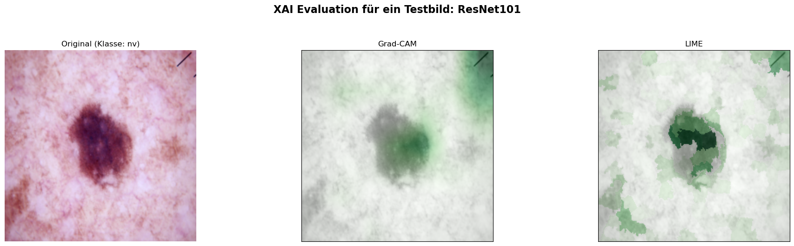

# Thesis - Vertrauen durch Validierung

**Eine quantitative Evaluation der Robustheit und Erklärungstreue von XAI-Methoden bei der dermatologischen Bildklassifikation auf dem HAM10000-Datensatz.**

Dieses Notebook demonstriert die gesamte experimentelle Pipeline der Bachelorarbeit: Vom Laden und Aufbereiten der dermatologischen Bilddaten über das Training der Convolutional Neural Networks (ResNet-101 und MobileNetV3) bis hin zur abschließenden quantitativen Evaluation der Explainable AI (XAI) Methoden LIME und Grad-CAM mithilfe des Quantus-Frameworks.

## 0. Installation
In diesem Schritt werden alle benötigten Bibliotheken und Abhängigkeiten installiert. Neben den Standard-Bibliotheken für Deep Learning (PyTorch) werden hier insbesondere captum für die Erklärungsgenerierung sowie quantus für die quantitative Validierung der XAI-Methoden benötigt


```python
# Führe diese Zelle nur aus, wenn die Pakete noch nicht installiert sind.
# Das Flag -q sorgt dafür, dass der Output nicht das ganze Notebook überflutet.

# Tipp: Eine eigene Umgebung dafür erstellen. Im Anaconda Prompt folgende Befehle ausführen:
#  - conda create --name thesis_env python=3.11 -y
#  - conda activate ml_env
#  - conda install ipykernel -y
#  - python -m ipykernel install --user --name thesis_env --display-name "cb thesis env"

# 1. Alle großen "schweren" Pakete über Conda installieren. 
# Das ! erlaubt den Terminal-Befehl im Notebook und das -y bestätigt die Installation automatisch.
#!conda install -y -c pytorch -c nvidia -c conda-forge pytorch torchvision pytorch-cuda=12.4 pandas "numpy<2.0" seaborn matplotlib ipywidgets scikit-learn scikit-image imbalanced-learn captum

# 2. Nur spezielle Pakete (wie quantus), die es bei Conda oft nicht gibt, über pip installieren:
#%pip install quantus
```


```python
# 1. Python Standardbibliotheken
import os

os.environ["KMP_DUPLICATE_LIB_OK"] = "TRUE"

import copy
import time
from collections import Counter

# 2. Drittanbieter-Bibliotheken (Datenverarbeitung & Machine Learning)
import numpy as np
import pandas as pd

from imblearn.over_sampling import RandomOverSampler
from PIL import Image
from skimage.segmentation import slic, mark_boundaries
from skimage import color
from sklearn.metrics import accuracy_score, classification_report, f1_score, precision_score, confusion_matrix
from sklearn.model_selection import train_test_split
from sklearn.preprocessing import LabelEncoder
import matplotlib.pyplot as plt
import seaborn as sns

# 3. PyTorch (Deep Learning)
import torch
import torch.nn as nn
import torch.nn.functional as F
import torch.optim as optim
from torch.utils.data import DataLoader, Dataset, Subset
from torchvision import models, transforms
from torchvision.models import MobileNet_V3_Large_Weights

# 4. Explainable AI (XAI)
import quantus
from captum._utils.models.linear_model import SkLearnLinearRegression
from captum.attr import LayerGradCam, Lime, visualization as viz
```


```python
# Globale Konstanten & Pfade

# Den HAM10000-Datensatz unter https://dataverse.harvard.edu/dataset.xhtml?persistentId=doi:10.7910/DVN/DBW86T runterladen, entpacken
# und an die entsprechenden stellen kopieren und evntl. die folgenden Pfade anpassen.
METADATA_PATH = "./HAM10000_metadata.csv"
IMAGE_DIR = "./images/"

# Modell-Pfade
MODEL_RESNET101_FILE_PATH = "./ham10000_model_resnet101.pth"
MODEL_MOBILE_NET_V3_FILE_PATH = "./ham10000_model_mobilenet_v3.pth" 

# Device Konfiguration
device = torch.device("cuda" if torch.cuda.is_available() else "cpu")
print(f"Aktuell verwendetes Gerät: {device}")
```

    Aktuell verwendetes Gerät: cuda
    

## 1. HAM10000 Datensatz
Als standardisierte Datengrundlage für diese Arbeit dient der HAM10000-Datensatz (Human Against Machine with 10000 training images). Er umfasst über 10.000 dermatoskopische Bilder der sieben häufigsten pigmentierten Hautläsionen und dient als etablierter Benchmark für KI-Diagnosesysteme in der Dermatologie.

### Bilddaten laden
Zunächst werden die Bilddaten sowie die dazugehörigen Metadaten (Diagnosen) aus dem Dateisystem in einen strukturierten Pandas-DataFrame geladen.


```python
 # Wir laden die Metadaten-Datei, die Labels und Bild-IDs enthält.
df = pd.read_csv(METADATA_PATH)

# Erstellen des vollen Pfades zu den Bildern, damit wir sie später laden können
# Wir fügen '.jpg' an die image_id an.
df['path'] = df['image_id'].apply(lambda x: os.path.join(IMAGE_DIR, f"{x}.jpg"))

df.head()
```


<div>
<style scoped>
    .dataframe tbody tr th:only-of-type {
        vertical-align: middle;
    }

    .dataframe tbody tr th {
        vertical-align: top;
    }

    .dataframe thead th {
        text-align: right;
    }
</style>
<table border="1" class="dataframe">
  <thead>
    <tr style="text-align: right;">
      <th></th>
      <th>lesion_id</th>
      <th>image_id</th>
      <th>dx</th>
      <th>dx_type</th>
      <th>age</th>
      <th>sex</th>
      <th>localization</th>
      <th>dataset</th>
      <th>path</th>
    </tr>
  </thead>
  <tbody>
    <tr>
      <th>0</th>
      <td>HAM_0000118</td>
      <td>ISIC_0027419</td>
      <td>bkl</td>
      <td>histo</td>
      <td>80.0</td>
      <td>male</td>
      <td>scalp</td>
      <td>vidir_modern</td>
      <td>./images/ISIC_0027419.jpg</td>
    </tr>
    <tr>
      <th>1</th>
      <td>HAM_0000118</td>
      <td>ISIC_0025030</td>
      <td>bkl</td>
      <td>histo</td>
      <td>80.0</td>
      <td>male</td>
      <td>scalp</td>
      <td>vidir_modern</td>
      <td>./images/ISIC_0025030.jpg</td>
    </tr>
    <tr>
      <th>2</th>
      <td>HAM_0002730</td>
      <td>ISIC_0026769</td>
      <td>bkl</td>
      <td>histo</td>
      <td>80.0</td>
      <td>male</td>
      <td>scalp</td>
      <td>vidir_modern</td>
      <td>./images/ISIC_0026769.jpg</td>
    </tr>
    <tr>
      <th>3</th>
      <td>HAM_0002730</td>
      <td>ISIC_0025661</td>
      <td>bkl</td>
      <td>histo</td>
      <td>80.0</td>
      <td>male</td>
      <td>scalp</td>
      <td>vidir_modern</td>
      <td>./images/ISIC_0025661.jpg</td>
    </tr>
    <tr>
      <th>4</th>
      <td>HAM_0001466</td>
      <td>ISIC_0031633</td>
      <td>bkl</td>
      <td>histo</td>
      <td>75.0</td>
      <td>male</td>
      <td>ear</td>
      <td>vidir_modern</td>
      <td>./images/ISIC_0031633.jpg</td>
    </tr>
  </tbody>
</table>
</div>


```python
#Encoding Labels
label_encoder = LabelEncoder()

df['label'] = label_encoder.fit_transform(df['dx'])

# Display the mapping between original labels and encoded labels
label_mapping = {klasse: int(wert) for klasse, wert in zip(label_encoder.classes_, label_encoder.transform(label_encoder.classes_))}
print("Label Encoding Mapping:")
print(label_mapping)
```

    Label Encoding Mapping:
    {'akiec': 0, 'bcc': 1, 'bkl': 2, 'df': 3, 'mel': 4, 'nv': 5, 'vasc': 6}
    

### Datensplit
Die Daten werden strikt in Trainings-, Validierungs- und Testdatensätze unterteilt. Das Modell lernt die Merkmale auf den Trainingsdaten und optimiert seine Hyperparameter auf den Validierungsdaten. Der Testdatensatz wird vollständig separiert und dient später als Grundlage für die XAI-Evaluation, da Erklärungen zwingend an ungesehenen Daten getestet werden müssen.


```python
X = df.drop(columns=['label'])
y = df['label']

# 1. Testdatensatz abspalten (ca. 15% -> entspricht Sangwans 1500 Bildern)
# WICHTIG: "Stratified sampling was employed".
# Das erreichen wir durch den Parameter 'stratify=y'.
X_temp, X_test, y_temp, y_test = train_test_split(
    X,
    y,
    test_size=0.15,  # Entspricht split_rate = 0.25 ??? RELLAY?
    stratify=y,  # Garantiert gleiche Klassenverteilung
    random_state=42  # Wichtig für Reproduzierbarkeit
)


# 2. Den Rest (85%) in Training und Validierung aufteilen (75-25 Split)
# Sangwan nutzt eine split_rate von 0.25 auf den verbleibenden Daten
X_train, X_val, y_train, y_val = train_test_split(
    X_temp, y_temp,
    test_size=0.25,
    stratify=y_temp,
    random_state=42
)
```

### Oversampling
Ein charakteristisches Merkmal des HAM10000-Datensatzes ist seine starke Klassenimbalance. Während gutartige melanozytäre Nävi stark überrepräsentiert sind (ca. 67 % der Daten), sind andere Klassen (wie Dermatofibrome) nur in geringer Zahl vorhanden. Um zu verhindern, dass das Modell einen Bias zugunsten der Mehrheitsklasse entwickelt, wird hier ein Oversampling-Verfahren angewendet, das sich an der Methodik von Sangwan (2024) orientiert. (GIT-Quelle: https://github.com/HardikSangwan/thesis_diagnostics_skin/tree/main)


```python
# 1. Wie viele Bilder pro Klasse sind AKTUELL in y_train?
train_counts = Counter(y_train)
majority_class_count = max(train_counts.values())

# 2. Dynamische Strategie nach Sangwans "Max 300% Increase" Regel berechnen
dynamic_strategy = {}
for cls, count in train_counts.items():
    # Wir vervierfachen die Minderheitsklassen (Original + 300% Increase) (Sangwan)
    # aber wir deckeln es bei der Größe der Mehrheitsklasse, damit keine Klasse 
    # größer wird als die Mehrheitsklasse.
    target_count = min(count * 4, majority_class_count)
    dynamic_strategy[cls] = target_count

# 3. Den Sampler mit der dynamischen Strategie anwenden
oversample = RandomOverSampler(sampling_strategy=dynamic_strategy, random_state=42)
X_train_oversampled, y_train_oversampled = oversample.fit_resample(X_train, y_train)

y_train_oversampled_text = label_encoder.inverse_transform(y_train_oversampled)
print(f"Verteilung nach Sangwan-Oversampling: {Counter(y_train_oversampled_text)}")
```

    Verteilung nach Sangwan-Oversampling: Counter({'nv': 4274, 'mel': 2836, 'bkl': 2804, 'bcc': 1312, 'akiec': 836, 'vasc': 360, 'df': 292})
    

### HAM10000Dataset Klasse
Hier definieren wir eine benutzerdefinierte PyTorch-Dataset-Klasse, die das effiziente Laden der Bilder, das Zuordnen der Labels und die spätere Übergabe an den DataLoader übernimmt.


```python
class HAM10000Dataset(Dataset):
    def __init__(self, file_paths, labels, transform=None):
        # Wir wandeln die Pandas Series in Numpy-Arrays um für schnelleren Zugriff
        self.file_paths = file_paths.values
        self.labels = labels.values
        self.transform = transform

    def __len__(self):
        return len(self.file_paths)

    def __getitem__(self, idx):
        # 1. Bildpfad holen und Bild laden
        img_path = self.file_paths[idx]
        image = Image.open(img_path).convert("RGB")

        # 2. Augmentierung anwenden (falls vorhanden)
        if self.transform:
            image = self.transform(image)

        # 3. Label holen. Es ist BEREITS eine Zahl, also direkt in einen Tensor packen!
        label = torch.tensor(self.labels[idx], dtype=torch.long)

        return image, label

```

## 2. Datenaufbereitung
Tiefe neuronale Netze reagieren sensibel auf unvorbereitete Rohdaten. In diesem Abschnitt werden die Bilder standardisiert und durch Data Augmentation (Datenaugmentierung) künstlich variiert, um die Generalisierungsfähigkeit der Modelle zu verbessern.

### Augmentierungs-Pipeline erstellen
Mithilfe der ```torchvision.transforms```-Pipeline werden die Bilder auf eine einheitliche Größe (z. B. 224x224 Pixel) skaliert und normalisiert. Für die Trainingsdaten werden zusätzlich zufällige Transformationen (wie Rotationen und Spiegelungen) angewendet, um Overfitting vorzubeugen und das Modell robuster zu machen.


```python
"""
Erstellt die Augmentierungs-Pipeline für das Training basierend auf Sangwan (2024).
Enthält: Resize, Normalize, Random Shifts, Flips, Zooms, Shears, Brightness.
"""
train_data_image_transformer = transforms.Compose([
    transforms.Resize((224, 224)),
    # Sangwan-spezifische Augmentations:
    transforms.RandomHorizontalFlip(p=0.5),
    transforms.RandomVerticalFlip(p=0.5),

    transforms.ColorJitter(brightness=0.5, contrast=0.1, hue=0.08),  # Helligkeit/Farbe
    transforms.RandomAffine(degrees=0, shear=15),  # Scherung & Zoom
    
    transforms.ToTensor(),
    transforms.Normalize([0.485, 0.456, 0.406], [0.229, 0.224, 0.225])
])

"""
Transformationen für die Validierung/Tests.
KEINE Augmentierung (kein Flip/Shear), nur Resize und Normalize.
"""
validation_data_image_transformer = transforms.Compose([
    transforms.Resize((224, 224)),
    transforms.ToTensor(),
    transforms.Normalize(mean=[0.485, 0.456, 0.406],
                         std=[0.229, 0.224, 0.225])
])

```

### Beispiel-Visualisierung der Augmentierungs-Pipeline


```python
# Wir nehmen einfach den ersten Pfad aus deinem Datensatz (oder du wählst einen spezifischen Index)
sample_image_path = X_train_oversampled['path'].iloc[1] 
original_image = Image.open(sample_image_path).convert('RGB')

# --- 3. Plot mit Original und Variationen erstellen ---
num_variations = 5  # Wie viele augmentierte Bilder gezeigt werden sollen
fig, axes = plt.subplots(1, num_variations + 1, figsize=(18, 4))

# Originalbild anzeigen (nur auf 224x224 skaliert für einen fairen Vergleich)
resize_only = transforms.Resize((224, 224))
axes[0].imshow(resize_only(original_image))
axes[0].set_title("Original (nur Resized)", fontsize=12)
axes[0].axis('off')

# Augmentierte Versionen generieren und anzeigen
for i in range(1, num_variations + 1):
    # Durch den Aufruf von viz_transformer() werden die Zufallsoperationen jedes Mal neu berechnet
    aug_image = train_data_image_transformer(original_image)
    aug_image = aug_image.detach().cpu().permute(1, 2, 0).numpy()
    # Farben für Matplotlib in den Bereich [0, 1] zwingen , da die Bilder durch das normalize aus der 
    # Augmentierungspipline sonst nicht "menschlich" dargstellt werden.
    aug_image = (aug_image - aug_image.min()) / (aug_image.max() - aug_image.min() + 1e-8)

    axes[i].imshow(aug_image)
    axes[i].set_title(f"Augmentierung {i}", fontsize=12)
    axes[i].axis('off')

# Layout anpassen, damit die Bilder schön nebeneinander stehen
plt.tight_layout()
plt.show()
```


    

    


### Erstelle Datasets and loader
Die aufbereiteten Pipelines werden nun an die PyTorch-DataLoader übergeben, welche die Bilder für den Trainingsprozess in ressourcenschonende Batches unterteilen. (evtl. nochmal übberarbeiten wegen der Bachtes-Aussage)


```python
train_dataset = HAM10000Dataset(
    X_train_oversampled['path'],
    y_train_oversampled,
    transform=train_data_image_transformer  # Deine Augmentierung
)

val_dataset = HAM10000Dataset(
    X_val['path'],
    y_val,
    transform=validation_data_image_transformer  # Nur Resize/Normalize
)

test_dataset = HAM10000Dataset(
    X_test['path'],
    y_test,
    transform=validation_data_image_transformer  # Nur Resize/Normalize
)

train_loader = DataLoader(train_dataset, batch_size=32, shuffle=True) # nur 32 Batchsize... sind das nicht zu wenig... wie funktioniert das?
val_loader = DataLoader(val_dataset, batch_size=32, shuffle=False)
test_loader = DataLoader(test_dataset, batch_size=32, shuffle=False)

```

## 3. Modelle erstellen
Um sicherzustellen, dass die XAI-Evaluation architekturübergreifend gültig ist und den Trade-off zwischen maximaler Performance und klinischer Effizienz abbildet, werden in dieser Arbeit zwei grundlegend unterschiedliche State-of-the-Art-Modelle implementiert: ResNet-101 und MobileNetV3. Da der Datensatz für ein Training von Grund auf nicht ausreicht, wird bei beiden Modellen auf Transfer Learning (vortrainierte ImageNet-Gewichte) zurückgegriffen.

### Resnet101 erstellen
Das ResNet-101 (Residual Network) repräsentiert in dieser Arbeit den massiven, parameterreichen Ansatz. Durch die Nutzung von "Shortcut-Connections" löst es das Problem der verschwindenden Gradienten und ermöglicht das Training extrem tiefer Netze. Es ist auf maximale Repräsentationskraft und höchste Klassifikationsgenauigkeit ausgelegt.


```python
# 1. ResNet101 laden (Standard für Transfer Learning in der Literatur)
# Sangwan (2024) nutzt ResNet (ResNet50 und ResNet101)
resNet101Model = models.resnet101(weights=models.ResNet101_Weights.IMAGENET1K_V2)

# Anzahl der Eingangs-Features holen (bei ResNet50 sind das 2048)
num_ftrs = resNet101Model.fc.in_features

# Den Classifier ersetzen => sangwan pseudocode
resNet101Model.fc = nn.Sequential(
    nn.Linear(num_ftrs, 512),  # Reduktion der Dimension
    nn.ReLU(),  # Nicht-Linearität
    nn.Dropout(0.5),  # WICHTIG: Gegen Overfitting (siehe Sangwan)
    nn.Linear(512, 7)  # Output: 7 Klassen für HAM10000
)
```

### MobileNetV3 erstellen
Im direkten Kontrast dazu steht das MobileNetV3. Diese Architekturfamilie wurde speziell für den Einsatz auf ressourcenbeschränkten, mobilen Geräten entwickelt (z. B. für Smartphone-Dermatoskope am Patientenbett). Es nutzt effiziente tiefenweise separierbare Faltungen (Depthwise Separable Convolutions) und Attention-Module (Squeeze-and-Excitation), um mit einem Bruchteil der Parameter auszukommen. (Viel zu kompliziert!!!)


```python
mobileNetV3Model = models.mobilenet_v3_large(weights=MobileNet_V3_Large_Weights.IMAGENET1K_V1)

# Den Classifier inspizieren und anpassen
# Der Classifier ist ein nn.Sequential Block.
# Struktur meist:
# (0): Linear (...)
# (1): Hardswish()
# (2): Dropout(...)
# (3): Linear (in_features=1280, out_features=1000)  
# Wir greifen auf die letzte Schicht zu
last_layer_index = len(mobileNetV3Model.classifier) - 1
in_features = mobileNetV3Model.classifier[last_layer_index].in_features

# Um Overfitting bei den relativ kleinen medizinischen Daten zu vermeiden,
# Dropout anpassen Hossain et al. (2024)
mobileNetV3Model.classifier[last_layer_index - 1] = nn.Dropout(p=0.3, inplace=True)

# Letzte Schicht auf 7 Klassen (HAM10000) anpassen
mobileNetV3Model.classifier[last_layer_index] = nn.Linear(in_features, 7)
```

## 4. Modelle trainieren
In diesem Schritt erfolgt das eigentliche Fine-Tuning der beiden Modelle. Die obersten Klassifikationsschichten der vortrainierten Netzwerke wurden auf die 7 Läsionsklassen des HAM10000-Datensatzes angepasst. Optimiert wird mit dem Adam-Optimizer und der Categorical Cross-Entropy als Verlustfunktion.

(Hinweis: Der Code-Block für das Training ist standardmäßig auskommentiert, da das Training auf einer Standard-Hardware mehrere Stunden in Anspruch nehmen kann. Die trainierten Gewichte werden stattdessen im nächsten Schritt geladen)


```python
def fit(model, train_loader, val_loader, title, num_epochs=100, learning_rate=0.00001, early_stop_patience=10):
    """
    Implementierung der Trainingsschleife basierend auf Sangwan (2024).
    Nutzt Adam Optimizer und ReduceLROnPlateau.
    """
    # Definition der Loss-Funktion: "Categorical Cross Entropy"
    criterion = nn.CrossEntropyLoss()

    # WICHTIG: Wir übergeben dem Optimierer NUR die Parameter, die aufgetaut sind!
    trainable_params = filter(lambda p: p.requires_grad, model.parameters())
    
    # Definition des Optimizers: "Adam"
    # Wir optimieren nur die Parameter, die requires_grad=True haben (unser neuer Classifier Head).
    # „Für das Training des Klassifikators wurde der Adam-Optimizer gewählt. Im Gegensatz zum klassischen Stochastic Gradient Descent (SGD)
    # nutzt Adam adaptive Lernraten, was in der Literatur (Kingma & Ba, 2014) und in der Referenzstudie von Sangwan (2024) mit einer
    # schnelleren Konvergenz des Modells begründet wird.“
    optimizer = optim.Adam(trainable_params, lr=learning_rate)

    # Learning Rate Scheduler: "Reduce on plateau was used"
    # Reduziert die Lernrate, wenn der Validation-Loss nicht mehr sinkt.
    scheduler = optim.lr_scheduler.ReduceLROnPlateau(optimizer, mode='min', factor=0.5, patience=2)

    model = model.to(device)

    best_model_wts = copy.deepcopy(model.state_dict())
    best_acc = 0.0
    best_precision = 0.0
    best_f1 = 0.0
    epochs_no_improve = 0
    
    print(f"Starte Training auf Gerät: {device} für {title}")
    
    for epoch in range(num_epochs):
        print(f'Epoch {epoch + 1}/{num_epochs}')
        print('-' * 10)

        # Jede Epoche hat eine Trainings- und eine Validierungsphase
        for phase in ['train', 'val']:
            if phase == 'train':
                model.train()  # Modell in Trainingsmodus setzen
                dataloader = train_loader
            else:
                model.eval()  # Modell in Evaluierungsmodus setzen
                dataloader = val_loader

            running_loss = 0.0
            running_corrects = 0
            
            # Listen zum Sammeln aller Vorhersagen und Labels dieser Epoche
            all_preds = []
            all_labels = []

            # Iteration über die Daten
            for inputs, labels in dataloader:
                inputs = inputs.to(device)
                labels = labels.to(device)

                # Parameter-Gradienten auf Null setzen
                optimizer.zero_grad()
                # Forward Pass
                # Nur im Trainings-Modus Gradienten berechnen (spart Speicher bei Val)
                with torch.set_grad_enabled(phase == 'train'):
                    outputs = model(inputs)
                    _, preds = torch.max(outputs, 1)
                    loss = criterion(outputs, labels)

                    # Backward Pass und Optimierung nur in der Trainingsphase
                    if phase == 'train':
                        loss.backward()
                        optimizer.step()
                        
                # echtes lernen nur bis hier
                # --------------------------------------
                # Statistiken sammeln
                running_loss += loss.item() * inputs.size(0)
                running_corrects += torch.sum(preds == labels.data)

                # Daten für Precision sammeln (auf CPU verschieben für scikit-learn)
                all_preds.extend(preds.cpu().numpy())
                all_labels.extend(labels.cpu().numpy())

            epoch_loss = running_loss / len(dataloader.dataset)
            epoch_acc = running_corrects.double() / len(dataloader.dataset)

            # Precision berechnen
            # average='weighted': Berücksichtigt das Ungleichgewicht der Klassen
            # zero_division=0: Verhindert Abstürze, falls eine Klasse gar nicht vorhergesagt wurde
            epoch_precision = precision_score(all_labels, all_preds, average='weighted', zero_division=0)
            epoch_f1 = f1_score(all_labels, all_preds, average='weighted', zero_division=0)
            print(f'{phase} Loss: {epoch_loss:.4f} Acc: {epoch_acc:.4f} Precision: {epoch_precision:.4f} F1-Score: {epoch_f1:.4f}')

            # Deep Copy des Modells, wenn es das beste bisher ist (basierend auf Val-Acc)
            if phase == 'val':
                scheduler.step(epoch_loss)  # Update Learning Rate basierend auf Val-Loss
                if epoch_acc > best_acc:
                    best_acc = epoch_acc
                    best_precision = epoch_precision
                    best_f1 = epoch_f1
                    best_model_wts = copy.deepcopy(model.state_dict())
                    epochs_no_improve = 0  # Counter zurücksetzen
                    print("Neues bestes Modell gespeichert!")
                else:
                    # Keine Verbesserung
                    epochs_no_improve += 1
                    print(f"Keine Verbesserung seit {epochs_no_improve} Epoche(n).")

        print()
        # --- Early Stopping Abbruchbedingung prüfen ---
        if epochs_no_improve >= early_stop_patience:
            print(f"Early Stopping ausgelöst! Keine Verbesserung der Validation Accuracy über {early_stop_patience} aufeinanderfolgende Epochen.")
            break # Bricht die äußere Epochen-Schleife ab

    print(f'Best Val Acc: {best_acc:.4f} Precision: {best_precision:.4f} F1-Score: {best_f1:.4f}')

    # Das beste Modell laden und zurückgeben
    model.load_state_dict(best_model_wts)
    return model
```

#### Modell MobileNetV3 trainieren
Vorsicht: Folgender Aufruf ist sehr zeitintensiv. (mehrere Stunden)


```python
#Komplettes Netz einfrieren, nur Classifier auftauen!
for param in mobileNetV3Model.parameters():
    param.requires_grad = False
    
for param in mobileNetV3Model.classifier.parameters():
    param.requires_grad = True
    
mobileNetV3Model = fit(
    model=mobileNetV3Model, 
    train_loader=train_loader, 
    val_loader=val_loader, 
    title="MobileNetV3 Phase 1 (Warm-Up Kopf)", 
    num_epochs=20,             # Nur kurzes Aufwärmen
    learning_rate=0.001,       
    early_stop_patience=5      # Kann hier sehr kurz sein
)

print("\nEntfriere das gesamte Netzwerk für das Fine-Tuning...")

# Nur das letzte Viertel des Netzwerks auftauen!
# PyTorch's MobileNetV3 hat die Faltungsschichten im Block 'features'.
# Wir tauen nur die letzten 4 Blöcke auf (Index -4 bis Ende), der Rest bleibt sicher eingefroren!
for param in mobileNetV3Model.features[-4:].parameters():
    param.requires_grad = True

# Wir tauen nun das gesamte Netzwerk auf, um die tieferen Schichten an die 
# spezifischen Hautkrebs-Merkmale anzupassen ("and then all layers were trained 
# to fine-tune the models" - Alfi et al., 2022).
for param in mobileNetV3Model.parameters():
    param.requires_grad = True

# Jetzt starten wir das eigentliche lange Training. 
# WICHTIG: Die Lernrate MUSS jetzt mikroskopisch klein sein, da wir das 
# Netz nur "feinjustieren" und nicht aus dem Konzept bringen wollen!
mobileNetV3Model = fit(
    model=mobileNetV3Model, 
    train_loader=train_loader, 
    val_loader=val_loader, 
    title="MobileNetV3 Phase 2 (Full Fine-Tuning)", 
    num_epochs=50,             # Jetzt dürfen es mehr Epochen sein
    learning_rate=1e-5,        # extrem wichtig für Fine-Tuning!
    early_stop_patience=10     # Jetzt greift das eigentliche Early Stopping
)

torch.save(mobileNetV3Model.state_dict(), MODEL_MOBILE_NET_V3_FILE_PATH)
```

    Starte Training auf Gerät: cuda für MobileNetV3 Phase 1 (Warm-Up Kopf)
    Epoch 1/20
    ----------
    train Loss: 0.9196 Acc: 0.6465 Precision: 0.6434 F1-Score: 0.6434
    val Loss: 0.7042 Acc: 0.7486 Precision: 0.7698 F1-Score: 0.7515
    Neues bestes Modell gespeichert!
    
    Epoch 2/20
    ----------
    train Loss: 0.8394 Acc: 0.6825 Precision: 0.6815 F1-Score: 0.6813
    val Loss: 0.7452 Acc: 0.7298 Precision: 0.7711 F1-Score: 0.7444
    Keine Verbesserung seit 1 Epoche(n).
    
    Epoch 3/20
    ----------
    train Loss: 0.8027 Acc: 0.6886 Precision: 0.6875 F1-Score: 0.6873
    val Loss: 0.6866 Acc: 0.7514 Precision: 0.7839 F1-Score: 0.7599
    Neues bestes Modell gespeichert!
    
    Epoch 4/20
    ----------
    train Loss: 0.7593 Acc: 0.7092 Precision: 0.7086 F1-Score: 0.7086
    val Loss: 0.7051 Acc: 0.7486 Precision: 0.7880 F1-Score: 0.7622
    Keine Verbesserung seit 1 Epoche(n).
    
    Epoch 5/20
    ----------
    train Loss: 0.7383 Acc: 0.7184 Precision: 0.7179 F1-Score: 0.7178
    val Loss: 0.7061 Acc: 0.7566 Precision: 0.7781 F1-Score: 0.7571
    Neues bestes Modell gespeichert!
    
    Epoch 6/20
    ----------
    train Loss: 0.6993 Acc: 0.7303 Precision: 0.7302 F1-Score: 0.7300
    val Loss: 0.7202 Acc: 0.7350 Precision: 0.7931 F1-Score: 0.7533
    Keine Verbesserung seit 1 Epoche(n).
    
    Epoch 7/20
    ----------
    train Loss: 0.6124 Acc: 0.7678 Precision: 0.7679 F1-Score: 0.7677
    val Loss: 0.6365 Acc: 0.7721 Precision: 0.7854 F1-Score: 0.7757
    Neues bestes Modell gespeichert!
    
    Epoch 8/20
    ----------
    train Loss: 0.5900 Acc: 0.7741 Precision: 0.7743 F1-Score: 0.7740
    val Loss: 0.6517 Acc: 0.7679 Precision: 0.7853 F1-Score: 0.7731
    Keine Verbesserung seit 1 Epoche(n).
    
    Epoch 9/20
    ----------
    train Loss: 0.5693 Acc: 0.7801 Precision: 0.7799 F1-Score: 0.7798
    val Loss: 0.6435 Acc: 0.7768 Precision: 0.7947 F1-Score: 0.7837
    Neues bestes Modell gespeichert!
    
    Epoch 10/20
    ----------
    train Loss: 0.5368 Acc: 0.7963 Precision: 0.7961 F1-Score: 0.7961
    val Loss: 0.7028 Acc: 0.7594 Precision: 0.7957 F1-Score: 0.7709
    Keine Verbesserung seit 1 Epoche(n).
    
    Epoch 11/20
    ----------
    train Loss: 0.4926 Acc: 0.8158 Precision: 0.8159 F1-Score: 0.8157
    val Loss: 0.6322 Acc: 0.7801 Precision: 0.7949 F1-Score: 0.7853
    Neues bestes Modell gespeichert!
    
    Epoch 12/20
    ----------
    train Loss: 0.4909 Acc: 0.8157 Precision: 0.8160 F1-Score: 0.8158
    val Loss: 0.6500 Acc: 0.7749 Precision: 0.7907 F1-Score: 0.7804
    Keine Verbesserung seit 1 Epoche(n).
    
    Epoch 13/20
    ----------
    train Loss: 0.4800 Acc: 0.8202 Precision: 0.8205 F1-Score: 0.8202
    val Loss: 0.6354 Acc: 0.7744 Precision: 0.7918 F1-Score: 0.7793
    Keine Verbesserung seit 2 Epoche(n).
    
    Epoch 14/20
    ----------
    train Loss: 0.4694 Acc: 0.8236 Precision: 0.8238 F1-Score: 0.8236
    val Loss: 0.6161 Acc: 0.7852 Precision: 0.7964 F1-Score: 0.7896
    Neues bestes Modell gespeichert!
    
    Epoch 15/20
    ----------
    train Loss: 0.4555 Acc: 0.8294 Precision: 0.8296 F1-Score: 0.8294
    val Loss: 0.6232 Acc: 0.7796 Precision: 0.7909 F1-Score: 0.7833
    Keine Verbesserung seit 1 Epoche(n).
    
    Epoch 16/20
    ----------
    train Loss: 0.4577 Acc: 0.8280 Precision: 0.8280 F1-Score: 0.8279
    val Loss: 0.6211 Acc: 0.7876 Precision: 0.7998 F1-Score: 0.7911
    Neues bestes Modell gespeichert!
    
    Epoch 17/20
    ----------
    train Loss: 0.4414 Acc: 0.8366 Precision: 0.8367 F1-Score: 0.8365
    val Loss: 0.6141 Acc: 0.7871 Precision: 0.7956 F1-Score: 0.7904
    Keine Verbesserung seit 1 Epoche(n).
    
    Epoch 18/20
    ----------
    train Loss: 0.4358 Acc: 0.8377 Precision: 0.8378 F1-Score: 0.8376
    val Loss: 0.6504 Acc: 0.7740 Precision: 0.7979 F1-Score: 0.7822
    Keine Verbesserung seit 2 Epoche(n).
    
    Epoch 19/20
    ----------
    train Loss: 0.4298 Acc: 0.8381 Precision: 0.8383 F1-Score: 0.8382
    val Loss: 0.6580 Acc: 0.7824 Precision: 0.8035 F1-Score: 0.7903
    Keine Verbesserung seit 3 Epoche(n).
    
    Epoch 20/20
    ----------
    train Loss: 0.4261 Acc: 0.8445 Precision: 0.8447 F1-Score: 0.8445
    val Loss: 0.6043 Acc: 0.7862 Precision: 0.7876 F1-Score: 0.7864
    Keine Verbesserung seit 4 Epoche(n).
    
    Best Val Acc: 0.7876 Precision: 0.7998 F1-Score: 0.7911
    
    Entfriere das gesamte Netzwerk für das Fine-Tuning...
    Starte Training auf Gerät: cuda für MobileNetV3 Phase 2 (Full Fine-Tuning)
    Epoch 1/50
    ----------
    train Loss: 0.4115 Acc: 0.8490 Precision: 0.8491 F1-Score: 0.8489
    val Loss: 0.5871 Acc: 0.7998 Precision: 0.8074 F1-Score: 0.8022
    Neues bestes Modell gespeichert!
    
    Epoch 2/50
    ----------
    train Loss: 0.3795 Acc: 0.8602 Precision: 0.8603 F1-Score: 0.8601
    val Loss: 0.5648 Acc: 0.8102 Precision: 0.8154 F1-Score: 0.8118
    Neues bestes Modell gespeichert!
    
    Epoch 3/50
    ----------
    train Loss: 0.3490 Acc: 0.8709 Precision: 0.8710 F1-Score: 0.8709
    val Loss: 0.5541 Acc: 0.8106 Precision: 0.8123 F1-Score: 0.8099
    Neues bestes Modell gespeichert!
    
    Epoch 4/50
    ----------
    train Loss: 0.3158 Acc: 0.8844 Precision: 0.8844 F1-Score: 0.8843
    val Loss: 0.5443 Acc: 0.8177 Precision: 0.8233 F1-Score: 0.8192
    Neues bestes Modell gespeichert!
    
    Epoch 5/50
    ----------
    train Loss: 0.3117 Acc: 0.8878 Precision: 0.8879 F1-Score: 0.8878
    val Loss: 0.5354 Acc: 0.8210 Precision: 0.8239 F1-Score: 0.8211
    Neues bestes Modell gespeichert!
    
    Epoch 6/50
    ----------
    train Loss: 0.2973 Acc: 0.8948 Precision: 0.8950 F1-Score: 0.8948
    val Loss: 0.5285 Acc: 0.8214 Precision: 0.8232 F1-Score: 0.8212
    Neues bestes Modell gespeichert!
    
    Epoch 7/50
    ----------
    train Loss: 0.2776 Acc: 0.9012 Precision: 0.9013 F1-Score: 0.9012
    val Loss: 0.5296 Acc: 0.8238 Precision: 0.8244 F1-Score: 0.8226
    Neues bestes Modell gespeichert!
    
    Epoch 8/50
    ----------
    train Loss: 0.2818 Acc: 0.8992 Precision: 0.8993 F1-Score: 0.8993
    val Loss: 0.5229 Acc: 0.8252 Precision: 0.8278 F1-Score: 0.8253
    Neues bestes Modell gespeichert!
    
    Epoch 9/50
    ----------
    train Loss: 0.2588 Acc: 0.9076 Precision: 0.9078 F1-Score: 0.9076
    val Loss: 0.5184 Acc: 0.8313 Precision: 0.8327 F1-Score: 0.8305
    Neues bestes Modell gespeichert!
    
    Epoch 10/50
    ----------
    train Loss: 0.2435 Acc: 0.9136 Precision: 0.9138 F1-Score: 0.9136
    val Loss: 0.5129 Acc: 0.8304 Precision: 0.8310 F1-Score: 0.8294
    Keine Verbesserung seit 1 Epoche(n).
    
    Epoch 11/50
    ----------
    train Loss: 0.2424 Acc: 0.9154 Precision: 0.9154 F1-Score: 0.9154
    val Loss: 0.5113 Acc: 0.8355 Precision: 0.8351 F1-Score: 0.8341
    Neues bestes Modell gespeichert!
    
    Epoch 12/50
    ----------
    train Loss: 0.2281 Acc: 0.9188 Precision: 0.9189 F1-Score: 0.9188
    val Loss: 0.5066 Acc: 0.8402 Precision: 0.8396 F1-Score: 0.8384
    Neues bestes Modell gespeichert!
    
    Epoch 13/50
    ----------
    train Loss: 0.2206 Acc: 0.9241 Precision: 0.9242 F1-Score: 0.9241
    val Loss: 0.5036 Acc: 0.8426 Precision: 0.8405 F1-Score: 0.8403
    Neues bestes Modell gespeichert!
    
    Epoch 14/50
    ----------
    train Loss: 0.2064 Acc: 0.9291 Precision: 0.9291 F1-Score: 0.9291
    val Loss: 0.5038 Acc: 0.8416 Precision: 0.8387 F1-Score: 0.8390
    Keine Verbesserung seit 1 Epoche(n).
    
    Epoch 15/50
    ----------
    train Loss: 0.2121 Acc: 0.9269 Precision: 0.9268 F1-Score: 0.9268
    val Loss: 0.5001 Acc: 0.8388 Precision: 0.8364 F1-Score: 0.8368
    Keine Verbesserung seit 2 Epoche(n).
    
    Epoch 16/50
    ----------
    train Loss: 0.2072 Acc: 0.9274 Precision: 0.9274 F1-Score: 0.9274
    val Loss: 0.4992 Acc: 0.8454 Precision: 0.8430 F1-Score: 0.8431
    Neues bestes Modell gespeichert!
    
    Epoch 17/50
    ----------
    train Loss: 0.1959 Acc: 0.9338 Precision: 0.9340 F1-Score: 0.9338
    val Loss: 0.4883 Acc: 0.8445 Precision: 0.8403 F1-Score: 0.8410
    Keine Verbesserung seit 1 Epoche(n).
    
    Epoch 18/50
    ----------
    train Loss: 0.1881 Acc: 0.9368 Precision: 0.9369 F1-Score: 0.9368
    val Loss: 0.4912 Acc: 0.8459 Precision: 0.8427 F1-Score: 0.8430
    Neues bestes Modell gespeichert!
    
    Epoch 19/50
    ----------
    train Loss: 0.1850 Acc: 0.9342 Precision: 0.9342 F1-Score: 0.9342
    val Loss: 0.4964 Acc: 0.8421 Precision: 0.8400 F1-Score: 0.8398
    Keine Verbesserung seit 1 Epoche(n).
    
    Epoch 20/50
    ----------
    train Loss: 0.1766 Acc: 0.9397 Precision: 0.9398 F1-Score: 0.9397
    val Loss: 0.4889 Acc: 0.8477 Precision: 0.8438 F1-Score: 0.8444
    Neues bestes Modell gespeichert!
    
    Epoch 21/50
    ----------
    train Loss: 0.1677 Acc: 0.9428 Precision: 0.9429 F1-Score: 0.9428
    val Loss: 0.4896 Acc: 0.8463 Precision: 0.8420 F1-Score: 0.8430
    Keine Verbesserung seit 1 Epoche(n).
    
    Epoch 22/50
    ----------
    train Loss: 0.1712 Acc: 0.9408 Precision: 0.9408 F1-Score: 0.9408
    val Loss: 0.4924 Acc: 0.8473 Precision: 0.8424 F1-Score: 0.8430
    Keine Verbesserung seit 2 Epoche(n).
    
    Epoch 23/50
    ----------
    train Loss: 0.1637 Acc: 0.9416 Precision: 0.9417 F1-Score: 0.9417
    val Loss: 0.4916 Acc: 0.8487 Precision: 0.8446 F1-Score: 0.8446
    Neues bestes Modell gespeichert!
    
    Epoch 24/50
    ----------
    train Loss: 0.1566 Acc: 0.9457 Precision: 0.9457 F1-Score: 0.9456
    val Loss: 0.4916 Acc: 0.8477 Precision: 0.8437 F1-Score: 0.8441
    Keine Verbesserung seit 1 Epoche(n).
    
    Epoch 25/50
    ----------
    train Loss: 0.1591 Acc: 0.9446 Precision: 0.9446 F1-Score: 0.9446
    val Loss: 0.4881 Acc: 0.8506 Precision: 0.8463 F1-Score: 0.8469
    Neues bestes Modell gespeichert!
    
    Epoch 26/50
    ----------
    train Loss: 0.1563 Acc: 0.9457 Precision: 0.9457 F1-Score: 0.9457
    val Loss: 0.4892 Acc: 0.8477 Precision: 0.8444 F1-Score: 0.8446
    Keine Verbesserung seit 1 Epoche(n).
    
    Epoch 27/50
    ----------
    train Loss: 0.1579 Acc: 0.9442 Precision: 0.9444 F1-Score: 0.9443
    val Loss: 0.4873 Acc: 0.8468 Precision: 0.8430 F1-Score: 0.8436
    Keine Verbesserung seit 2 Epoche(n).
    
    Epoch 28/50
    ----------
    train Loss: 0.1562 Acc: 0.9477 Precision: 0.9477 F1-Score: 0.9477
    val Loss: 0.4889 Acc: 0.8496 Precision: 0.8458 F1-Score: 0.8460
    Keine Verbesserung seit 3 Epoche(n).
    
    Epoch 29/50
    ----------
    train Loss: 0.1523 Acc: 0.9486 Precision: 0.9487 F1-Score: 0.9486
    val Loss: 0.4866 Acc: 0.8510 Precision: 0.8464 F1-Score: 0.8473
    Neues bestes Modell gespeichert!
    
    Epoch 30/50
    ----------
    train Loss: 0.1525 Acc: 0.9468 Precision: 0.9469 F1-Score: 0.9468
    val Loss: 0.4880 Acc: 0.8501 Precision: 0.8453 F1-Score: 0.8461
    Keine Verbesserung seit 1 Epoche(n).
    
    Epoch 31/50
    ----------
    train Loss: 0.1474 Acc: 0.9506 Precision: 0.9506 F1-Score: 0.9506
    val Loss: 0.4886 Acc: 0.8520 Precision: 0.8470 F1-Score: 0.8479
    Neues bestes Modell gespeichert!
    
    Epoch 32/50
    ----------
    train Loss: 0.1490 Acc: 0.9498 Precision: 0.9498 F1-Score: 0.9498
    val Loss: 0.4885 Acc: 0.8515 Precision: 0.8471 F1-Score: 0.8477
    Keine Verbesserung seit 1 Epoche(n).
    
    Epoch 33/50
    ----------
    train Loss: 0.1442 Acc: 0.9512 Precision: 0.9513 F1-Score: 0.9512
    val Loss: 0.4884 Acc: 0.8524 Precision: 0.8469 F1-Score: 0.8480
    Neues bestes Modell gespeichert!
    
    Epoch 34/50
    ----------
    train Loss: 0.1469 Acc: 0.9490 Precision: 0.9490 F1-Score: 0.9489
    val Loss: 0.4875 Acc: 0.8510 Precision: 0.8458 F1-Score: 0.8469
    Keine Verbesserung seit 1 Epoche(n).
    
    Epoch 35/50
    ----------
    train Loss: 0.1464 Acc: 0.9501 Precision: 0.9502 F1-Score: 0.9501
    val Loss: 0.4880 Acc: 0.8496 Precision: 0.8443 F1-Score: 0.8455
    Keine Verbesserung seit 2 Epoche(n).
    
    Epoch 36/50
    ----------
    train Loss: 0.1481 Acc: 0.9490 Precision: 0.9491 F1-Score: 0.9490
    val Loss: 0.4868 Acc: 0.8487 Precision: 0.8436 F1-Score: 0.8448
    Keine Verbesserung seit 3 Epoche(n).
    
    Epoch 37/50
    ----------
    train Loss: 0.1433 Acc: 0.9544 Precision: 0.9544 F1-Score: 0.9544
    val Loss: 0.4866 Acc: 0.8515 Precision: 0.8465 F1-Score: 0.8474
    Keine Verbesserung seit 4 Epoche(n).
    
    Epoch 38/50
    ----------
    train Loss: 0.1470 Acc: 0.9512 Precision: 0.9512 F1-Score: 0.9512
    val Loss: 0.4870 Acc: 0.8510 Precision: 0.8464 F1-Score: 0.8471
    Keine Verbesserung seit 5 Epoche(n).
    
    Epoch 39/50
    ----------
    train Loss: 0.1476 Acc: 0.9491 Precision: 0.9492 F1-Score: 0.9491
    val Loss: 0.4870 Acc: 0.8524 Precision: 0.8474 F1-Score: 0.8485
    Keine Verbesserung seit 6 Epoche(n).
    
    Epoch 40/50
    ----------
    train Loss: 0.1430 Acc: 0.9509 Precision: 0.9509 F1-Score: 0.9509
    val Loss: 0.4860 Acc: 0.8496 Precision: 0.8447 F1-Score: 0.8459
    Keine Verbesserung seit 7 Epoche(n).
    
    Epoch 41/50
    ----------
    train Loss: 0.1427 Acc: 0.9527 Precision: 0.9527 F1-Score: 0.9527
    val Loss: 0.4879 Acc: 0.8534 Precision: 0.8482 F1-Score: 0.8489
    Neues bestes Modell gespeichert!
    
    Epoch 42/50
    ----------
    train Loss: 0.1422 Acc: 0.9520 Precision: 0.9521 F1-Score: 0.9520
    val Loss: 0.4864 Acc: 0.8515 Precision: 0.8464 F1-Score: 0.8473
    Keine Verbesserung seit 1 Epoche(n).
    
    Epoch 43/50
    ----------
    train Loss: 0.1427 Acc: 0.9515 Precision: 0.9516 F1-Score: 0.9515
    val Loss: 0.4862 Acc: 0.8506 Precision: 0.8453 F1-Score: 0.8465
    Keine Verbesserung seit 2 Epoche(n).
    
    Epoch 44/50
    ----------
    train Loss: 0.1413 Acc: 0.9537 Precision: 0.9537 F1-Score: 0.9536
    val Loss: 0.4862 Acc: 0.8524 Precision: 0.8472 F1-Score: 0.8481
    Keine Verbesserung seit 3 Epoche(n).
    
    Epoch 45/50
    ----------
    train Loss: 0.1419 Acc: 0.9523 Precision: 0.9523 F1-Score: 0.9523
    val Loss: 0.4855 Acc: 0.8524 Precision: 0.8475 F1-Score: 0.8485
    Keine Verbesserung seit 4 Epoche(n).
    
    Epoch 46/50
    ----------
    train Loss: 0.1459 Acc: 0.9504 Precision: 0.9505 F1-Score: 0.9504
    val Loss: 0.4851 Acc: 0.8501 Precision: 0.8453 F1-Score: 0.8463
    Keine Verbesserung seit 5 Epoche(n).
    
    Epoch 47/50
    ----------
    train Loss: 0.1447 Acc: 0.9513 Precision: 0.9513 F1-Score: 0.9513
    val Loss: 0.4854 Acc: 0.8524 Precision: 0.8476 F1-Score: 0.8484
    Keine Verbesserung seit 6 Epoche(n).
    
    Epoch 48/50
    ----------
    train Loss: 0.1433 Acc: 0.9520 Precision: 0.9520 F1-Score: 0.9520
    val Loss: 0.4854 Acc: 0.8506 Precision: 0.8455 F1-Score: 0.8466
    Keine Verbesserung seit 7 Epoche(n).
    
    Epoch 49/50
    ----------
    train Loss: 0.1424 Acc: 0.9511 Precision: 0.9511 F1-Score: 0.9511
    val Loss: 0.4876 Acc: 0.8524 Precision: 0.8474 F1-Score: 0.8484
    Keine Verbesserung seit 8 Epoche(n).
    
    Epoch 50/50
    ----------
    train Loss: 0.1446 Acc: 0.9514 Precision: 0.9514 F1-Score: 0.9514
    val Loss: 0.4870 Acc: 0.8510 Precision: 0.8462 F1-Score: 0.8467
    Keine Verbesserung seit 9 Epoche(n).
    
    Best Val Acc: 0.8534 Precision: 0.8482 F1-Score: 0.8489
    

#### Modell ResNet101 trainieren
Vorsicht: Folgender Aufruf ist sehr zeitintensiv. (mehrere Stunden)


```python
# ALLES einfrieren (Basis-Wissen bewahren)...
for param in resNet101Model.parameters():
    param.requires_grad = False
    
# ... bis auf die letzten Layer
for param in resNet101Model.layer4.parameters():
    param.requires_grad = True

for param in resNet101Model.fc.parameters():
    param.requires_grad = True

resNet101Model = fit(
    model=resNet101Model, 
    train_loader=train_loader, 
    val_loader=val_loader, 
    title="ResNet101 Phase 1 (Warm-Up Kopf)", 
    num_epochs=20,             # Nur kurzes Aufwärmen
    learning_rate=0.001,       
    early_stop_patience=5      # Kann hier sehr kurz sein
)

print("\nEntfriere das gesamte Netzwerk für das Fine-Tuning...")

# Wir tauen nun das gesamte Netzwerk auf, um die tieferen Schichten an die 
# spezifischen Hautkrebs-Merkmale anzupassen ("and then all layers were trained 
# to fine-tune the models" - Alfi et al., 2022).
for param in resNet101Model.parameters():
    param.requires_grad = True

# Jetzt starten wir das eigentliche lange Training. 
# WICHTIG: Die Lernrate MUSS jetzt mikroskopisch klein sein, da wir das 
# Netz nur "feinjustieren" und nicht aus dem Konzept bringen wollen!
resNet101Model = fit(
    model=resNet101Model, 
    train_loader=train_loader, 
    val_loader=val_loader, 
    title="ResNet101 Phase 2 (Full Fine-Tuning)", 
    num_epochs=50,             # Jetzt dürfen es mehr Epochen sein
    learning_rate=1e-5,        # extrem wichtig für Fine-Tuning!
    early_stop_patience=10     # Jetzt greift das eigentliche Early Stopping
)

torch.save(resNet101Model.state_dict(), MODEL_RESNET101_FILE_PATH)
```

    Starte Training auf Gerät: cuda für ResNet101 Phase 1 (Warm-Up Kopf)
    Epoch 1/20
    ----------
    train Loss: 0.9654 Acc: 0.6387 Precision: 0.6358 F1-Score: 0.6317
    val Loss: 0.5117 Acc: 0.8195 Precision: 0.8083 F1-Score: 0.8070
    Neues bestes Modell gespeichert!
    
    Epoch 2/20
    ----------
    train Loss: 0.6297 Acc: 0.7682 Precision: 0.7678 F1-Score: 0.7676
    val Loss: 0.4876 Acc: 0.8261 Precision: 0.8283 F1-Score: 0.8259
    Neues bestes Modell gespeichert!
    
    Epoch 3/20
    ----------
    train Loss: 0.5047 Acc: 0.8142 Precision: 0.8144 F1-Score: 0.8141
    val Loss: 0.5006 Acc: 0.8261 Precision: 0.8368 F1-Score: 0.8285
    Keine Verbesserung seit 1 Epoche(n).
    
    Epoch 4/20
    ----------
    train Loss: 0.4009 Acc: 0.8531 Precision: 0.8533 F1-Score: 0.8531
    val Loss: 0.5320 Acc: 0.8214 Precision: 0.8301 F1-Score: 0.8244
    Keine Verbesserung seit 2 Epoche(n).
    
    Epoch 5/20
    ----------
    train Loss: 0.3535 Acc: 0.8704 Precision: 0.8707 F1-Score: 0.8705
    val Loss: 0.5757 Acc: 0.7989 Precision: 0.8367 F1-Score: 0.8099
    Keine Verbesserung seit 3 Epoche(n).
    
    Epoch 6/20
    ----------
    train Loss: 0.2532 Acc: 0.9076 Precision: 0.9077 F1-Score: 0.9076
    val Loss: 0.5220 Acc: 0.8369 Precision: 0.8412 F1-Score: 0.8377
    Neues bestes Modell gespeichert!
    
    Epoch 7/20
    ----------
    train Loss: 0.2024 Acc: 0.9312 Precision: 0.9312 F1-Score: 0.9312
    val Loss: 0.5460 Acc: 0.8473 Precision: 0.8399 F1-Score: 0.8418
    Neues bestes Modell gespeichert!
    
    Epoch 8/20
    ----------
    train Loss: 0.1929 Acc: 0.9282 Precision: 0.9282 F1-Score: 0.9282
    val Loss: 0.5530 Acc: 0.8435 Precision: 0.8432 F1-Score: 0.8426
    Keine Verbesserung seit 1 Epoche(n).
    
    Epoch 9/20
    ----------
    train Loss: 0.1510 Acc: 0.9487 Precision: 0.9488 F1-Score: 0.9487
    val Loss: 0.5701 Acc: 0.8501 Precision: 0.8434 F1-Score: 0.8435
    Neues bestes Modell gespeichert!
    
    Epoch 10/20
    ----------
    train Loss: 0.1330 Acc: 0.9521 Precision: 0.9521 F1-Score: 0.9521
    val Loss: 0.5914 Acc: 0.8581 Precision: 0.8533 F1-Score: 0.8538
    Neues bestes Modell gespeichert!
    
    Epoch 11/20
    ----------
    train Loss: 0.1223 Acc: 0.9581 Precision: 0.9581 F1-Score: 0.9581
    val Loss: 0.6077 Acc: 0.8510 Precision: 0.8441 F1-Score: 0.8455
    Keine Verbesserung seit 1 Epoche(n).
    
    Epoch 12/20
    ----------
    train Loss: 0.1057 Acc: 0.9644 Precision: 0.9644 F1-Score: 0.9644
    val Loss: 0.6071 Acc: 0.8557 Precision: 0.8480 F1-Score: 0.8496
    Keine Verbesserung seit 2 Epoche(n).
    
    Epoch 13/20
    ----------
    train Loss: 0.0955 Acc: 0.9654 Precision: 0.9654 F1-Score: 0.9654
    val Loss: 0.5831 Acc: 0.8506 Precision: 0.8450 F1-Score: 0.8465
    Keine Verbesserung seit 3 Epoche(n).
    
    Epoch 14/20
    ----------
    train Loss: 0.0895 Acc: 0.9670 Precision: 0.9670 F1-Score: 0.9670
    val Loss: 0.6080 Acc: 0.8510 Precision: 0.8446 F1-Score: 0.8464
    Keine Verbesserung seit 4 Epoche(n).
    
    Epoch 15/20
    ----------
    train Loss: 0.0866 Acc: 0.9707 Precision: 0.9707 F1-Score: 0.9707
    val Loss: 0.6379 Acc: 0.8553 Precision: 0.8476 F1-Score: 0.8476
    Keine Verbesserung seit 5 Epoche(n).
    
    Early Stopping ausgelöst! Keine Verbesserung der Validation Accuracy über 5 aufeinanderfolgende Epochen.
    Best Val Acc: 0.8581 Precision: 0.8533 F1-Score: 0.8538
    
    Entfriere das gesamte Netzwerk für das Fine-Tuning...
    Starte Training auf Gerät: cuda für ResNet101 Phase 2 (Full Fine-Tuning)
    Epoch 1/50
    ----------
    train Loss: 0.1052 Acc: 0.9623 Precision: 0.9623 F1-Score: 0.9623
    val Loss: 0.5617 Acc: 0.8586 Precision: 0.8544 F1-Score: 0.8559
    Neues bestes Modell gespeichert!
    
    Epoch 2/50
    ----------
    train Loss: 0.0946 Acc: 0.9685 Precision: 0.9686 F1-Score: 0.9685
    val Loss: 0.5467 Acc: 0.8586 Precision: 0.8522 F1-Score: 0.8535
    Keine Verbesserung seit 1 Epoche(n).
    
    Epoch 3/50
    ----------
    train Loss: 0.0804 Acc: 0.9710 Precision: 0.9710 F1-Score: 0.9710
    val Loss: 0.5790 Acc: 0.8586 Precision: 0.8521 F1-Score: 0.8536
    Keine Verbesserung seit 2 Epoche(n).
    
    Epoch 4/50
    ----------
    train Loss: 0.0720 Acc: 0.9762 Precision: 0.9762 F1-Score: 0.9762
    val Loss: 0.5979 Acc: 0.8600 Precision: 0.8525 F1-Score: 0.8537
    Neues bestes Modell gespeichert!
    
    Epoch 5/50
    ----------
    train Loss: 0.0696 Acc: 0.9767 Precision: 0.9767 F1-Score: 0.9767
    val Loss: 0.5816 Acc: 0.8633 Precision: 0.8566 F1-Score: 0.8578
    Neues bestes Modell gespeichert!
    
    Epoch 6/50
    ----------
    train Loss: 0.0597 Acc: 0.9796 Precision: 0.9796 F1-Score: 0.9795
    val Loss: 0.5860 Acc: 0.8675 Precision: 0.8613 F1-Score: 0.8623
    Neues bestes Modell gespeichert!
    
    Epoch 7/50
    ----------
    train Loss: 0.0602 Acc: 0.9805 Precision: 0.9805 F1-Score: 0.9805
    val Loss: 0.6033 Acc: 0.8618 Precision: 0.8549 F1-Score: 0.8558
    Keine Verbesserung seit 1 Epoche(n).
    
    Epoch 8/50
    ----------
    train Loss: 0.0541 Acc: 0.9828 Precision: 0.9828 F1-Score: 0.9828
    val Loss: 0.6053 Acc: 0.8618 Precision: 0.8546 F1-Score: 0.8549
    Keine Verbesserung seit 2 Epoche(n).
    
    Epoch 9/50
    ----------
    train Loss: 0.0538 Acc: 0.9832 Precision: 0.9832 F1-Score: 0.9832
    val Loss: 0.6081 Acc: 0.8628 Precision: 0.8554 F1-Score: 0.8556
    Keine Verbesserung seit 3 Epoche(n).
    
    Epoch 10/50
    ----------
    train Loss: 0.0474 Acc: 0.9858 Precision: 0.9858 F1-Score: 0.9858
    val Loss: 0.5934 Acc: 0.8651 Precision: 0.8583 F1-Score: 0.8589
    Keine Verbesserung seit 4 Epoche(n).
    
    Epoch 11/50
    ----------
    train Loss: 0.0479 Acc: 0.9832 Precision: 0.9833 F1-Score: 0.9832
    val Loss: 0.6090 Acc: 0.8637 Precision: 0.8570 F1-Score: 0.8568
    Keine Verbesserung seit 5 Epoche(n).
    
    Epoch 12/50
    ----------
    train Loss: 0.0486 Acc: 0.9834 Precision: 0.9834 F1-Score: 0.9834
    val Loss: 0.5906 Acc: 0.8651 Precision: 0.8582 F1-Score: 0.8591
    Keine Verbesserung seit 6 Epoche(n).
    
    Epoch 13/50
    ----------
    train Loss: 0.0470 Acc: 0.9855 Precision: 0.9855 F1-Score: 0.9855
    val Loss: 0.5988 Acc: 0.8628 Precision: 0.8558 F1-Score: 0.8567
    Keine Verbesserung seit 7 Epoche(n).
    
    Epoch 14/50
    ----------
    train Loss: 0.0475 Acc: 0.9848 Precision: 0.9848 F1-Score: 0.9848
    val Loss: 0.5906 Acc: 0.8694 Precision: 0.8636 F1-Score: 0.8642
    Neues bestes Modell gespeichert!
    
    Epoch 15/50
    ----------
    train Loss: 0.0467 Acc: 0.9842 Precision: 0.9842 F1-Score: 0.9842
    val Loss: 0.5972 Acc: 0.8656 Precision: 0.8590 F1-Score: 0.8602
    Keine Verbesserung seit 1 Epoche(n).
    
    Epoch 16/50
    ----------
    train Loss: 0.0482 Acc: 0.9840 Precision: 0.9841 F1-Score: 0.9840
    val Loss: 0.6102 Acc: 0.8642 Precision: 0.8580 F1-Score: 0.8583
    Keine Verbesserung seit 2 Epoche(n).
    
    Epoch 17/50
    ----------
    train Loss: 0.0494 Acc: 0.9840 Precision: 0.9840 F1-Score: 0.9840
    val Loss: 0.5971 Acc: 0.8670 Precision: 0.8611 F1-Score: 0.8622
    Keine Verbesserung seit 3 Epoche(n).
    
    Epoch 18/50
    ----------
    train Loss: 0.0459 Acc: 0.9843 Precision: 0.9843 F1-Score: 0.9843
    val Loss: 0.5890 Acc: 0.8684 Precision: 0.8625 F1-Score: 0.8640
    Keine Verbesserung seit 4 Epoche(n).
    
    Epoch 19/50
    ----------
    train Loss: 0.0440 Acc: 0.9856 Precision: 0.9856 F1-Score: 0.9856
    val Loss: 0.5912 Acc: 0.8647 Precision: 0.8585 F1-Score: 0.8596
    Keine Verbesserung seit 5 Epoche(n).
    
    Epoch 20/50
    ----------
    train Loss: 0.0411 Acc: 0.9855 Precision: 0.9855 F1-Score: 0.9855
    val Loss: 0.6117 Acc: 0.8642 Precision: 0.8571 F1-Score: 0.8579
    Keine Verbesserung seit 6 Epoche(n).
    
    Epoch 21/50
    ----------
    train Loss: 0.0445 Acc: 0.9850 Precision: 0.9850 F1-Score: 0.9850
    val Loss: 0.6046 Acc: 0.8670 Precision: 0.8606 F1-Score: 0.8615
    Keine Verbesserung seit 7 Epoche(n).
    
    Epoch 22/50
    ----------
    train Loss: 0.0432 Acc: 0.9847 Precision: 0.9847 F1-Score: 0.9847
    val Loss: 0.6074 Acc: 0.8656 Precision: 0.8588 F1-Score: 0.8594
    Keine Verbesserung seit 8 Epoche(n).
    
    Epoch 23/50
    ----------
    train Loss: 0.0445 Acc: 0.9852 Precision: 0.9852 F1-Score: 0.9852
    val Loss: 0.6060 Acc: 0.8642 Precision: 0.8574 F1-Score: 0.8584
    Keine Verbesserung seit 9 Epoche(n).
    
    Epoch 24/50
    ----------
    train Loss: 0.0456 Acc: 0.9856 Precision: 0.9856 F1-Score: 0.9856
    val Loss: 0.6164 Acc: 0.8651 Precision: 0.8586 F1-Score: 0.8589
    Keine Verbesserung seit 10 Epoche(n).
    
    Early Stopping ausgelöst! Keine Verbesserung der Validation Accuracy über 10 aufeinanderfolgende Epochen.
    Best Val Acc: 0.8694 Precision: 0.8636 F1-Score: 0.8642
    

## 5. Vortrainierte Modelle laden
Hier laden wir die Gewichte der fertig trainierten Modelle (.pth oder .pt Dateien). Dies ermöglicht eine exakte Reproduzierbarkeit der späteren Erklärungsgenerierung, ohne das Modell jedes Mal neu trainieren zu müssen.


```python
loaded_data_resnet101 = torch.load(MODEL_RESNET101_FILE_PATH)
resNet101Model.load_state_dict(loaded_data_resnet101)

loaded_data_mobilenetv3 = torch.load(MODEL_MOBILE_NET_V3_FILE_PATH)
mobileNetV3Model.load_state_dict(loaded_data_mobilenetv3)
```

    C:\Users\jalle\AppData\Local\Temp\ipykernel_3760\2924343579.py:1: FutureWarning: You are using `torch.load` with `weights_only=False` (the current default value), which uses the default pickle module implicitly. It is possible to construct malicious pickle data which will execute arbitrary code during unpickling (See https://github.com/pytorch/pytorch/blob/main/SECURITY.md#untrusted-models for more details). In a future release, the default value for `weights_only` will be flipped to `True`. This limits the functions that could be executed during unpickling. Arbitrary objects will no longer be allowed to be loaded via this mode unless they are explicitly allowlisted by the user via `torch.serialization.add_safe_globals`. We recommend you start setting `weights_only=True` for any use case where you don't have full control of the loaded file. Please open an issue on GitHub for any issues related to this experimental feature.
      loaded_data_resnet101 = torch.load(MODEL_RESNET101_FILE_PATH)
    C:\Users\jalle\AppData\Local\Temp\ipykernel_3760\2924343579.py:4: FutureWarning: You are using `torch.load` with `weights_only=False` (the current default value), which uses the default pickle module implicitly. It is possible to construct malicious pickle data which will execute arbitrary code during unpickling (See https://github.com/pytorch/pytorch/blob/main/SECURITY.md#untrusted-models for more details). In a future release, the default value for `weights_only` will be flipped to `True`. This limits the functions that could be executed during unpickling. Arbitrary objects will no longer be allowed to be loaded via this mode unless they are explicitly allowlisted by the user via `torch.serialization.add_safe_globals`. We recommend you start setting `weights_only=True` for any use case where you don't have full control of the loaded file. Please open an issue on GitHub for any issues related to this experimental feature.
      loaded_data_mobilenetv3 = torch.load(MODEL_MOBILE_NET_V3_FILE_PATH)
    


    <All keys matched successfully>


## 6. Modelle gegen den Testdatensatz validieren
Bevor die Black-Box geöffnet und erklärt wird, muss sichergestellt sein, dass die Modelle diagnostisch auf hohem Niveau agieren. In diesem Schritt wird die Performance (Accuracy, Precision, Recall, F1-Score) beider Modelle auf dem ungesehenen Testdatensatz berechnet.


```python
"""
Berechnet Accuracy, Precision, Recall und F1 auf dem Testset.
"""
resNet101Model.eval()  # Wichtig: Evaluation Modus
resNet101Model.to(device)

mobileNetV3Model.eval()  # Wichtig: Evaluation Modus
mobileNetV3Model.to(device)

def evaluateTestData(model, title):
    all_preds = []
    all_labels = []
    
    print(f"Starte Evaluation für {title} auf dem Testdatensatz...")
    
    with torch.no_grad():  # Keine Gradientenberechnung nötig
        for inputs, labels in test_loader:
            inputs = inputs.to(device)
            labels = labels.to(device)
    
            # Vorhersage
            outputs = model(inputs)
            _, preds = torch.max(outputs, 1)
    
            # Sammeln der Ergebnisse (zurück auf CPU schieben)
            all_preds.extend(preds.cpu().numpy())
            all_labels.extend(labels.cpu().numpy())
    
    # --- Berechnung der Metriken ---
    
    # 1. Gesamte Accuracy (Top-1)
    acc = accuracy_score(all_labels, all_preds)
    print(f"\n=== Gesamtergebnis für {title} ===")
    print(f"Test Accuracy: {acc:.4f} ({acc * 100:.2f}%)")
    class_names=['akiec', 'bcc', 'bkl', 'df', 'mel', 'nv', 'vasc']
    # 2. Detaillierter Bericht (Precision, Recall, F1 pro Klasse)
    # Dies entspricht Table 3 in Sangwan (2024)
    print("\n=== Detaillierter Klassifikationsbericht ===")
    report = classification_report(
        all_labels,
        all_preds,
        target_names=class_names,
        digits=4  # 4 Nachkommastellen für Präzision
    )
    print(report)

    # 3. Confusion Matrix
    print(f"Erstelle Confusion Matrix für {title}...")
    cm = confusion_matrix(all_labels, all_preds)
    print(repr(cm))
    
    print("\n" + "="*40 + "\n")
    
    # Visualisierung der Confusion Matrix mit Seaborn
    plt.figure(figsize=(10, 8))
    sns.heatmap(cm, annot=True, fmt='d', cmap='Blues', 
                xticklabels=class_names, yticklabels=class_names)
    
    plt.title(f'Confusion Matrix - {title}', fontsize=14)
    plt.ylabel('Wahre Klasse', fontsize=12)
    plt.xlabel('Vorhergesagte Klasse', fontsize=12)
    
    # Layout anpassen und anzeigen
    plt.tight_layout()
    plt.show()

evaluateTestData(resNet101Model, "ResNet101")
evaluateTestData(mobileNetV3Model, "MobileNetV3")
```

    Starte Evaluation für ResNet101 auf dem Testdatensatz...
    
    === Gesamtergebnis für ResNet101 ===
    Test Accuracy: 0.8743 (87.43%)
    
    === Detaillierter Klassifikationsbericht ===
                  precision    recall  f1-score   support
    
           akiec     0.7308    0.7755    0.7525        49
             bcc     0.8101    0.8312    0.8205        77
             bkl     0.7857    0.7333    0.7586       165
              df     0.8571    0.7059    0.7742        17
             mel     0.7615    0.5928    0.6667       167
              nv     0.9118    0.9553    0.9330      1006
            vasc     0.9500    0.8636    0.9048        22
    
        accuracy                         0.8743      1503
       macro avg     0.8296    0.7797    0.8015      1503
    weighted avg     0.8701    0.8743    0.8704      1503
    
    Erstelle Confusion Matrix für ResNet101...
    array([[ 38,   2,   4,   0,   2,   3,   0],
           [  3,  64,   4,   1,   1,   4,   0],
           [  8,   3, 121,   0,   5,  28,   0],
           [  0,   1,   1,  12,   0,   3,   0],
           [  1,   2,   9,   1,  99,  55,   0],
           [  2,   6,  14,   0,  22, 961,   1],
           [  0,   1,   1,   0,   1,   0,  19]], dtype=int64)
    
    ========================================
    
    


    

    


    Starte Evaluation für MobileNetV3 auf dem Testdatensatz...
    
    === Gesamtergebnis für MobileNetV3 ===
    Test Accuracy: 0.8323 (83.23%)
    
    === Detaillierter Klassifikationsbericht ===
                  precision    recall  f1-score   support
    
           akiec     0.6591    0.5918    0.6237        49
             bcc     0.6883    0.6883    0.6883        77
             bkl     0.6500    0.7091    0.6783       165
              df     0.8182    0.5294    0.6429        17
             mel     0.6357    0.5329    0.5798       167
              nv     0.9070    0.9304    0.9185      1006
            vasc     0.9474    0.8182    0.8780        22
    
        accuracy                         0.8323      1503
       macro avg     0.7579    0.6857    0.7156      1503
    weighted avg     0.8289    0.8323    0.8294      1503
    
    Erstelle Confusion Matrix für MobileNetV3...
    array([[ 29,   5,  11,   0,   3,   1,   0],
           [  2,  53,   6,   1,   5,   9,   1],
           [  9,   5, 117,   1,   7,  26,   0],
           [  0,   4,   0,   9,   1,   3,   0],
           [  3,   2,  18,   0,  89,  55,   0],
           [  1,   8,  27,   0,  34, 936,   0],
           [  0,   0,   1,   0,   1,   2,  18]], dtype=int64)
    
    ========================================
    
    


    

    


## 7. XAI
Dies ist der methodische Kern des Notebooks. Die zuvor validierten Black-Box-Modelle werden nun mithilfe zweier konzeptionell gegensätzlicher XAI-Methoden durchleuchtet. Das Ziel ist es, die generierten Heatmaps nicht nur visuell zu betrachten, sondern objektiv und quantitativ zu messen.

### Methode zum Erstellen der XAI-Evaluations-True-Positive-Bilder
Warum Metriken (wie IROF) auf True Positives beschränkt werden sollten: Wenn man quantitativ messen will, ob Grad-CAM oder LIME die bessere Methode ist, müssen Sie die Fehlerhaftigkeit des neuronalen Netzes von der Fehlerhaftigkeit der XAI-Methode trennen. Wenn ein Modell eine komplett falsche Vorhersage trifft (False Negative oder False Positive), ist die zugrunde liegende Entscheidung per se inkorrekt. Wenn Grad-CAM nun bei einem übersehenen Melanom auf einen völlig irrelevanten Hautbereich zeigt, ist es mathematisch unmöglich zu trennen, ob Grad-CAM als Erklärungsmethode versagt hat, oder ob das Modell bei diesem Bild schlichtweg unsinnige Merkmale gelernt hat. (Zou et al. (2023))


```python
def get_xai_loader(model, num_images=60):
    """
    Erstellt einen DataLoader mit exakt 'num_images' True Positives für ein spezifisches Modell.
    """
    model.eval()
    tp_indices = []
    all_targets = []
        
    with torch.no_grad():
        for batch_idx, (inputs, targets) in enumerate(test_loader):
            inputs, targets = inputs.to(device), targets.to(device)
            
            # Vorhersage des Modells
            outputs = model(inputs)
            _, predicted = torch.max(outputs, 1)
            
            # Finde Indizes, wo Vorhersage == Wahrheit (True Positives)
            matches = (predicted == targets).cpu().numpy()
            
            # Speichere die globalen Indizes des Datasets und die dazugehörigen Labels
            start_idx = batch_idx * test_loader.batch_size
            for i, match in enumerate(matches):
                if match:
                    tp_indices.append(start_idx + i)
                    all_targets.append(targets[i].item())

    # Ziehe exakt 60 Bilder (stratifiziert, falls möglich)
    xai_indices, _ = train_test_split(
        tp_indices, 
        train_size=num_images, 
        stratify=all_targets, 
        random_state=42 # Fixer Seed für Reproduzierbarkeit
    )

    # Erstelle ein PyTorch Subset aus den originalen Testdaten
    xai_dataset = Subset(test_dataset, xai_indices)
    
    # Erstelle den finalen DataLoader (Batch-Size entspricht oft num_images für die Quantus-Metriken)
    return DataLoader(xai_dataset, batch_size=num_images, shuffle=False)
```

### Definiere Quantus-Metriken
Für die objektive Bewertung der XAI-Verfahren nutzen wir das Quantus-Framework. Wir definieren hier Metriken zur Evaluation der Robustheit (Stabilität der Erklärung bei minimalen Bildstörungen) und der Erklärungstreue / Faithfulness (wie präzise die Erklärung den wahren Modellentscheidungsprozess widerspiegelt, z. B. durch iteratives Entfernen wichtiger Pixel).


```python
import quantus

# QUANTUS-BUGFIX
def patched_perturb_func(arr, mask, **kwargs):
    """
    Fängt den Quantus-internen Shape-Bug ab, indem die 1-Kanal-Maske 
    auf die 3 Farbkanäle des Bildes dupliziert wird.
    """
    if arr.shape != mask.shape and mask.shape[1] == 1:
        mask = np.repeat(mask, arr.shape[1], axis=1)
        
    return quantus.functions.perturb_func.baseline_replacement_by_mask(arr, mask, **kwargs)

# FAITHFULNESS
metric_irof = quantus.IROF(
    #perturb_baseline="mean", is default =>  Rieger und Hansen betonen, dass es essenziell ist, die entfernten Bildsegmente durch den Mittelwert des Datensatzes zu ersetzen und nicht durch Rauschen (Uniform Noise) oder schwarze Pixel
#. Rauschen würde das Bild so stark verfälschen, dass es außerhalb der gelernten Datenverteilung ("out-of-distribution") liegt
#. Man würde dann nicht mehr messen, ob das Feature wichtig war, sondern nur, dass das CNN durch künstliches Rauschen verwirrt wird

    perturb_func=patched_perturb_func,
    return_aggregate=False,
    disable_warnings=True
)

# ROBUSTNESS
metric_robustness = quantus.LocalLipschitzEstimate(
    nr_samples=20,  # EMPFEHLUNG 20: Anlehung an Sangwan "Runs=20"
    disable_warnings=True
)

metrics = {
    "Faithfulness": metric_irof,
    "Robustness": metric_robustness
}
```

### Helferfunktionen


```python
# Eine kleine Helferfunktion, um die Ergebnisse der Metriken darzustellen.
def score_display_helper(scores):
    scores_array = np.array(scores).flatten()
    
    # Metriken berechnen
    mean_score = np.mean(scores_array)
    std_score = np.std(scores_array)
    min_score = np.min(scores_array)
    max_score = np.max(scores_array)

    formatted_scores = [f"{s:.4f}" for s in scores_array]
    scores_str = ", ".join(formatted_scores) 

    print(f"    Statistik: Mean: {mean_score:.4f} | Std: {std_score:.4f} | Min: {min_score:.4f} | Max: {max_score:.4f}")
    print(f"    Einzel-Scores: [{scores_str}]")
```


```python
# Box-Plot Helferfunkton
def plot_xai_comparison(results_gradcam, results_lime, metric_name):
    # Ergebnisse zusammenführen
    data = [results_gradcam, results_lime]
    labels = ['Grad-CAM', 'LIME']
    
    plt.figure(figsize=(8, 6))
    
    # Den Box-and-Whisker-Plot erstellen
    bp = plt.boxplot(data, tick_labels=labels, patch_artist=True)
    
    # Ein bisschen Farbe für die Thesis
    colors = ['#005EA6', '#FFB6C1'] # blau für Grad-CAM, Hellrosa für LIME
    for patch, color in zip(bp['boxes'], colors):
        patch.set_facecolor(color)
        
    plt.title(f'Vergleich: {metric_name}', fontsize=14)
    plt.grid(axis='y', linestyle='--', alpha=0.7)
    
    plt.tight_layout()
    plt.show()
```

### Definiere Lime
Als Repräsentant der perturbationsbasierten Ansätze implementieren wir hier LIME (Local Interpretable Model-agnostic Explanations). LIME behandelt das CNN als Black-Box, unterteilt das Bild in Superpixel und maskiert diese systematisch, um zu messen, wie sich die Modellvorhersage verändert. Die Hyperparameter (Anzahl der Segmente und Perturbationen) sind kritisch für die Qualität der Erklärung.


```python
def get_lime_explainer(model):
    # LIME benötigt ein lokales, interpretierbares Modell (Standard: Lineare Regression)
    explainer = Lime(model, interpretable_model=SkLearnLinearRegression())

    def wrapper(model, inputs, targets, **kwargs):
        model.eval()
        inputs = torch.as_tensor(inputs, device=device)
        targets = torch.as_tensor(targets, device=device)

        batch_size = inputs.shape[0]
        attrs = []

        # WICHTIG: LIME muss die Bilder einzeln verarbeiten,
        # da die Superpixel (Segmente) spezifisch pro Bild generiert werden.
        for i in range(batch_size):
            single_input = inputs[i:i+1]  # Shape: (1, C, H, W)
            single_target = targets[i:i+1]

            # 1. Bild für die Superpixel-Berechnung vorbereiten
            # Skimage erwartet das Format (H, W, C) als Numpy-Array
            img_np = single_input[0].detach().cpu().numpy().transpose(1, 2, 0)
            
            # Normalisieren (0 bis 1) für eine saubere Segmentierung
            img_np = (img_np - img_np.min()) / (img_np.max() - img_np.min() + 1e-8)

            # 2. Superpixel (Segmente) generieren
            # n_segments bestimmt die Granularität. Sangwan betont, dass Hyperparameter
            # von Erklärungsalgorithmen die Qualität signifikant beeinflussen.
            segments = slic(img_np, n_segments=250, compactness=10, start_label=0)

            # Feature-Maske in das von Captum erwartete Tensor-Format bringen: (1, 1, H, W)
            feature_mask = torch.tensor(segments, device=device).unsqueeze(0).unsqueeze(0)

            # 3. LIME Attribute berechnen
            # n_samples = Anzahl der Perturbationen (Je höher, desto stabiler, aber deutlich langsamer)
            attr = explainer.attribute(
                single_input,
                target=single_target,
                feature_mask=feature_mask,
                n_samples=5000 # (Ribeiro et al., 2016) nutzten für die Bildklassifikation beispielsweise oft 5.000 Samples 
            )

            # Über die Farbkanäle summieren, um eine 2D-Heatmap zu erhalten (analog zu Grad-CAM)
            attr = attr.sum(dim=1)
            attrs.append(attr)

        # Den Batch wieder zusammensetzen
        batch_attr = torch.cat(attrs, dim=0)
        return batch_attr.detach().cpu().numpy()

    return wrapper

def evaluateLIME(model, x_batch, y_batch):
    print("-" * 30)
    print("Evaluate LIME metric...")

    results = {}
    for key in metrics:
        print(f"  -> Running metric: {key}")
        start = time.time()
        scores = metrics[key](
            model=model,
            x_batch=x_batch,
            y_batch=y_batch,
            device=device,
            explain_func=get_lime_explainer(model),
        )
        end = time.time()
        results[key] = scores;
        print(f"    Dauer: {end - start:.2f}s")
        score_display_helper(scores)
        print()
    return results
```

### Definiere Grad-CAM
Als Repräsentant der gradientenbasierten Ansätze wird Grad-CAM (Gradient-weighted Class Activation Mapping) definiert. Es schaut direkt in die Architektur des CNNs und berechnet die Heatmap aus dem Gradientenfluss der letzten Faltungsschicht in nur einem einzigen Vorwärts- und Rückwärtsdurchlauf.


```python
def get_gradcam_explainer(model, target_layer):
    explainer = LayerGradCam(model, target_layer)

    def wrapper(model, inputs, targets, **kwargs):
        model.eval()

        device = next(model.parameters()).device
        inputs = torch.as_tensor(inputs, device=device)
        targets = torch.as_tensor(targets, device=device)

        # Wichtig: Gradienten nullen, um Akkumulation zu verhindern
        model.zero_grad()

        attr = explainer.attribute(inputs, target=targets)
        
        # Upsampling & Transformation
        attr = F.interpolate(attr, size=inputs.shape[2:], mode='bilinear', align_corners=False)

        return attr.detach().cpu().numpy()

    return wrapper


def evaluateGradCAM(model, x_batch, y_batch, model_target_layer):
    print("-" * 30)
    print("Evaluate Grad-CAM metric...")

    results = {}
    for key in metrics:
        print(f"  -> Running metric: {key}")
        start = time.time()
        scores = metrics[key](
            model=model,
            x_batch=x_batch,
            y_batch=y_batch,
            device=device,
            explain_func=get_gradcam_explainer(model, model_target_layer),
        )
        end = time.time()
        results[key] = scores;
        print(f"    Dauer: {end - start:.2f}s")
        score_display_helper(scores)
        print()
    return results

```

### Evaluiere XAI mit Quantus-Metriken
In dieser finalen Evaluationsschleife werden Grad-CAM und LIME auf einer gezielten Stichprobe des Testdatensatzes angewendet. Es wird berechnet, welches Grundkonzept – Gradienten oder Perturbation – auf dem jeweiligen Modell (ResNet vs. MobileNet) die treueren und robusteren Erklärungen liefert und wie sich der signifikante Unterschied im Rechenaufwand verhält.

def get_eval_data(dataloader, num_samples):
    """Zieht exakt num_samples Bilder am Stück aus dem Dataloader."""
    x_list, y_list = [], []
    collected = 0
    
    for inputs, labels in dataloader:
        x_list.append(inputs)
        y_list.append(labels)
        collected += len(inputs)
        if collected >= num_samples:
            break
            
    # Tensoren zusammenfügen und exakt auf num_samples abschneiden
    x_tensor = torch.cat(x_list, dim=0)[:num_samples]
    y_tensor = torch.cat(y_list, dim=0)[:num_samples]
    
    return x_tensor.numpy(), y_tensor.numpy()

def evaluateXai(model, target_layer, title, max_gradcam=32, max_lime=10):
    print(f"\n{'='*40}")
    print(f"Starte Evaluation - {title}")
    print(f"{'='*40}")
    
    model = model.to(device)
    
    # 1. Datenbeschaffung
    # Bilder aufteilen (LIME testet exakt dieselben ersten Bilder wie Grad-CAM)
    xai_image_loader = get_xai_loader(model)
    print(f"Lade {max_gradcam} Bilder aus dem Test-Loader für Grad-CAM...")
    
    x_gradcam, y_gradcam = get_eval_data(xai_image_loader, max_gradcam)

    print(f"Lade {max_lime} Bilder aus dem Test-Loader für Lime...")
    x_lime, y_lime = get_eval_data(xai_image_loader, max_lime)
    
    # 2. Grad-CAM Evaluierung (Alles in einem Rutsch)
    print(f"\n-> Evaluiere Grad-CAM ({len(x_gradcam)} Bilder)...")
    results_gradcam = evaluateGradCAM(model, x_gradcam, y_gradcam, target_layer)
        
    # 3. LIME Evaluierung (Alles in einem Rutsch)
    print(f"\n-> Evaluiere LIME ({len(x_lime)} Bilder)...")
    results_lime = evaluateLIME(model, x_lime, y_lime)
    
    for key in metrics:
        plot_xai_comparison(results_gradcam[key], results_lime[key], key)
    
    print(f"\nEvaluation für {title} abgeschlossen!")

# Aufruf: GradCam und Lime später mit 60 Bildern. Das ist sehr Zeitintensiv (für Lime > 12 Std. mal 2 für Resnet und MobileNet)
evaluateXai(resNet101Model, resNet101Model.layer4[-1], "ResNet101", max_gradcam=32, max_lime=32)
evaluateXai(mobileNetV3Model, mobileNetV3Model.features[-1], "MobileNetV3", max_gradcam=32, max_lime=32)

### Zeiten messen für Grad-CAM und LIME


```python
def measure_xai_performance(model, img, target, target_layer, iterations=10):
    # Vorbereitung der Explainer
    gradcam_func = get_gradcam_explainer(model, target_layer)
    # Falls du einen LIME-Explainer hast, hier definieren:
    lime_explainer = get_lime_explainer(model)
    
    gradcam_times = []
    lime_times = []

    print(f"Starte Benchmark ({iterations} Durchläufe)...")

    for i in range(iterations):
        # --- Messung Grad-CAM ---
        start = time.perf_counter()
        _ = gradcam_func(model, img, target)
        end = time.perf_counter()
        gradcam_times.append(end - start)
        
        # --- Messung LIME (Beispielhafter Aufruf) ---
        start = time.perf_counter()
        _ = lime_explainer(model, img, target)
        end = time.perf_counter()
        lime_times.append(end - start)
        
        print(f"Durchlauf {i+1}/{iterations} abgeschlossen.", end="\r")

    # Statistiken berechnen
    gc_mean = np.mean(gradcam_times)
    gc_std = np.std(gradcam_times)
    
    print(f"\n\nErgebnisse für Grad-CAM:")
    print(f"Mittelwert: {gc_mean:.4f} Sekunden")
    print(f"Standardabweichung: {gc_std:.4f} Sekunden\n")

    print(f"{'='*40}")

    lime_mean = np.mean(lime_times)
    lime_std = np.std(lime_times)
    print(f"\nErgebnisse für LIME:")
    print(f"Mittelwert: {lime_mean:.4f} Sekunden")
    print(f"Standardabweichung: {lime_std:.4f} Sekunden")

img_idx=1
xai_mobilenet_image_loader = get_xai_loader(mobileNetV3Model)
data_iter = iter(xai_mobilenet_image_loader)
images, labels = next(data_iter)
input_img = images[img_idx: img_idx+1].to(device)
target = labels[img_idx: img_idx+1].to(device)

measure_xai_performance(mobileNetV3Model, input_img, target, mobileNetV3Model.features[-1])
```

    Starte Benchmark (10 Durchläufe)...
    Durchlauf 10/10 abgeschlossen.
    
    Ergebnisse für Grad-CAM:
    Mittelwert: 0.0113 Sekunden
    Standardabweichung: 0.0014 Sekunden
    ========================================
    
    
    Ergebnisse für LIME:
    Mittelwert: 37.8305 Sekunden
    Standardabweichung: 0.9381 Sekunden
    

## 8. Heatmap-Visualisierung eines Beispielbildes
Um die berechneten quantitativen Metriken in einen praktischen Kontext zu setzen, werden in diesem Schritt die originalen Eingabebilder gemeinsam mit den generierten Heatmaps von LIME und Grad-CAM nebeneinander geplottet. Dies veranschaulicht visuell den Unterschied zwischen der feingranularen gradientenbasierten Segmentierung und der gröberen superpixel-basierten Maskierung der Modelle.


```python
def visualize_explanations(model, images, labels, target_layer, title, img_idx=0):

   # 1. Daten vorbereiten (Direkt 1 Bild auswählen)
    input_img = images[img_idx: img_idx+1].to(device)
    target = labels[img_idx: img_idx+1].to(device)
    
    # --- DIE TENSOR-GYMNASTIK ---
    # Bild für den Plot vorbereiten: Von GPU auf CPU, zu Numpy, Format drehen (H,W,C)
    img_for_plot = input_img[0].detach().cpu().permute(1, 2, 0).numpy()
    # Farben für Matplotlib in den Bereich [0, 1] zwingen
    img_for_plot = (img_for_plot - img_for_plot.min()) / (img_for_plot.max() - img_for_plot.min() + 1e-8)
    # ----------------------------

    # 2. Erklärungen generieren
    # --- Grad-CAM ---
    gradcam_func = get_gradcam_explainer(model, target_layer)
    attr_gradcam = gradcam_func(model, input_img, target)[0] 
    attr_gradcam = attr_gradcam.transpose(1, 2, 0)
    
    # --- LIME ---
    lime_func = get_lime_explainer(model)
    attr_lime = lime_func(model, input_img, target)[0] 
    attr_lime = np.expand_dims(attr_lime, axis=-1)
    
    # 3. Visualisierung
    fig, axs = plt.subplots(1, 3, figsize=(20, 5))
    fig.suptitle(f"XAI Evaluation für ein Testbild: {title}", fontsize=16, fontweight='bold', y=1.05)
    
    # Originalbild plotten
    label_remapped = {0: 'akiec', 1: 'bcc', 2: 'bkl', 3: 'df', 4: 'mel', 5: 'nv', 6: 'vasc'}
    axs[0].imshow(img_for_plot)
    axs[0].set_title(f"Original (Klasse: {label_remapped[target.item()]})")
    axs[0].axis('off')
    
    # Grad-CAM plotten
    viz.visualize_image_attr(
        attr_gradcam, img_for_plot, method="blended_heat_map", sign="positive",
        show_colorbar=False, use_pyplot=False, title="Grad-CAM", plt_fig_axis=(fig, axs[1])
    )
    
    # LIME plotten
    viz.visualize_image_attr(
        attr_lime, img_for_plot, method="blended_heat_map", sign="positive",
        show_colorbar=False, use_pyplot=False, title="LIME", plt_fig_axis=(fig, axs[2])
    )
    
    plt.tight_layout()
    plt.show()


resNet101Model.to(device)
mobileNetV3Model.to(device)

# Bilder nur aus dem MobileNetV3Loader nehmen, sodass für Resnet101 und MobileNetBV3 die gleichen Bilder verwendet werden.
xai_mobilenet_image_loader = get_xai_loader(mobileNetV3Model)
data_iter = iter(xai_mobilenet_image_loader)
images, labels = next(data_iter)

visualize_explanations(resNet101Model, images, labels, resNet101Model.layer4[-1], "ResNet101", 3)
visualize_explanations(mobileNetV3Model, images, labels, mobileNetV3Model.features[-1],"MobileNetV3", 3)


```


    

    


    

    


### Beispiel Segmentierung für IROF


```python
img_idx = 3
xai_mobilenet_image_loader = get_xai_loader(mobileNetV3Model)
data_iter = iter(xai_mobilenet_image_loader)
images, labels = next(data_iter)

img_tensor = images[img_idx]
img_np = img_tensor.cpu().numpy()
img = np.transpose(img_np, (1, 2, 0))
img = (img - img.min()) / (img.max() - img.min())

model = mobileNetV3Model.to(device)
model.eval()

global_mean_color = img.mean(axis=(0, 1))

# Superpixel-Segmentierung (SLIC)
# n_segments definiert die ungefähre Anzahl der Superpixel
segments = slic(img, n_segments=60, compactness=15, sigma=1, start_label=1)

# Simulation der Relevanz (XAI-Methode) & Maskierung
# Wir berechnen den Abstand jedes Segments zum Zentrum.
segment_ids = np.unique(segments)
relevance_scores = []
for seg_id in segment_ids:
    coords = np.column_stack(np.where(segments == seg_id))
    center_y, center_x = coords.mean(axis=0)
    dist_to_center = np.sqrt((center_x - 112)**2 + (center_y - 112)**2)
    relevance_scores.append(-dist_to_center) # Näher am Zentrum = höhere Relevanz

# Sortieren der Segmente nach Relevanz (absteigend)
sorted_seg_indices = np.argsort(relevance_scores)[::-1]
sorted_segments = segment_ids[sorted_seg_indices]

# Maskieren der Top 30% der relevantesten Segmente mit dem globalen Mean
# (Mean Imputation nach Rieger & Hansen, 2020)
masked_img = img.copy()
global_mean_color = img.mean(axis=(0, 1))
num_to_mask = int(len(segment_ids) * 0.03)

top_segments_to_mask = sorted_segments[:num_to_mask]
for seg_id in top_segments_to_mask:
    masked_img[segments == seg_id] = global_mean_color

# ==========================================
# 4. Simulation der AOC-Kurve (Modell-Konfidenz)
# ==========================================
fractions = np.linspace(0, 1, 10)

# ==========================================
# 5. Plotten der Schematischen Abbildung
# ==========================================
fig, axes = plt.subplots(1, 2, figsize=(18, 5))
plt.rcParams.update({'font.size': 12})

# Plot 1: Originalbild mit Superpixeln
img_with_boundaries = mark_boundaries(img, segments, color=(1, 1, 0), mode='thick')
axes[0].imshow(img_with_boundaries)
axes[0].set_title("1. Segmentierung (SLIC)", fontweight='bold')
axes[0].axis('off')

# Plot 2: Iterative Maskierung (Mean Imputation)
axes[1].imshow(masked_img)
axes[1].set_title("2. Maskierung relevanter Segmente", fontweight='bold')
axes[1].axis('off')

# Layout optimieren und anzeigen
plt.tight_layout()
plt.show()
```


    

    


## Visualisierung wie sich leichtes Racuhen auf das Ergebnis auswirkt


```python
# Bild mit rauschen erstellen!
def plot_gradcam_instability(model, images, labels, target_layer, img_idx=0, noise_std=0.1):
    """
    Erstellt ein Vorher-Nachher-Bild, das die Instabilität von Grad-CAM bei Rauschen zeigt.
    noise_std: Standardabweichung des Rauschens (je höher, desto stärker die Störung).
    """
    # 1. Daten vorbereiten (1 Bild auswählen)
    input_img = images[img_idx: img_idx+1].to(device)
    target = labels[img_idx: img_idx+1].to(device)
    
    # 2. Minimales, kaum wahrnehmbares Rauschen hinzufügen (Gaussian Noise)
    # Entspricht methodisch Alvarez-Melis & Jaakkola (2018)
    noise = torch.randn_like(input_img) * noise_std
    noisy_img = input_img + noise
    
    # 3. Bilder für Matplotlib skalieren (Min-Max Normalisierung für den Plot)
    img_orig_plot = input_img.detach().cpu().squeeze(0).permute(1, 2, 0).numpy()
    img_orig_plot = (img_orig_plot - img_orig_plot.min()) / (img_orig_plot.max() - img_orig_plot.min() + 1e-8)
    
    img_noisy_plot = noisy_img.detach().cpu().squeeze(0).permute(1, 2, 0).numpy()
    img_noisy_plot = (img_noisy_plot - img_noisy_plot.min()) / (img_noisy_plot.max() - img_noisy_plot.min() + 1e-8)
    
    # 4. Erklärungen (Heatmaps) generieren
    model.eval()
    gradcam_func = get_gradcam_explainer(model, target_layer)
    
    # Original Heatmap
    attr_orig = gradcam_func(model, input_img, target)
    if isinstance(attr_orig, torch.Tensor): # Falls es doch mal ein Tensor ist
        attr_orig = attr_orig.squeeze(0).cpu().permute(1, 2, 0).detach().numpy()
    else: # Wenn es (wie im Fehler) bereits ein Numpy-Array ist
        attr_orig = np.squeeze(attr_orig, axis=0)
        attr_orig = np.transpose(attr_orig, (1, 2, 0))
    
    # Gestörte Heatmap (für das verrauschte Bild)
    attr_noisy = gradcam_func(model, noisy_img, target)
    if isinstance(attr_noisy, torch.Tensor):
        attr_noisy = attr_noisy.squeeze(0).cpu().permute(1, 2, 0).detach().numpy()
    else:
        attr_noisy = np.squeeze(attr_noisy, axis=0)
        attr_noisy = np.transpose(attr_noisy, (1, 2, 0))
    
    # 5. Visualisierung im gewünschten 3-Spalten-Layout
    fig, axs = plt.subplots(1, 3, figsize=(18, 6))
    fig.suptitle("Instabilität von Grad-CAM gegenüber minimalem Rauschen", fontsize=18, fontweight='bold', y=1.05)
    
    # Spalte 1: Originalbild + saubere Heatmap
    viz.visualize_image_attr(
        attr_orig, img_orig_plot, method="blended_heat_map", sign="positive",
        show_colorbar=False, use_pyplot=False, 
        title="Originalbild\n+ saubere Heatmap", plt_fig_axis=(fig, axs[0])
    )
    
    # Spalte 2: Das "+" Zeichen und das Kästchen (KORRIGIERT auf axs[1])
    axs[1].axis('off')
    axs[1].text(0.5, 0.5, '+\n\nMinimales,\nkaum wahrnehmbares\nRauschen', 
                fontsize=16, ha='center', va='center', fontweight='bold',
                bbox=dict(boxstyle="round,pad=1.5", fc="#f0f0f0", ec="#333333", lw=2))
    
    # Spalte 3: Gestörtes Bild + zerschossene Heatmap (KORRIGIERT auf axs[2])
    viz.visualize_image_attr(
        attr_noisy, img_noisy_plot, method="blended_heat_map", sign="positive",
        show_colorbar=False, use_pyplot=False, 
        title="Gestörtes Bild\n+ verschobene Heatmap", plt_fig_axis=(fig, axs[2])
    )
    
    plt.tight_layout()
    plt.show()

# Aufruf der Funktion (Beispiel für Ihr ResNet101):
data_iter = iter(xai_mobilenet_image_loader)
images, labels = next(data_iter)
plot_gradcam_instability(resNet101Model, images, labels, resNet101Model.layer4[-1], 0)
```


    

    


## Visualisierung der Erklärungstreue als Violin-Plot


```python
# --- ResNet-101 Daten ---
faith_grad_resnet = [92.4613, 43.8197, 74.9168, 51.3528, 91.1718, 75.9846, 29.1998, 90.0316, 80.5131, 73.2153, 75.5331, 85.0464, 78.9854, 46.7030, 92.5023, 71.8888, 75.1960, 58.1193, 60.7161, 83.9134, 58.4366, 76.0540, 78.2140, 78.7453, 90.3374, 71.8125, 23.2766, 88.2497, 10.4084, 84.2271, 89.2264, 93.6262]
faith_lime_resnet = [96.4620, 43.2492, 70.1298, 90.6888, 88.0375, 78.5296, 22.0342, 86.1290, 83.2196, 80.4134, 82.0970, 92.1431, 81.1343, 22.7135, 94.8421, 84.5738, 80.1461, 73.3751, 73.2712, 90.7904, 86.4116, 66.7947, 72.6379, 89.6523, 90.0999, 85.7788, 36.8838, 87.6935, 42.4586, 85.8750, 88.9620, 93.5030]

# --- MobileNetV3 Daten ---
faith_grad_mobile = [88.8333, 57.7797, 51.1560, 41.3344, 40.1525, 52.9381, 63.2086, 53.2984, 53.7326, 48.1268, 58.0388, 50.0508, 88.5189, 44.2849, 46.2662, 57.3253, 58.3802, 39.6705, 88.1187, 50.7047, 60.5030, 48.9873, 51.5827, 86.6216, 36.3420, 37.6179, 40.7641, 56.3676, 51.3279, 55.9757, -3.5310, 86.2395]
faith_lime_mobile = [75.1875, 46.5803, 57.7411, 48.5129, 37.7317, 41.7190, 78.6034, 55.5205, 59.9980, 34.9575, 43.0082, 44.7075, 42.4723, 38.8432, 35.1916, 62.0721, 52.4421, 47.0232, 69.0977, 37.9720, 71.5314, 48.1011, 43.3314, 82.9373, 46.8019, 31.6470, 65.6159, 38.5697, 50.0091, 46.3562, 7.4643, 86.0820]

# ==========================================
# 2. DATAFRAME ERSTELLEN FÜR SEABORN
# ==========================================
data = []

# ResNet-Daten anhängen
for val in faith_grad_resnet:
    data.append({'XAI-Methode': 'Grad-CAM', 'Modell': 'ResNet-101', 'IROF Score': val})
for val in faith_lime_resnet:
    data.append({'XAI-Methode': 'LIME', 'Modell': 'ResNet-101', 'IROF Score': val})

# MobileNet-Daten anhängen
for val in faith_grad_mobile:
    data.append({'XAI-Methode': 'Grad-CAM', 'Modell': 'MobileNetV3', 'IROF Score': val})
for val in faith_lime_mobile:
    data.append({'XAI-Methode': 'LIME', 'Modell': 'MobileNetV3', 'IROF Score': val})

df = pd.DataFrame(data)

# ==========================================
# 3. GRUPPIERTEN PLOT ERSTELLEN
# ==========================================
plt.figure(figsize=(10, 6))

# 'hue' und 'split' sorgen für die überlagerte, direkte Vergleichsansicht
sns.violinplot(x='XAI-Methode', y='IROF Score', hue='Modell', data=df, 
               split=True, inner='box', palette=['#1f77b4', '#ff7f0e'])

plt.title('Erklärungstreue (IROF) im Modellvergleich', fontsize=14, fontweight='bold', pad=15)
plt.ylabel('IROF Score (AOC)', fontsize=12)
plt.xlabel('Evaluierte XAI-Methode', fontsize=12)
plt.grid(axis='y', linestyle='--', alpha=0.7)

# Legende anpassen
plt.legend(title='Architektur', loc='lower center')
plt.tight_layout()

plt.show()
```


    

    


## Visualisierung der Robustheit als Violin-Plot


```python
# --- ResNet-101 Daten ---
rob_grad_resnet = [0.3938, 0.3807, 1.0087, 0.4216, 0.3379, 0.9721, 0.4353, 0.4098, 0.2915, 0.4038, 0.4298, 0.2980, 0.4962, 0.6703, 0.4088, 0.4281, 0.5416, 0.3765, 0.4685, 0.3285, 0.4868, 0.4161, 0.3679, 0.3404, 0.3265, 0.6157, 0.6097, 0.7509, 0.8328, 0.3424, 0.4068, 0.5046]
rob_lime_resnet = [0.5796, 0.2121, 0.3770, 0.1754, 0.1700, 0.6993, 0.2831, 0.1809, 0.3383, 0.2182, 0.2903, 0.3154, 0.1808, 0.2665, 0.3781, 0.2197, 0.1987, 0.2306, 0.2757, 0.1972, 0.2692, 0.1893, 0.1748, 0.1827, 0.2242, 0.2350, 0.5864, 0.5737, 0.5936, 0.2097, 0.1773, 0.5990]

# --- MobileNetV3 Daten ---
rob_grad_mobile = [0.8903, 0.8433, 0.6700, 0.9808, 0.6653, 1.0210, 1.2674, 0.6240, 1.3576, 0.5991, 1.0480, 0.7141, 0.5874, 0.5390, 0.6449, 0.6734, 0.7630, 0.6867, 0.8297, 0.7854, 1.4032, 0.6685, 0.9022, 1.6025, 0.8016, 0.4461, 0.8231, 0.5450, 0.6705, 0.7096, 0.5578, 1.9018]
rob_lime_mobile = [1.3891, 0.7398, 1.3414, 0.9119, 1.0601, 0.8069, 0.8961, 1.5162, 0.9040, 0.6081, 0.8062, 0.7590, 1.2249, 0.5351, 1.0121, 1.2427, 0.6190, 0.5852, 1.3218, 0.6100, 0.9927, 1.0700, 0.5186, 1.8363, 0.8020, 1.6199, 1.0374, 2.2068, 0.5837, 0.8772, 1.0502, 1.2806]

# ==========================================
# 2. DATAFRAME ERSTELLEN FÜR SEABORN
# ==========================================
data = []

# ResNet-Daten anhängen
for val in rob_grad_resnet:
    data.append({'XAI-Methode': 'Grad-CAM', 'Modell': 'ResNet-101', 'Local Lipschitz Estimate': val})
for val in rob_lime_resnet:
    data.append({'XAI-Methode': 'LIME', 'Modell': 'ResNet-101', 'Local Lipschitz Estimate': val})

# MobileNet-Daten anhängen
for val in rob_grad_mobile:
    data.append({'XAI-Methode': 'Grad-CAM', 'Modell': 'MobileNetV3', 'Local Lipschitz Estimate': val})
for val in rob_lime_mobile:
    data.append({'XAI-Methode': 'LIME', 'Modell': 'MobileNetV3', 'Local Lipschitz Estimate': val})

df = pd.DataFrame(data)

# ==========================================
# 3. GRUPPIERTEN PLOT ERSTELLEN
# ==========================================
plt.figure(figsize=(10, 6))

# 'hue' und 'split' sorgen für die überlagerte, direkte Vergleichsansicht
sns.violinplot(x='XAI-Methode', y='Local Lipschitz Estimate', hue='Modell', data=df, 
               split=True, inner='box', palette=['#1f77b4', '#ff7f0e'])

plt.title('Robustheit (Local Lipschitz Estimate) im Modellvergleich', fontsize=14, fontweight='bold', pad=15)
plt.ylabel('Local Lipschitz Estimate', fontsize=12)
plt.xlabel('Evaluierte XAI-Methode', fontsize=12)
plt.grid(axis='y', linestyle='--', alpha=0.7)

# Legende anpassen
plt.legend(title='Architektur', loc='lower center')
plt.tight_layout()

plt.show()
```


    

    


```python

```
